# //uses-long-cache-ttl/samples/pages+cached+noadtech+nomedia

[→ Parent](../..)


## Raw


```yaml
p90min: 570952.85
p90max: 570954.6166666667
p90range: 1.7666666667209938
p90mean: 570953.8648936178
p90median: 570953.7333333334
p90stdev: 0.5305861654791375
p90skewness: -0.07186584830807274
p90eccentricity: 0.9999999999999989
p90discretization: 31.333333333333332
outlandishness: 0.9999905588848608
confidence: 10.52322894972374
p90confidence: 0.21452113291750483

```

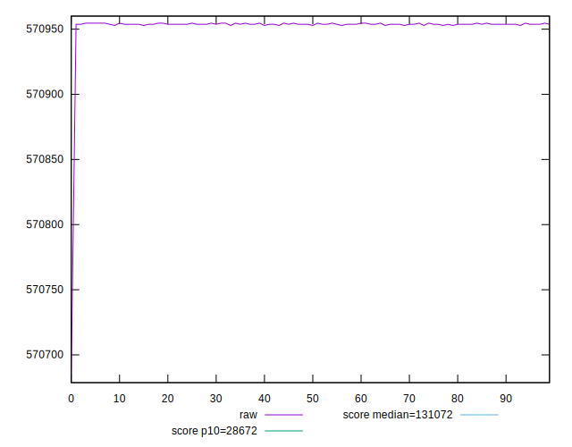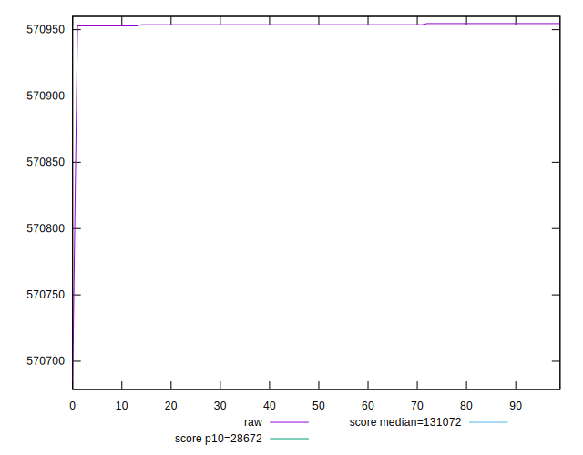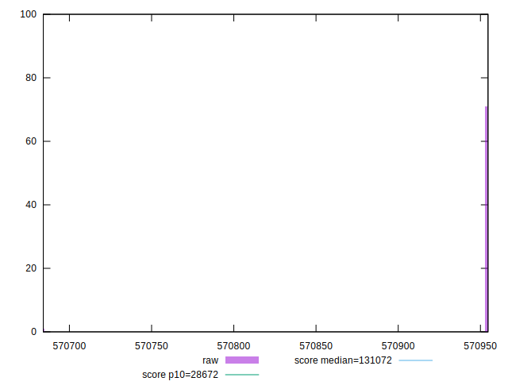
## Score


```yaml
p90min: 0.11
p90max: 0.11
p90range: 0
p90mean: 0.10999999999999997
p90median: 0.11
p90stdev: 2.7755575615628914e-17
p90skewness: 1
p90eccentricity: 1
p90discretization: 94
outlandishness: 0.9999999999999996
confidence: 2.1759971430724333e-17
p90confidence: 1.1221848425816715e-17

```

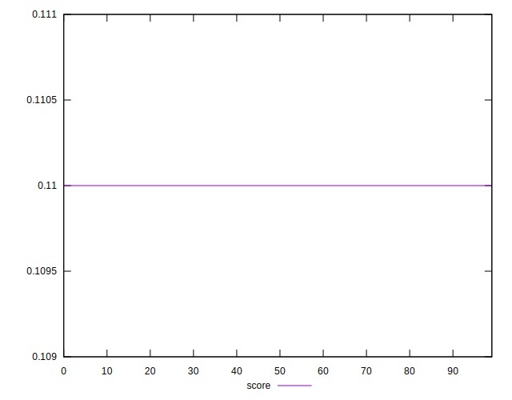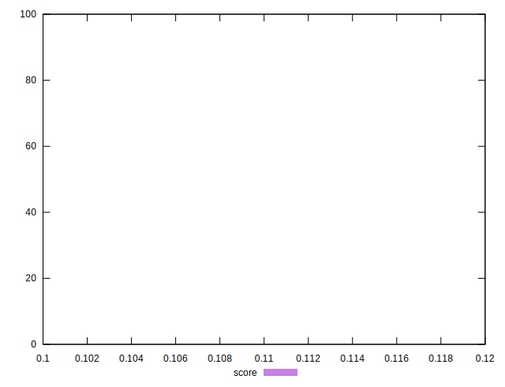
## Raw Estimate

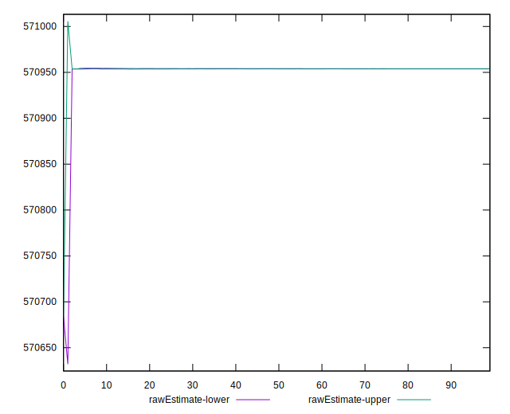
## Score Estimate

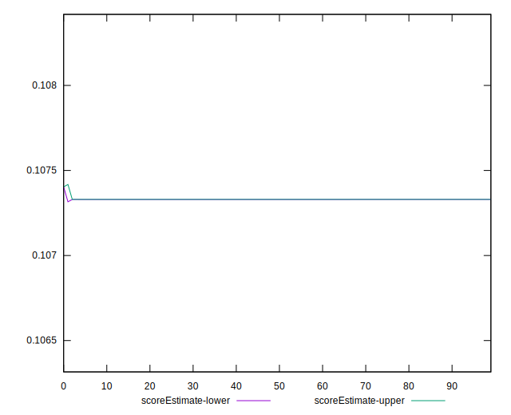
## P Score


```yaml
p90min: 0.10732967930565729
p90max: 0.10733016132038486
p90range: 4.820147275763631e-7
p90mean: 0.10732988441807197
p90median: 0.10732992031263955
p90stdev: 1.4476428842495966e-7
p90skewness: 0.07187051100907511
p90eccentricity: 1.0000000000000007
p90discretization: 31.333333333333332
outlandishness: 1.0000137095059918
confidence: 0.0000028725287867215497
p90confidence: 5.852960589516134e-8

```

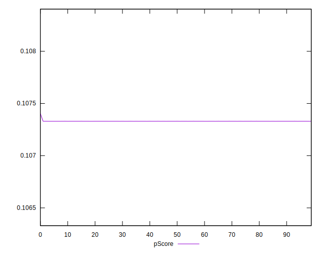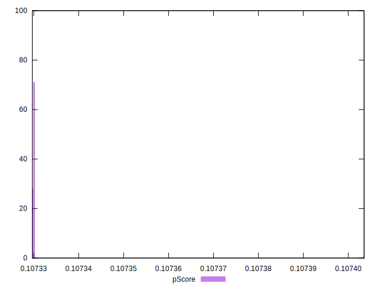
## Score Difference


```yaml
p90min: 0
p90max: 0
p90range: 0
p90mean: 0
p90median: 0
p90stdev: 0
p90skewness: .nan
p90eccentricity: .nan
p90discretization: 94
outlandishness: .nan
confidence: 0
p90confidence: 0

```


## P Score Difference


```yaml
p90min: -0.002670320694342712
p90max: -0.0026698386796151358
p90range: 4.820147275763631e-7
p90mean: -0.0026701155819280837
p90median: -0.002670079687360452
p90stdev: 1.4476428842495963e-7
p90skewness: 0.07187051059565805
p90eccentricity: 0.9999999999999989
p90discretization: 31.333333333333332
outlandishness: 0.9994490006565652
confidence: 0.0000028725287867215497
p90confidence: 5.8529605895161325e-8

```

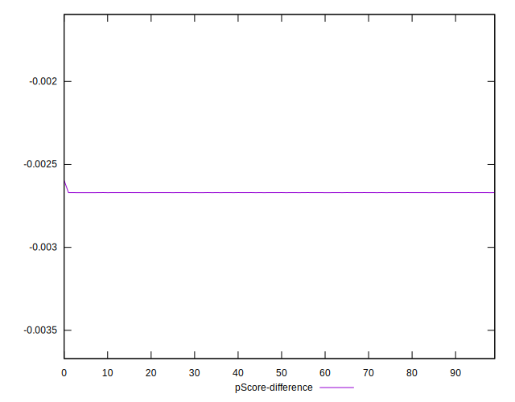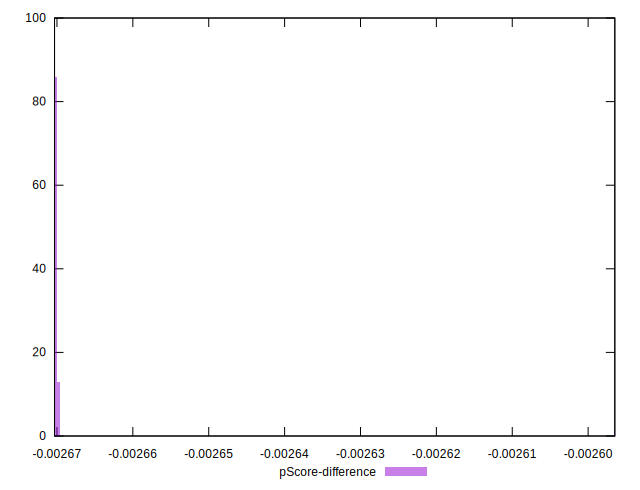