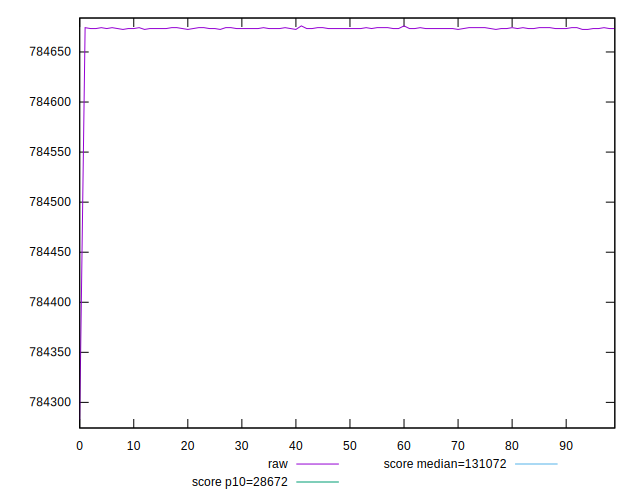
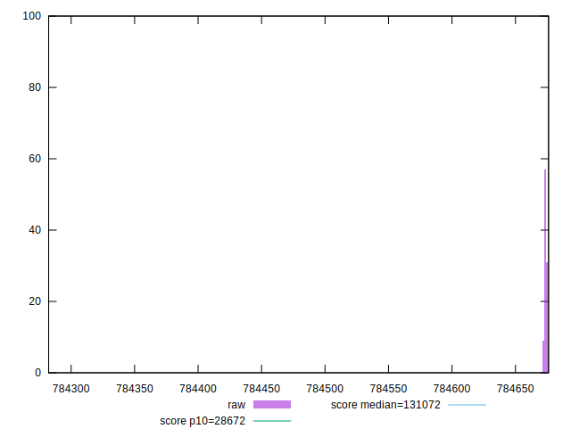
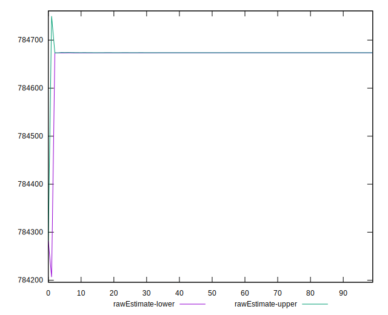
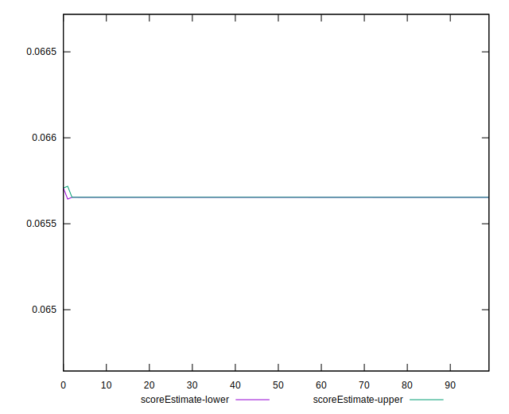
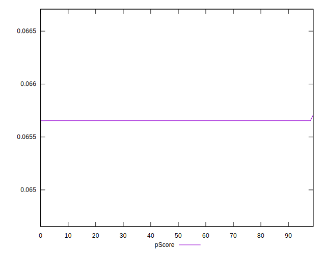
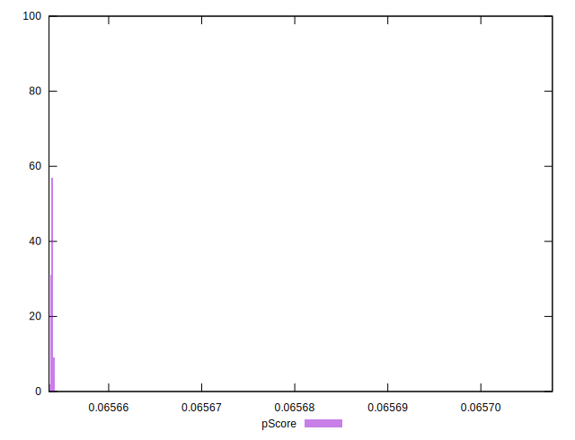
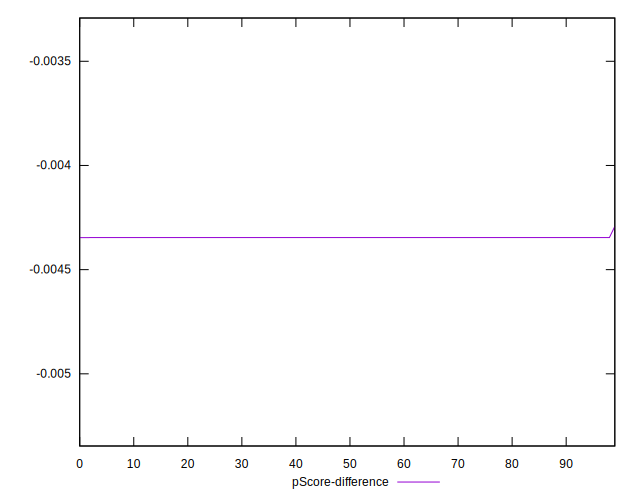
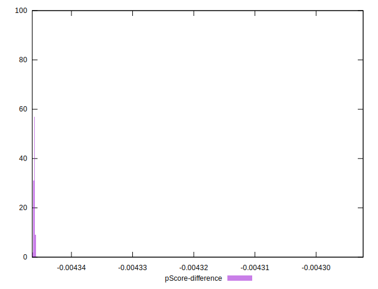

# //uses-long-cache-ttl/samples/pages+cached+noadtech

[→ Parent](../..)


## Raw


```yaml
p90min: 784672.5166666666
p90max: 784674.2833333333
p90range: 1.7666666667209938
p90mean: 784673.6161347512
p90median: 784673.4
p90stdev: 0.5103100858634595
p90skewness: -0.0775549324692889
p90eccentricity: 0.9999999999999991
p90discretization: 31.333333333333332
outlandishness: 0.9999901106436802
confidence: 15.266352380019127
p90confidence: 0.20632331726893266

```


## Score


```yaml
p90min: 0.07
p90max: 0.07
p90range: 0
p90mean: 0.07000000000000008
p90median: 0.07
p90stdev: 6.938893903907228e-17
p90skewness: -1
p90eccentricity: 1
p90discretization: 94
outlandishness: 1.0000000000000004
confidence: 3.26399571460865e-17
p90confidence: 2.8054621064541785e-17

```


## Raw Estimate


## Score Estimate


## P Score


```yaml
p90min: 0.06565382824508414
p90max: 0.06565407083927921
p90range: 2.425941950656707e-7
p90mean: 0.06565391986301058
p90median: 0.06565394954202658
p90stdev: 7.007444951434201e-8
p90skewness: 0.07755837125662673
p90eccentricity: 1.0000000000000004
p90discretization: 31.333333333333332
outlandishness: 1.0000162395147338
confidence: 0.000002097523602652757
p90confidence: 2.8331779598535752e-8

```


## Score Difference


```yaml
p90min: 0
p90max: 0
p90range: 0
p90mean: 0
p90median: 0
p90stdev: 0
p90skewness: .nan
p90eccentricity: .nan
p90discretization: 94
outlandishness: .nan
confidence: 0
p90confidence: 0

```


## P Score Difference


```yaml
p90min: -0.004346171754915862
p90max: -0.004345929160720796
p90range: 2.425941950656707e-7
p90mean: -0.004346080136989434
p90median: -0.004346050457973427
p90stdev: 7.007444951434208e-8
p90skewness: 0.07755837118236013
p90eccentricity: 0.9999999999999994
p90discretization: 31.333333333333332
outlandishness: 0.9997546943343032
confidence: 0.000002097523602652757
p90confidence: 2.8331779598535782e-8

```

