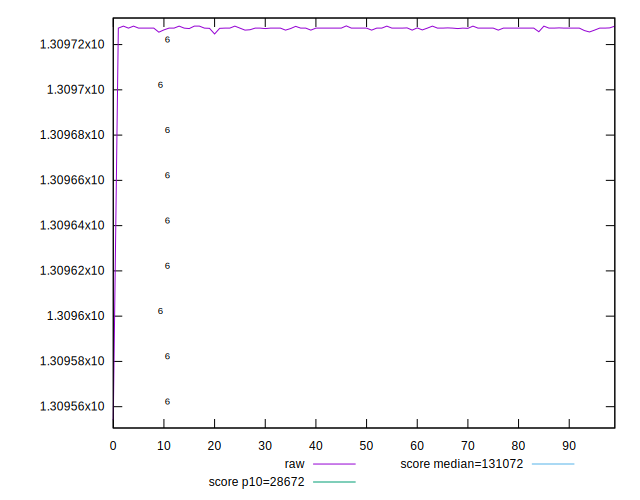
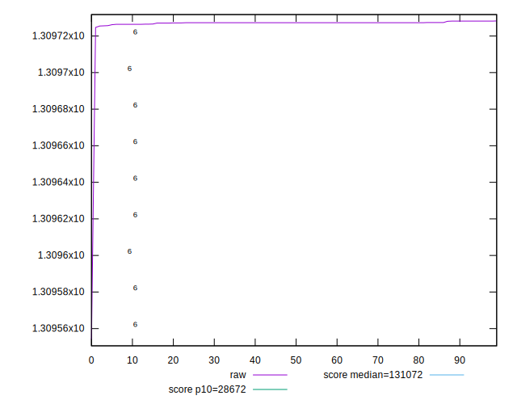
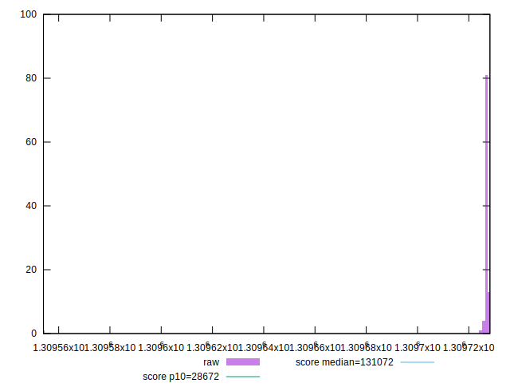
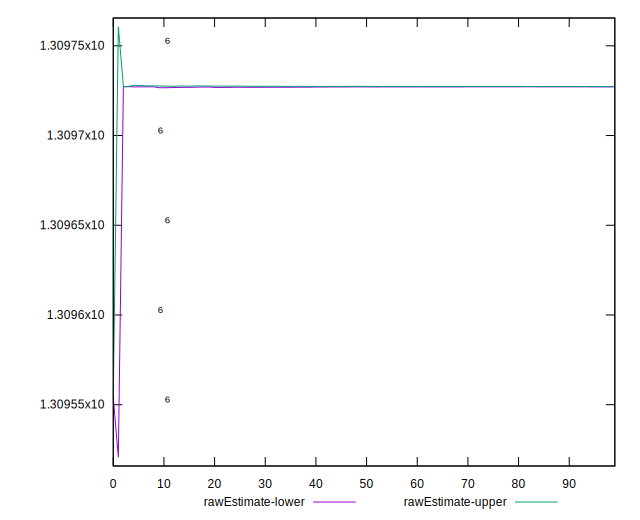
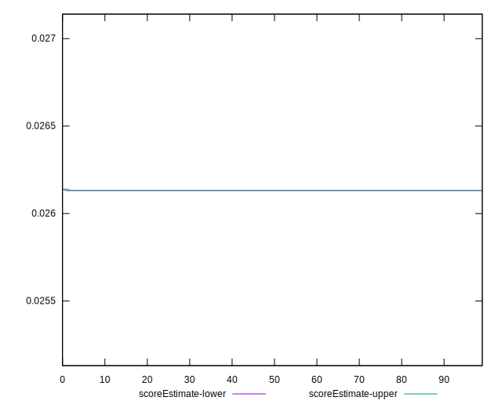
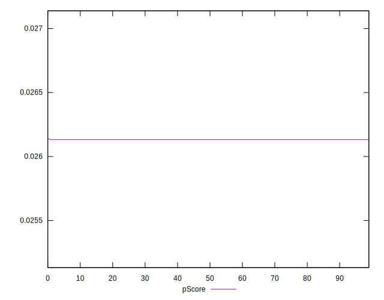
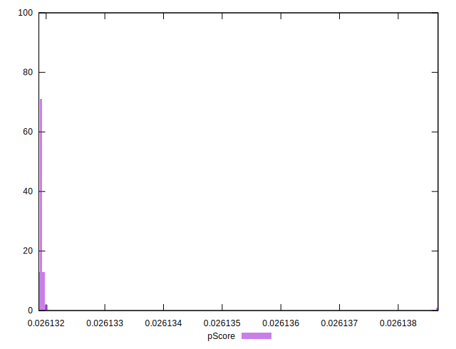
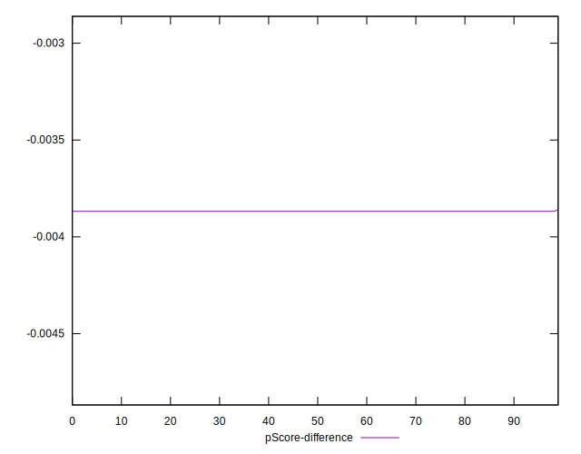
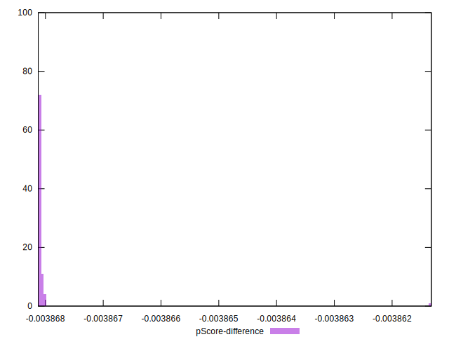

# //uses-long-cache-ttl/samples/pages+cached

[→ Parent](../..)


## Raw


```yaml
p90min: 1309725.5697408444
p90max: 1309728.1527948482
p90range: 2.5830540037713945
p90mean: 1309727.2191336486
p90median: 1309727.269461515
p90stdev: 0.47811880442603333
p90skewness: -0.6376377899832095
p90eccentricity: 0.9999999999999992
p90discretization: 7.230769230769231
outlandishness: 0.9999973347550186
confidence: 6.756869122964086
p90confidence: 0.1933080699569587

```


## Score


```yaml
p90min: 0.03
p90max: 0.03
p90range: 0
p90mean: 0.02999999999999996
p90median: 0.03
p90stdev: 3.8163916471489756e-17
p90skewness: 1
p90eccentricity: 1
p90discretization: 94
outlandishness: 0.9999999999999993
confidence: 1.903997500188379e-17
p90confidence: 1.5430041585497983e-17

```


## Raw Estimate


## Score Estimate


## P Score


```yaml
p90min: 0.026131879583306927
p90max: 0.026131980449827064
p90range: 1.0086652013630015e-7
p90mean: 0.02613191604209673
p90median: 0.02613191407682003
p90stdev: 1.867020975832036e-8
p90skewness: 0.637643348496486
p90eccentricity: 0.9999999999999999
p90discretization: 7.230769230769231
outlandishness: 1.0000052171816254
confidence: 2.6389694648583053e-7
p90confidence: 7.548546889731936e-9

```


## Score Difference


```yaml
p90min: 0
p90max: 0
p90range: 0
p90mean: 0
p90median: 0
p90stdev: 0
p90skewness: .nan
p90eccentricity: .nan
p90discretization: 94
outlandishness: .nan
confidence: 0
p90confidence: 0

```


## P Score Difference


```yaml
p90min: -0.0038681204166930716
p90max: -0.0038680195501729353
p90range: 1.0086652013630015e-7
p90mean: -0.003868083957903241
p90median: -0.0038680859231799702
p90stdev: 1.8670209758320353e-8
p90skewness: 0.6376433442456725
p90eccentricity: 1.000000000000001
p90discretization: 7.230769230769231
outlandishness: 0.9999647542363198
confidence: 2.638969464858305e-7
p90confidence: 7.548546889731932e-9

```

