# //uses-long-cache-ttl/samples/pages

[→ Parent](../..)


## Raw


```yaml
p90min: 1309514.264354438
p90max: 1394776.7213698786
p90range: 85262.45701544057
p90mean: 1334822.2504658855
p90median: 1311420.15525644
p90stdev: 37504.9765020617
p90skewness: 0.9378753299936893
p90eccentricity: 0.9999999999999997
p90discretization: 1
outlandishness: 1.0015042300323174
confidence: 15347.86339406836
p90confidence: 15163.625764726095

```

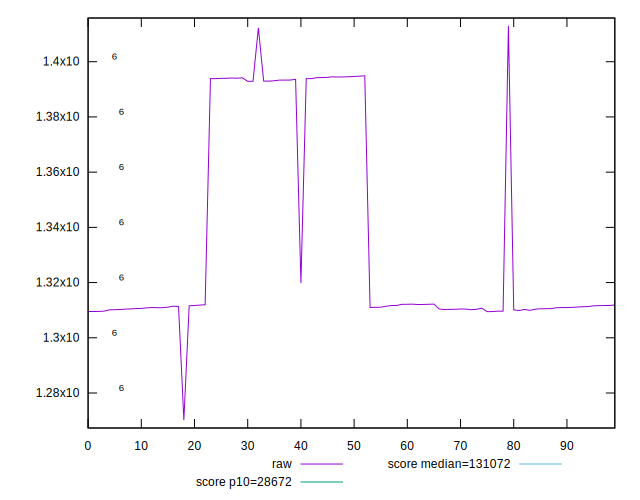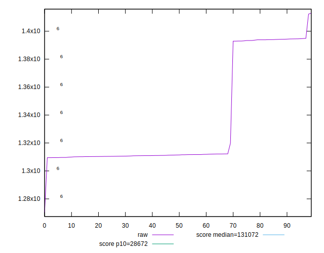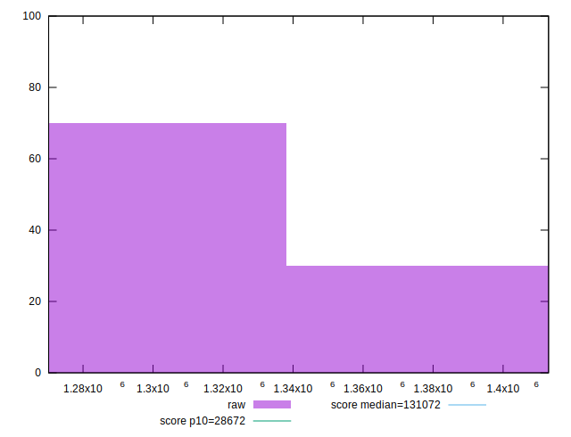
## Score


```yaml
p90min: 0.02
p90max: 0.03
p90range: 0.009999999999999998
p90mean: 0.027127659574468065
p90median: 0.03
p90stdev: 0.00452471708896526
p90skewness: -0.9404608211447842
p90eccentricity: 1.0000000000000002
p90discretization: 47
outlandishness: 0.9906103806228368
confidence: 0.0017963366637084124
p90confidence: 0.0018293870048034404

```

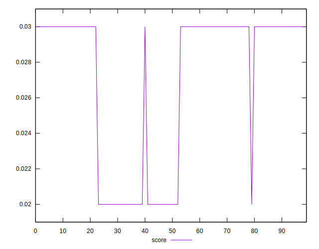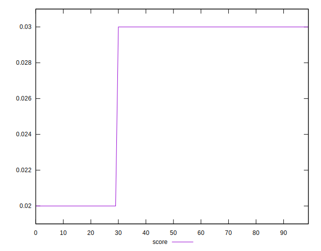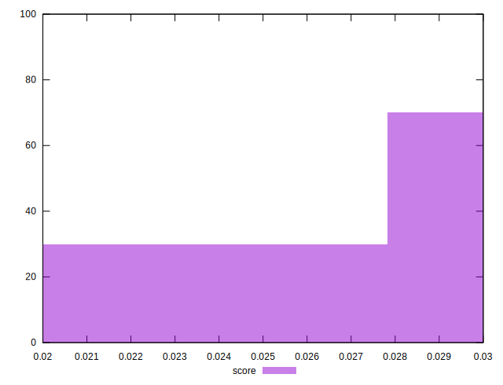
## Raw Estimate

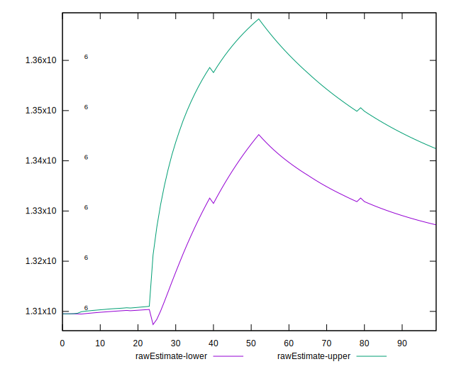
## Score Estimate

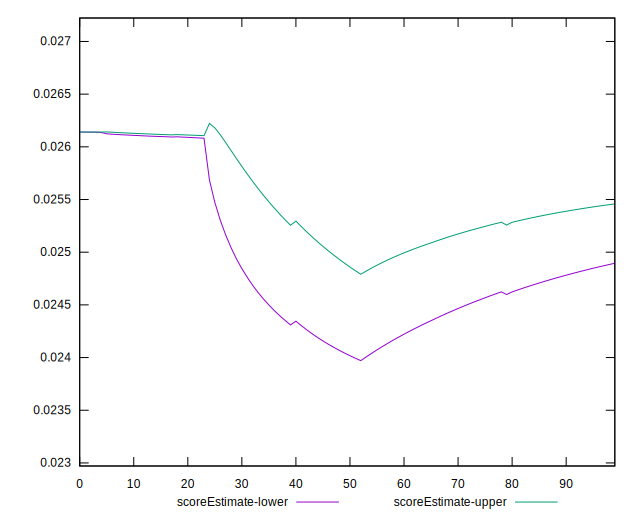
## P Score


```yaml
p90min: 0.02307569461161696
p90max: 0.02614023355971473
p90range: 0.0030645389480977725
p90mean: 0.025226608994920192
p90median: 0.02606592057179971
p90stdev: 0.0013472165225298547
p90skewness: -0.9373984358848209
p90eccentricity: 1
p90discretization: 1
outlandishness: 0.9974068299418833
confidence: 0.0005516475247278291
p90confidence: 0.0005446927068618588

```

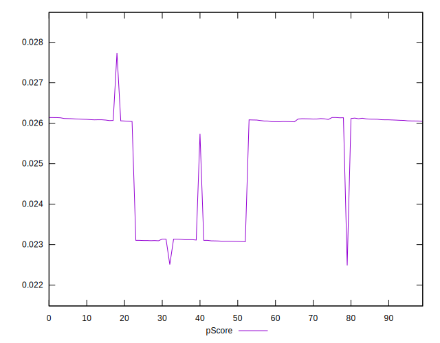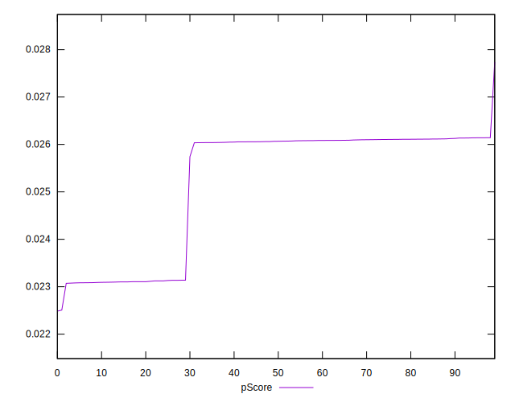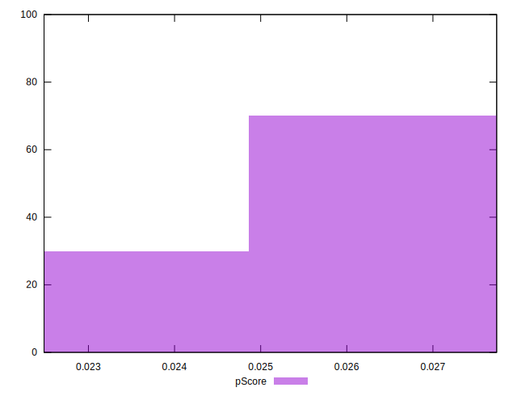
## Score Difference


```yaml
p90min: 0
p90max: 0
p90range: 0
p90mean: 0
p90median: 0
p90stdev: 0
p90skewness: .nan
p90eccentricity: .nan
p90discretization: 94
outlandishness: .nan
confidence: 0
p90confidence: 0

```


## P Score Difference


```yaml
p90min: -0.0039620691917247874
p90max: 0.003135228139400443
p90range: 0.00709729733112523
p90mean: -0.0018918663724896857
p90median: -0.0038911401538033463
p90stdev: 0.0031465439227892217
p90skewness: 0.9344850978785133
p90eccentricity: 0.9999999999999999
p90discretization: 1
outlandishness: 0.9114075364110437
confidence: 0.001251916833142808
p90confidence: 0.0012721782266634965

```

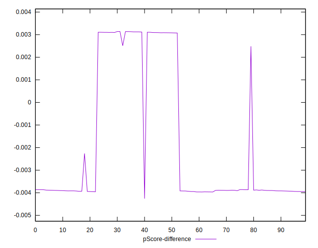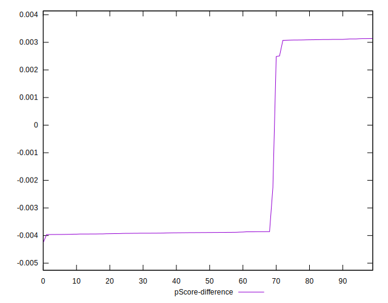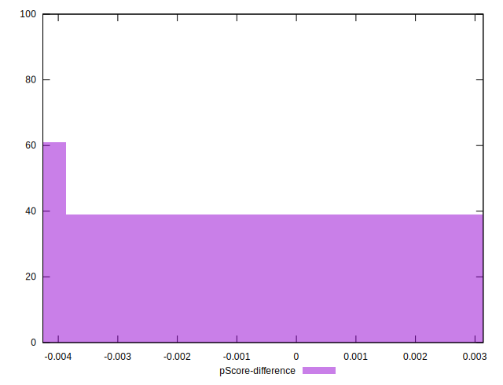