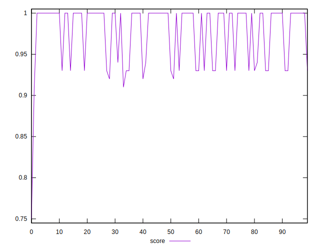

# //uses-rel-preconnect/samples/pages+cached+noadtech+nomedia+nocss

[→ Parent](../..)


## Raw


```yaml
p90min: 0
p90max: 97.82499980926514
p90range: 97.82499980926514
p90mean: 24.835500027271028
p90median: 0
p90stdev: 38.25272145427143
p90skewness: 0.9059292313873374
p90eccentricity: 1.000000000000001
p90discretization: 3.2413793103448274
outlandishness: 1.316238237723025
confidence: 18.69623262205472
p90confidence: 15.465946301366028

```


## Score


```yaml
p90min: 0.92
p90max: 1
p90range: 0.07999999999999996
p90mean: 0.9791489361702133
p90median: 1
p90stdev: 0.032112156327077264
p90skewness: -0.9041869828353555
p90eccentricity: 1.0000000000000009
p90discretization: 23.5
outlandishness: 0.9937819690709465
confidence: 0.015649253852927425
p90confidence: 0.012983256262416623

```


## Raw Estimate


## Score Estimate


## P Score


```yaml
p90min: 0.9184791668256124
p90max: 1
p90range: 0.08152083317438763
p90mean: 0.9793037499772743
p90median: 1
p90stdev: 0.03187726787855955
p90skewness: -0.9059292313873312
p90eccentricity: 0.9999999999999968
p90discretization: 3.2413793103448274
outlandishness: 0.9937859479571785
confidence: 0.01557894094440951
p90confidence: 0.0128882885844717

```


## Score Difference


```yaml
p90min: 0
p90max: 0
p90range: 0
p90mean: 0
p90median: 0
p90stdev: 0
p90skewness: .nan
p90eccentricity: .nan
p90discretization: 94
outlandishness: .inf
confidence: 7.423946114831072e-18
p90confidence: 0

```


## P Score Difference


```yaml
p90min: -0.004285000165303532
p90max: 0.0043916662534077
p90range: 0.008676666418711232
p90mean: 0.00015128840170288728
p90median: 0
p90stdev: 0.0012404414017566968
p90skewness: 0.4473149807350844
p90eccentricity: 0.9999999999999982
p90discretization: 3.6153846153846154
outlandishness: 1.0671596271213522
confidence: 0.0006455741876619484
p90confidence: 0.0005015224899094873

```

