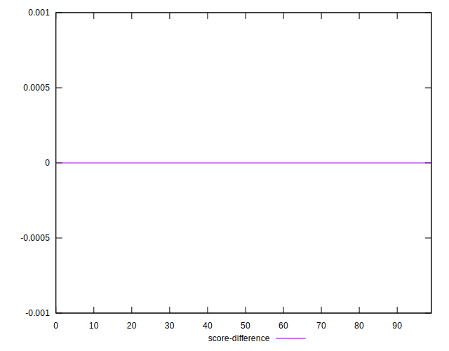

# //uses-rel-preconnect/samples/pages+cached

[→ Parent](../..)


## Raw


```yaml
p90min: 0
p90max: 300.668
p90range: 300.668
p90mean: 219.57254254763177
p90median: 300
p90stdev: 126.61217830244377
p90skewness: -1.1111799802915405
p90eccentricity: 0.9999999999999997
p90discretization: 1.7407407407407407
outlandishness: 0.9634016085529572
confidence: 50.676187577124296
p90confidence: 51.19053171329119

```


## Score


```yaml
p90min: 0.75
p90max: 1
p90range: 0.25
p90mean: 0.8171276595744683
p90median: 0.75
p90stdev: 0.10541329340475655
p90skewness: 1.1124649609113564
p90eccentricity: 1.0000000000000016
p90discretization: 10.444444444444445
outlandishness: 1.008271166256631
confidence: 0.042194797305202265
p90confidence: 0.04261961693881154

```


## Raw Estimate


## Score Estimate


## P Score


```yaml
p90min: 0.7496288888888889
p90max: 1
p90range: 0.2503711111111111
p90mean: 0.8170538977587704
p90median: 0.75
p90stdev: 0.10549036195855542
p90skewness: 1.1112821689390586
p90eccentricity: 0.9999999999999999
p90discretization: 1.7407407407407407
outlandishness: 1.0083662275525738
confidence: 0.04221349307098951
p90confidence: 0.042650776502608914

```


## Score Difference


```yaml
p90min: 0
p90max: 0
p90range: 0
p90mean: 0
p90median: 0
p90stdev: 0
p90skewness: .nan
p90eccentricity: .nan
p90discretization: 94
outlandishness: .inf
confidence: 6.09279200060281e-18
p90confidence: 0

```


## P Score Difference


```yaml
p90min: -0.002139999866485609
p90max: 0.0031558330853780348
p90range: 0.005295832951863644
p90mean: -0.00006401299894842616
p90median: -5.555555555591951e-7
p90stdev: 0.0005519870236516182
p90skewness: 3.297742493835732
p90eccentricity: 0.9999999999999994
p90discretization: 1.88
outlandishness: 0.30567897969885277
confidence: 0.0004464407193375738
p90confidence: 0.00022317370744594475

```

