# //uses-rel-preconnect/samples/pages

[→ Parent](../..)


## Raw


```yaml
p90min: 0
p90max: 308.49
p90range: 308.49
p90mean: 249.68487234342862
p90median: 300.07500000000005
p90stdev: 109.14663843623107
p90skewness: -1.8346542141617566
p90eccentricity: 0.9999999999999999
p90discretization: 1.46875
outlandishness: 0.957378954076896
confidence: 45.020665510091945
p90confidence: 44.12904454516579

```

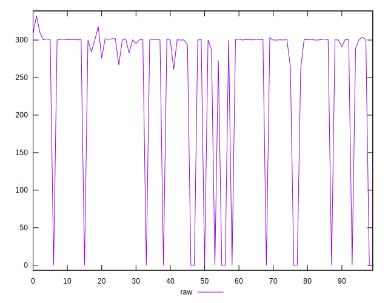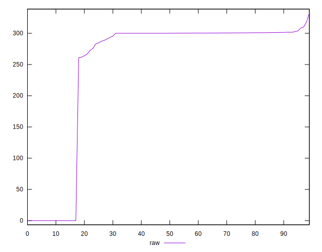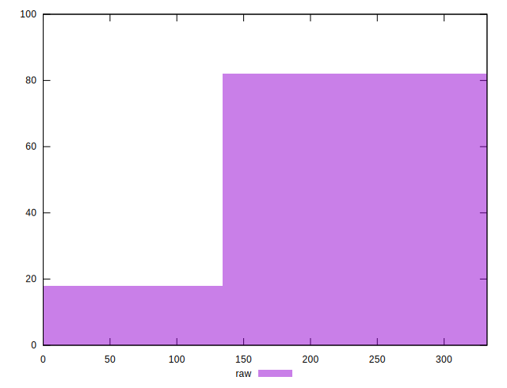
## Score


```yaml
p90min: 0.75
p90max: 1
p90range: 0.25
p90mean: 0.7922340425531916
p90median: 0.75
p90stdev: 0.09079031553142698
p90skewness: 1.8373304345452492
p90eccentricity: 0.999999999999998
p90discretization: 18.8
outlandishness: 1.0115600060290877
confidence: 0.03742609606108055
p90confidence: 0.03670740515473402

```

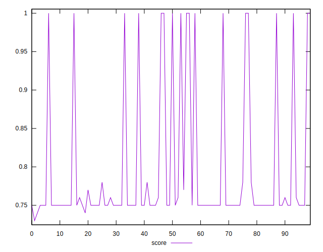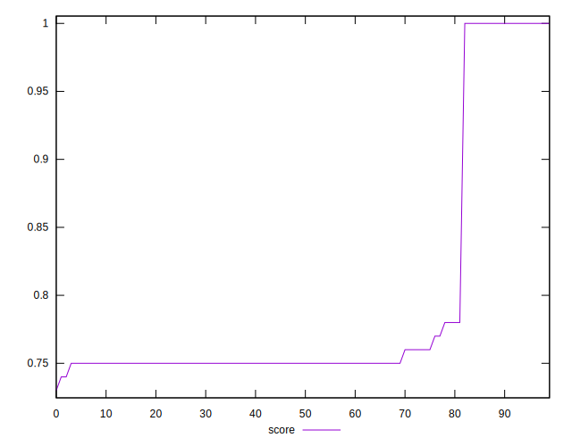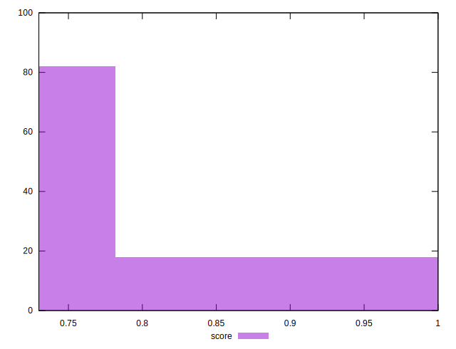
## Raw Estimate

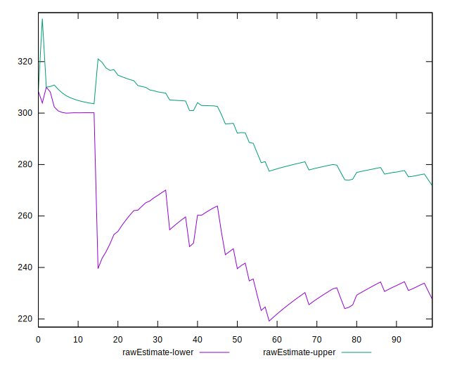
## Score Estimate

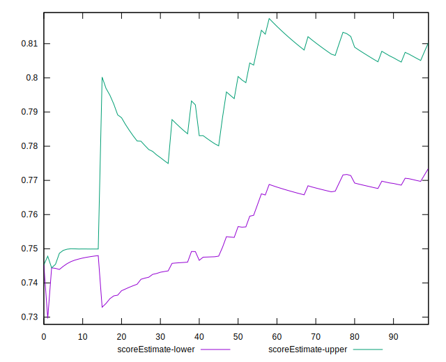
## P Score


```yaml
p90min: 0.7452833333333333
p90max: 1
p90range: 0.2547166666666667
p90mean: 0.7920614479885936
p90median: 0.7499583333333333
p90stdev: 0.09089172295959348
p90skewness: 1.8351749323095794
p90eccentricity: 1.0000000000000002
p90discretization: 1.46875
outlandishness: 1.0117549879172365
confidence: 0.03744907619605875
p90confidence: 0.03674840516150367

```

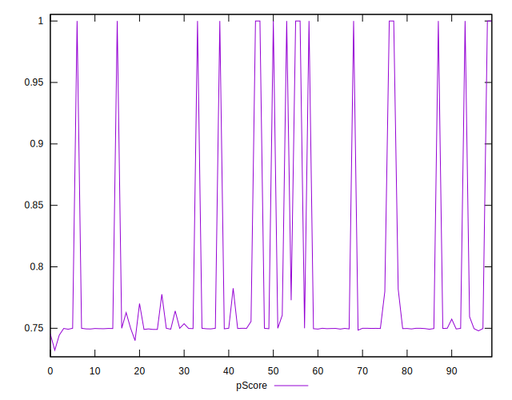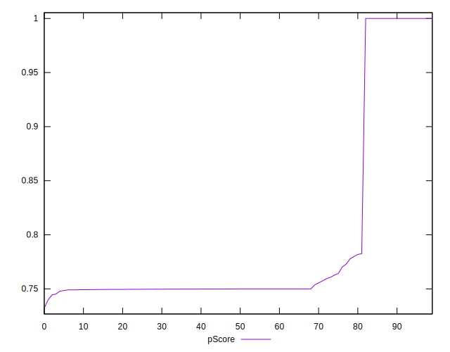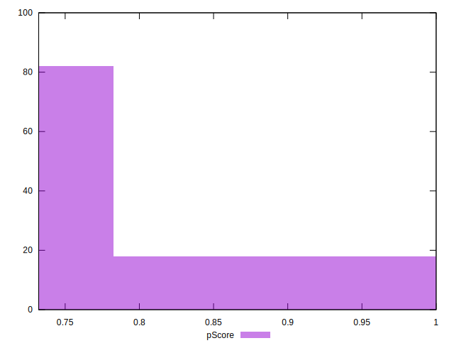
## Score Difference


```yaml
p90min: 0
p90max: 0
p90range: 0
p90mean: 0
p90median: 0
p90stdev: 0
p90skewness: .nan
p90eccentricity: .nan
p90discretization: 94
outlandishness: .nan
confidence: 0
p90confidence: 0

```


## P Score Difference


```yaml
p90min: -0.0023124996821086707
p90max: 0.002829999923706028
p90range: 0.005142499605814699
p90mean: -0.0001088268286905681
p90median: -0.0000688888888888406
p90stdev: 0.0007347806620984976
p90skewness: 1.679967466029057
p90eccentricity: 0.9999999999999992
p90discretization: 1.5666666666666667
outlandishness: 0.7914588166065274
confidence: 0.00047990785536678224
p90confidence: 0.000297078948405868

```

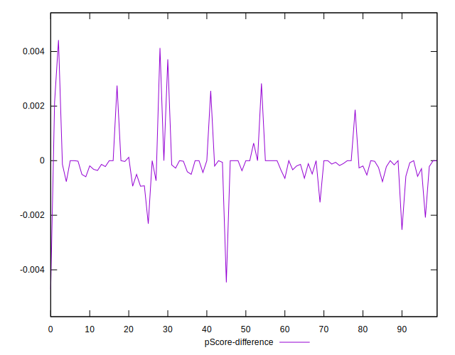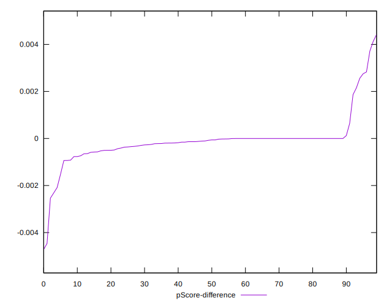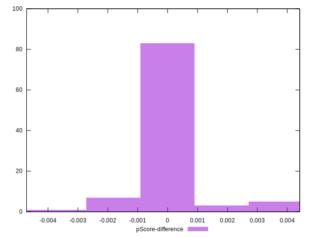