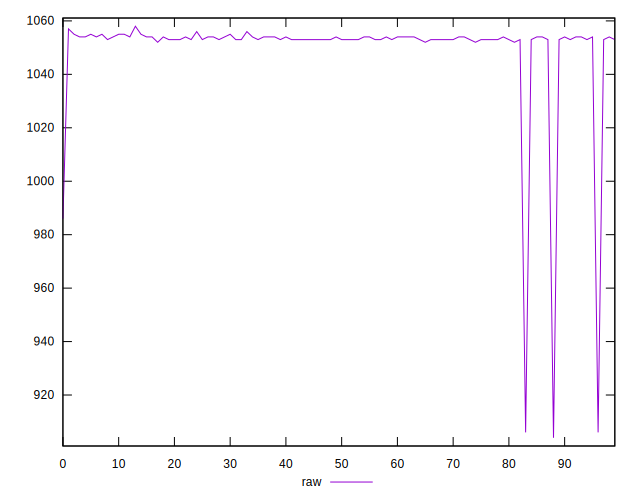
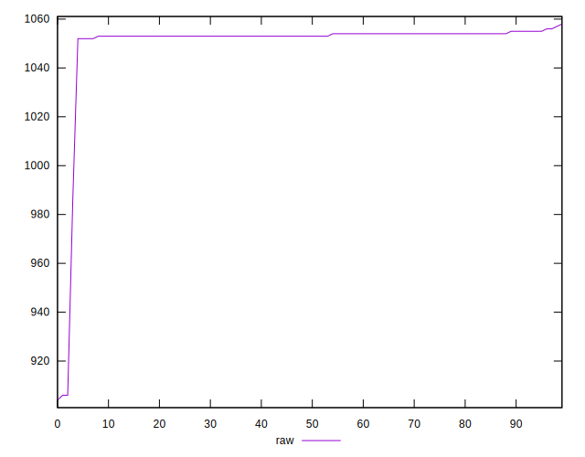
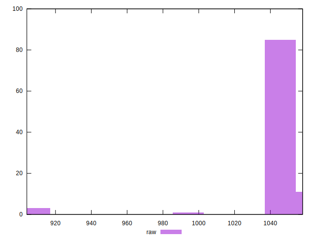
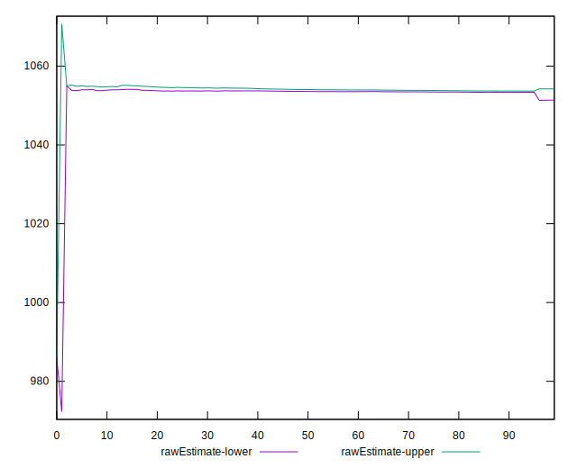
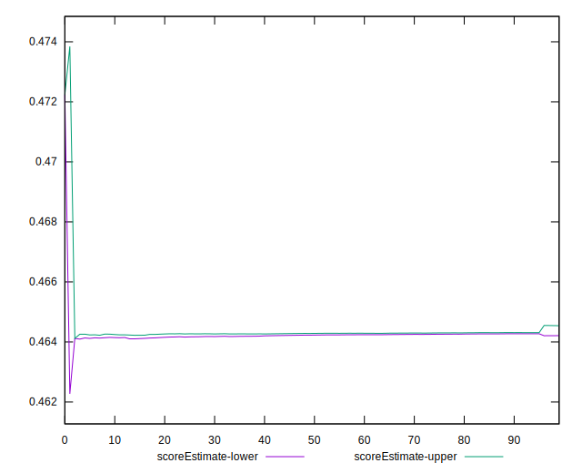
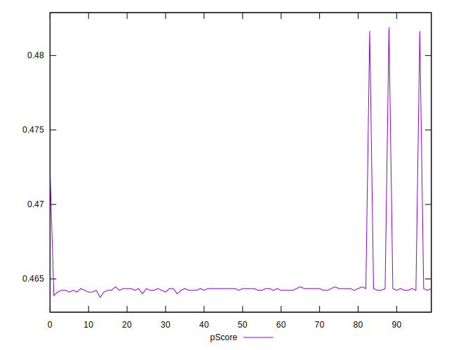
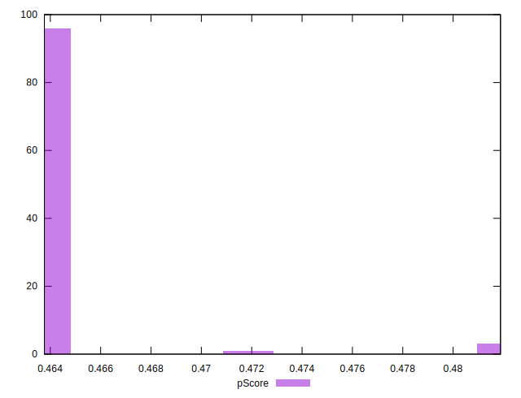
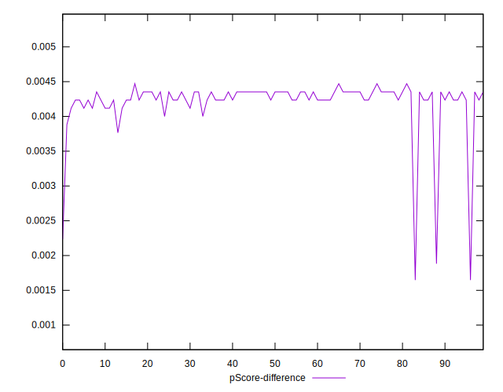
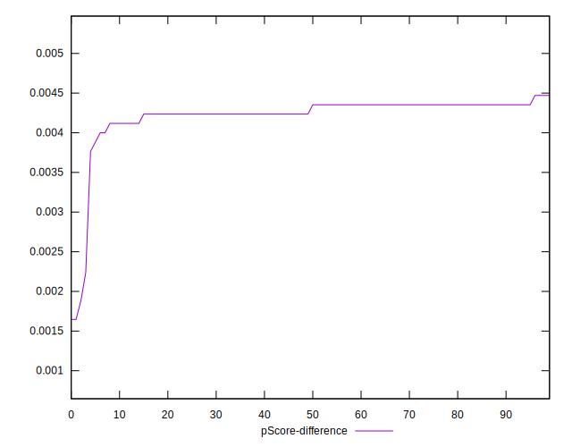
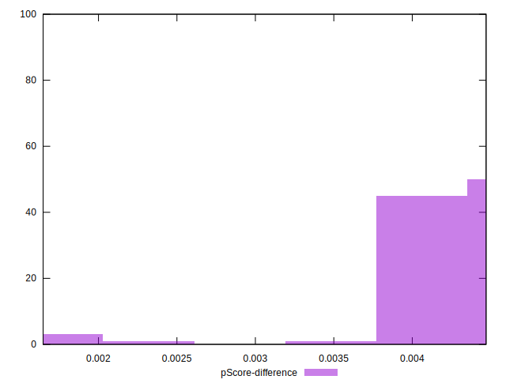

# //uses-rel-preload/samples/pages+cached+noadtech+nomedia+nocss

[→ Parent](../..)


## Raw


```yaml
p90min: 986
p90max: 1056
p90range: 70
p90mean: 1052.7978723404256
p90median: 1053
p90stdev: 6.9658433944834695
p90skewness: -9.375531385212462
p90eccentricity: 0.9999999999999957
p90discretization: 15.666666666666666
outlandishness: 0.9918519978462235
confidence: 10.22259796600819
p90confidence: 2.816358046880262

```


## Score


```yaml
p90min: 0.46
p90max: 0.47
p90range: 0.009999999999999953
p90mean: 0.4601063829787241
p90median: 0.46
p90stdev: 0.00102592029372265
p90skewness: 9.539955591517986
p90eccentricity: 0.9999999999999994
p90discretization: 47
outlandishness: 1.0025820113682375
confidence: 0.0013864580750514402
p90confidence: 0.0004147895252672127

```


## Raw Estimate


## Score Estimate


## P Score


```yaml
p90min: 0.46399999999999997
p90max: 0.4722352941176471
p90range: 0.008235294117647118
p90mean: 0.46437672090112697
p90median: 0.4643529411764706
p90stdev: 0.0008195109875862927
p90skewness: 9.375531385211838
p90eccentricity: 1.0000000000000007
p90discretization: 15.666666666666666
outlandishness: 1.0021788659660338
confidence: 0.0012026585842362589
p90confidence: 0.0003313362408094435

```


## Score Difference


```yaml
p90min: 0
p90max: 0
p90range: 0
p90mean: 0
p90median: 0
p90stdev: 0
p90skewness: .nan
p90eccentricity: .nan
p90discretization: 94
outlandishness: .inf
confidence: 2.165089820536967e-18
p90confidence: 0

```


## P Score Difference


```yaml
p90min: 0.002235294117647113
p90max: 0.004470588235294115
p90range: 0.002235294117647002
p90mean: 0.004251564455569445
p90median: 0.004294117647058809
p90stdev: 0.0002356699525492637
p90skewness: -6.788888968876517
p90eccentricity: 1.0000000000000016
p90discretization: 11.75
outlandishness: 0.9677068685776101
confidence: 0.00019229931289808266
p90confidence: 0.0000952836476047744

```

