# //uses-rel-preload/samples/pages+cached+noadtech+nomedia

[→ Parent](../..)


## Raw


```yaml
p90min: 755
p90max: 764
p90range: 9
p90mean: 757.7872340425532
p90median: 757
p90stdev: 1.7496038483254277
p90skewness: 1.1254034321241677
p90eccentricity: 1.0000000000000004
p90discretization: 9.4
outlandishness: 1.0025690333117492
confidence: 3.2167875682843103
p90confidence: 0.70738180548048

```

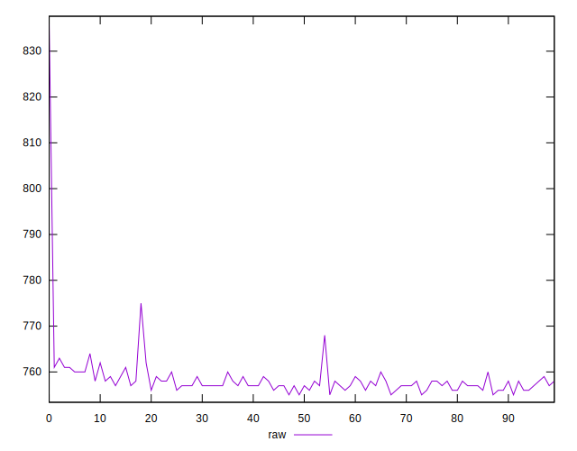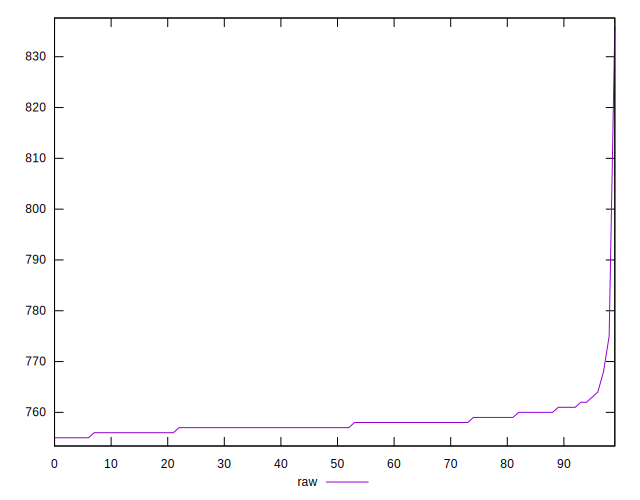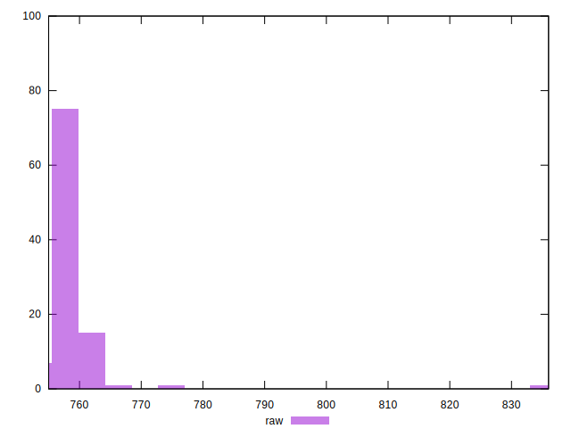
## Score


```yaml
p90min: 0.5
p90max: 0.5
p90range: 0
p90mean: 0.5
p90median: 0.5
p90stdev: 0
p90skewness: .nan
p90eccentricity: .nan
p90discretization: 94
outlandishness: 0.99960004
confidence: 0.0003900279083597579
p90confidence: 0

```

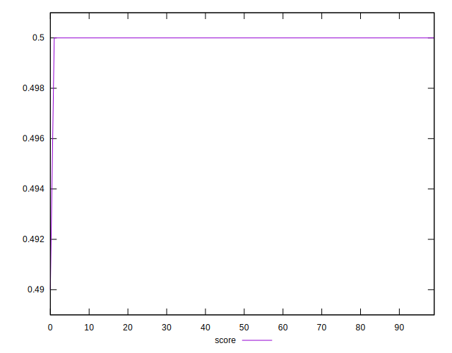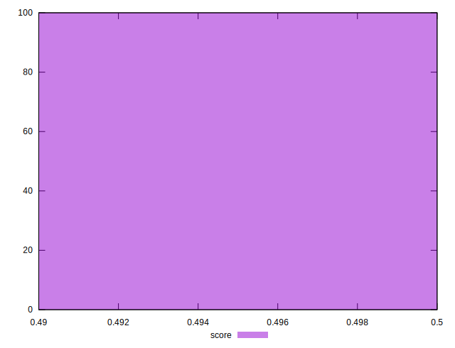
## Raw Estimate

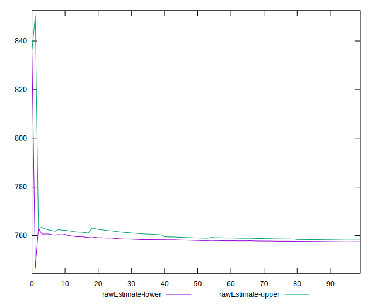
## Score Estimate

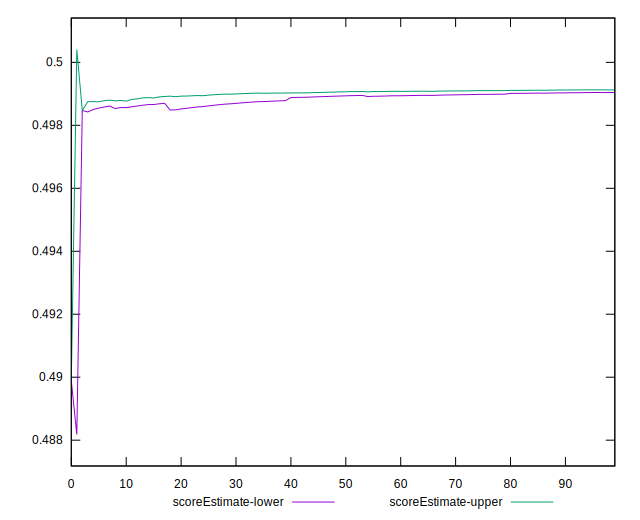
## P Score


```yaml
p90min: 0.4983529411764706
p90max: 0.49941176470588233
p90range: 0.0010588235294117232
p90mean: 0.49908385481852297
p90median: 0.4991764705882353
p90stdev: 0.000205835746861811
p90skewness: -1.1254034321215014
p90eccentricity: 0.9999999999999996
p90discretization: 9.4
outlandishness: 0.99954144005478
confidence: 0.00037844559626874124
p90confidence: 0.00008322138888005483

```

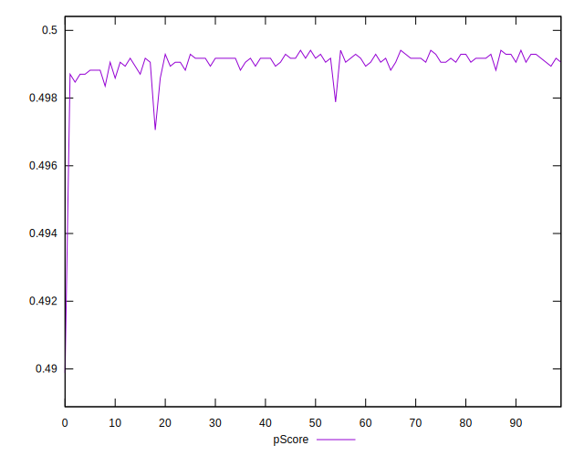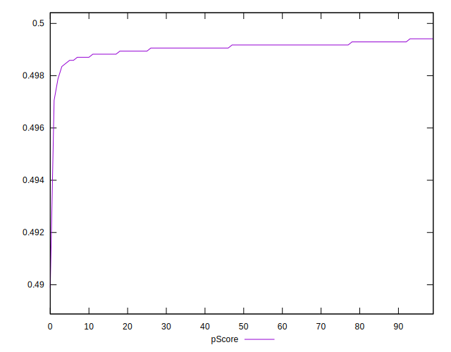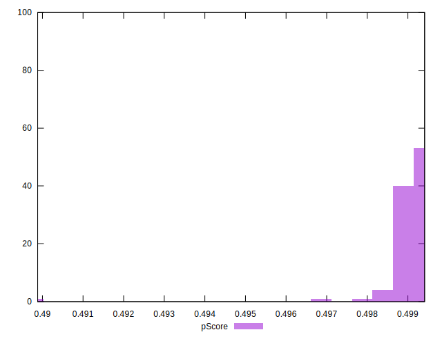
## Score Difference


```yaml
p90min: 0
p90max: 0
p90range: 0
p90mean: 0
p90median: 0
p90stdev: 0
p90skewness: .nan
p90eccentricity: .nan
p90discretization: 94
outlandishness: .nan
confidence: 0
p90confidence: 0

```


## P Score Difference


```yaml
p90min: -0.0015294117647058902
p90max: -0.0005882352941176672
p90range: 0.0009411764705882231
p90mean: -0.0009048811013767236
p90median: -0.0008235294117647229
p90stdev: 0.0001941700507599988
p90skewness: -0.8962232726413321
p90eccentricity: 1.0000000000000002
p90discretization: 10.444444444444445
outlandishness: 1.0576259048187489
confidence: 0.00012681616797626227
p90confidence: 0.00007850483479920691

```

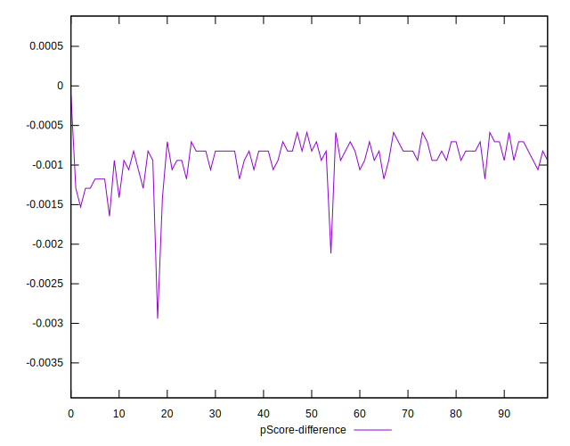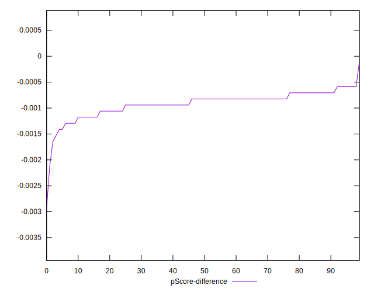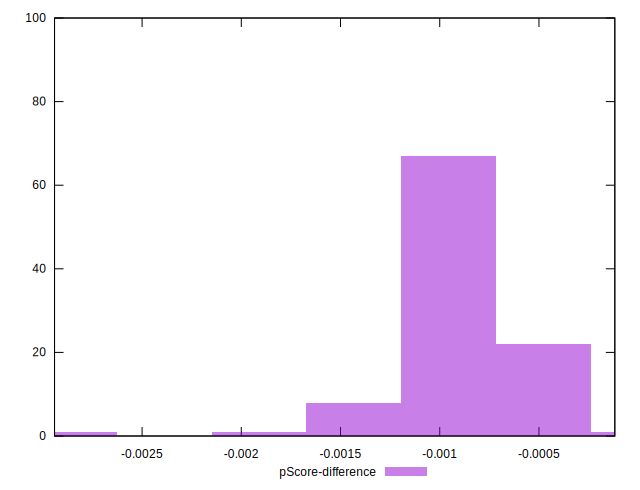