# //uses-rel-preload/samples/pages+cached+noadtech

[→ Parent](../..)


## Raw


```yaml
p90min: 755
p90max: 762
p90range: 7
p90mean: 757.0851063829788
p90median: 757
p90stdev: 1.3888582059887318
p90skewness: 0.9436962411927916
p90eccentricity: 0.999999999999998
p90discretization: 13.428571428571429
outlandishness: 1.0022596568836408
confidence: 3.1835124913292248
p90confidence: 0.5615288433716068

```

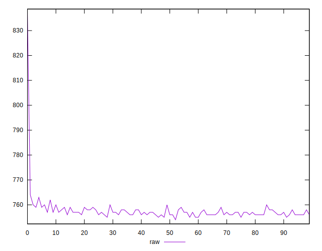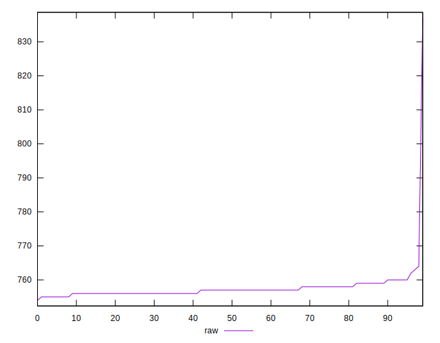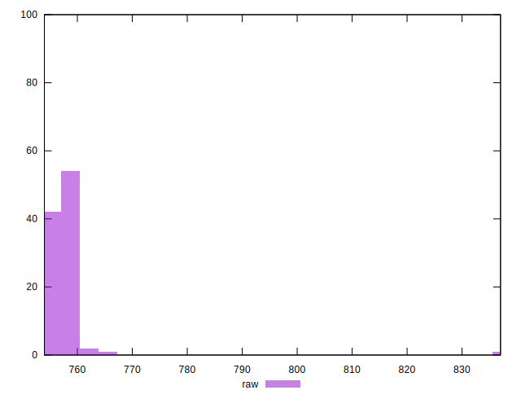
## Score


```yaml
p90min: 0.5
p90max: 0.5
p90range: 0
p90mean: 0.5
p90median: 0.5
p90stdev: 0
p90skewness: .nan
p90eccentricity: .nan
p90discretization: 94
outlandishness: 0.99960004
confidence: 0.0003900279083597579
p90confidence: 0

```


## Raw Estimate

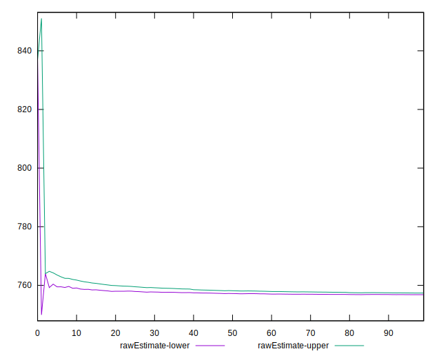
## Score Estimate

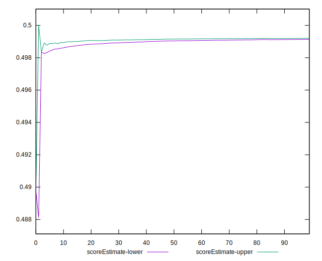
## P Score


```yaml
p90min: 0.49858823529411767
p90max: 0.49941176470588233
p90range: 0.0008235294117646674
p90mean: 0.4991664580725906
p90median: 0.4991764705882353
p90stdev: 0.00016339508305749574
p90skewness: -0.9436962411858779
p90eccentricity: 1.0000000000000009
p90discretization: 13.428571428571429
outlandishness: 0.9995970659259804
confidence: 0.00037453088133284994
p90confidence: 0.000066062216867247

```

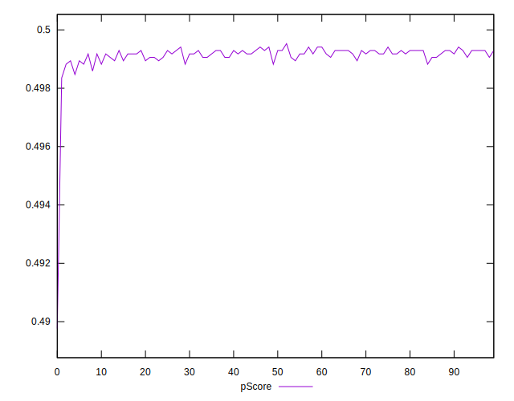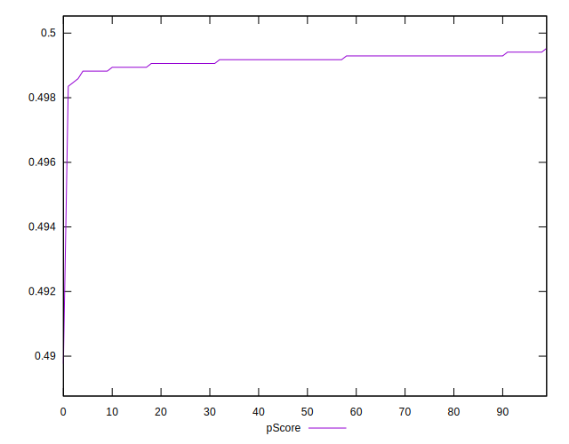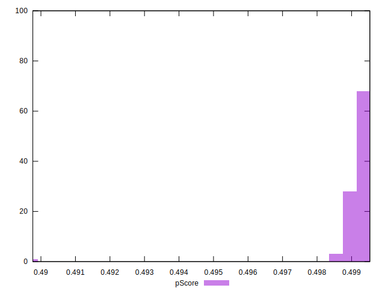
## Score Difference


```yaml
p90min: 0
p90max: 0
p90range: 0
p90mean: 0
p90median: 0
p90stdev: 0
p90skewness: .nan
p90eccentricity: .nan
p90discretization: 94
outlandishness: .nan
confidence: 0
p90confidence: 0

```


## P Score Difference


```yaml
p90min: -0.0011764705882352788
p90max: -0.0005882352941176672
p90range: 0.0005882352941176117
p90mean: -0.0008247809762202767
p90median: -0.0008235294117647229
p90stdev: 0.00015396277733163274
p90skewness: -0.6923251528812273
p90eccentricity: 0.9999999999999982
p90discretization: 15.666666666666666
outlandishness: 1.0227685107108064
confidence: 0.00008095961465606068
p90confidence: 0.00006224864417729724

```

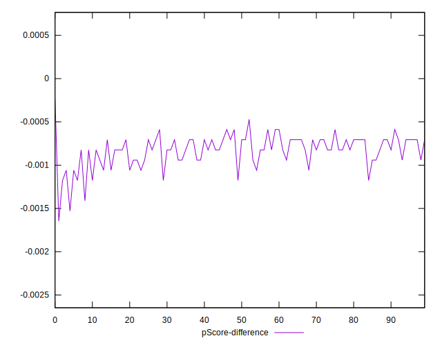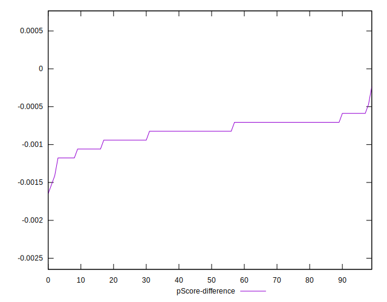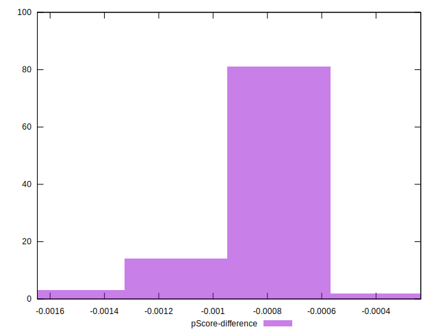