# //uses-rel-preload/samples/pages+cached

[→ Parent](../..)


## Raw


```yaml
p90min: 755
p90max: 777
p90range: 22
p90mean: 758.4893617021277
p90median: 758
p90stdev: 3.0795988991766228
p90skewness: 3.0393063906277598
p90eccentricity: 1.0000000000000007
p90discretization: 6.714285714285714
outlandishness: 0.9917654582177949
confidence: 31.44679092277171
p90confidence: 1.2451117043096855

```

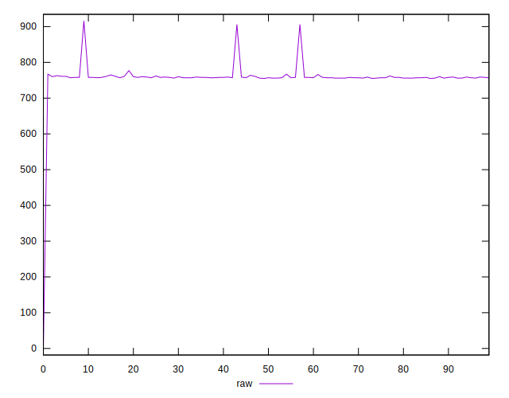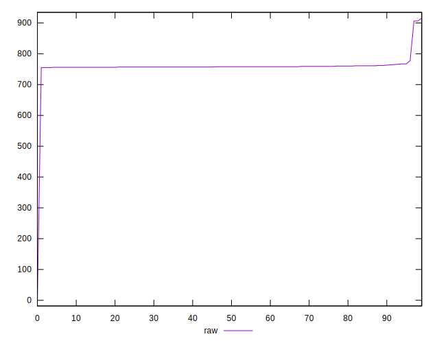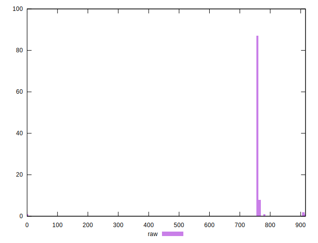
## Score


```yaml
p90min: 0.5
p90max: 0.5
p90range: 0
p90mean: 0.5
p90median: 0.5
p90stdev: 0
p90skewness: .nan
p90eccentricity: .nan
p90discretization: 94
outlandishness: 1.01767744
confidence: 0.01957076791014089
p90confidence: 0

```

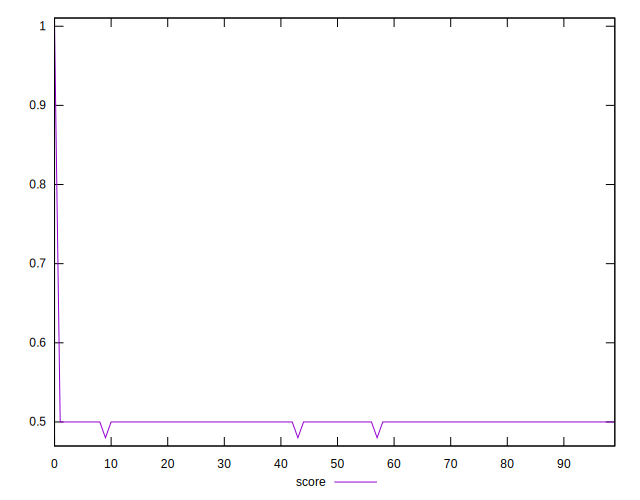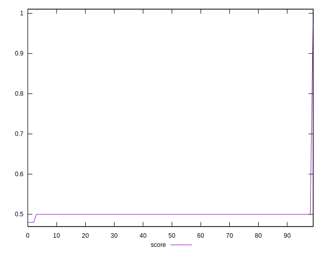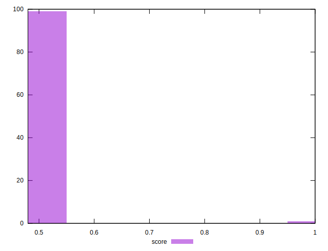
## Raw Estimate

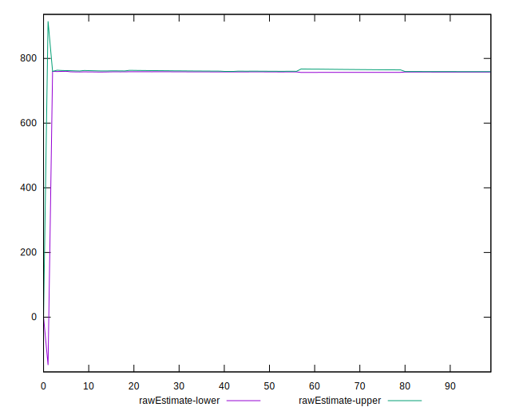
## Score Estimate

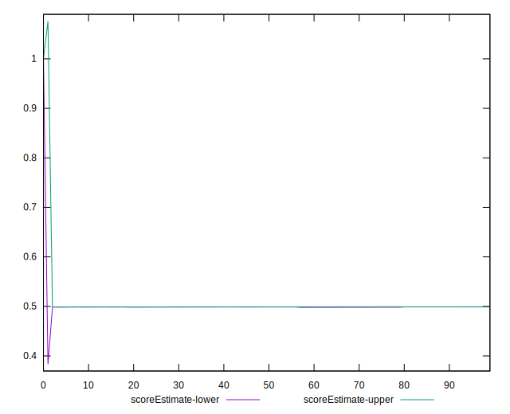
## P Score


```yaml
p90min: 0.4968235294117647
p90max: 0.49941176470588233
p90range: 0.0025882352941176134
p90mean: 0.4990012515644554
p90median: 0.4990588235294118
p90stdev: 0.00036230575284430637
p90skewness: -3.039306390626418
p90eccentricity: 0.9999999999999983
p90discretization: 6.714285714285714
outlandishness: 1.0180599547064304
confidence: 0.01959751892211483
p90confidence: 0.00014648372991878566

```

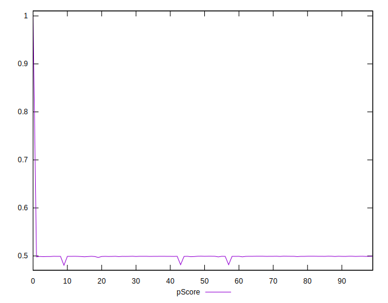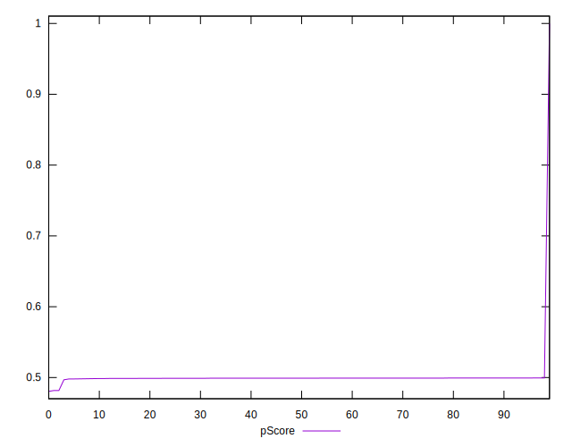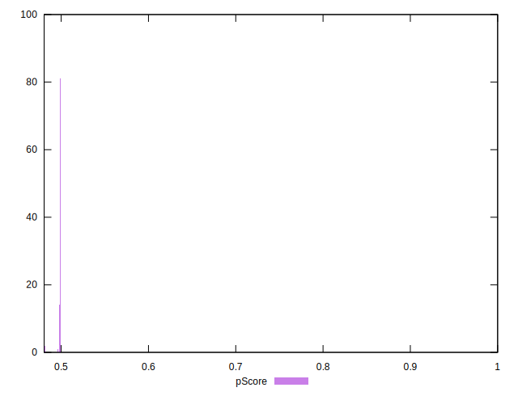
## Score Difference


```yaml
p90min: 0
p90max: 0
p90range: 0
p90mean: 0
p90median: 0
p90stdev: 0
p90skewness: .nan
p90eccentricity: .nan
p90discretization: 94
outlandishness: .nan
confidence: 0
p90confidence: 0

```


## P Score Difference


```yaml
p90min: -0.0018823529411764461
p90max: 0
p90range: 0.0018823529411764461
p90mean: -0.0009349186483103892
p90median: -0.0009411764705882231
p90stdev: 0.00026383085593017727
p90skewness: -0.8078688108431021
p90eccentricity: 1.0000000000000013
p90discretization: 7.230769230769231
outlandishness: 0.9535378705361366
confidence: 0.00021144640642190994
p90confidence: 0.00010666937397741482

```

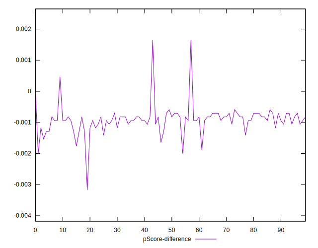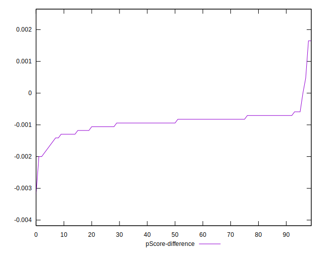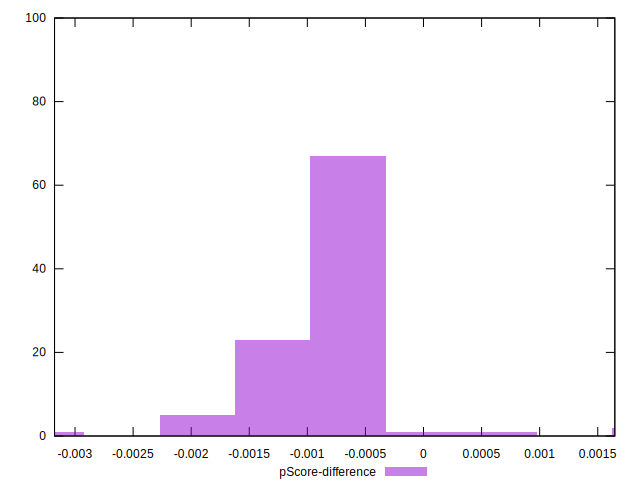