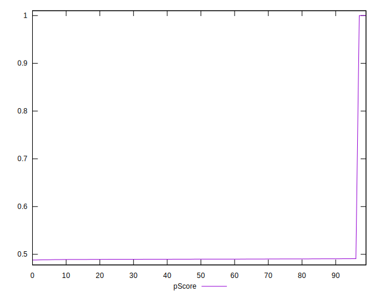

# //uses-rel-preload/samples/pages

[→ Parent](../..)


## Raw


```yaml
p90min: 828
p90max: 848
p90range: 20
p90mean: 836.4468085106383
p90median: 836
p90stdev: 4.5537382849245
p90skewness: 0.27250224449237587
p90eccentricity: 1.0000000000000009
p90discretization: 4.7
outlandishness: 0.9419360900206653
confidence: 55.998746990526755
p90confidence: 1.8411205558095718

```


## Score


```yaml
p90min: 0.49
p90max: 0.49
p90range: 0
p90mean: 0.4900000000000001
p90median: 0.49
p90stdev: 1.1102230246251565e-16
p90skewness: -1
p90eccentricity: 1
p90discretization: 94
outlandishness: 1.063423948354853
confidence: 0.03410317057549929
p90confidence: 4.488739370326686e-17

```


## Raw Estimate


## Score Estimate


## P Score


```yaml
p90min: 0.4884705882352941
p90max: 0.4908235294117647
p90range: 0.002352941176470613
p90mean: 0.4898297872340426
p90median: 0.4898823529411765
p90stdev: 0.0005357339158734747
p90skewness: -0.2725022444934939
p90eccentricity: 1
p90discretization: 4.7
outlandishness: 1.0632466098760467
confidence: 0.03411898367810954
p90confidence: 0.0002166024183305395

```


## Score Difference


```yaml
p90min: 0
p90max: 0
p90range: 0
p90mean: 0
p90median: 0
p90stdev: 0
p90skewness: .nan
p90eccentricity: .nan
p90discretization: 94
outlandishness: .nan
confidence: 0
p90confidence: 0

```


## P Score Difference


```yaml
p90min: -0.0015294117647058902
p90max: 0.0007058823529411673
p90range: 0.0022352941176470575
p90mean: -0.0001952440550688229
p90median: -0.00011764705882350013
p90stdev: 0.00050806734567125
p90skewness: -0.38411661625211085
p90eccentricity: 0.9999999999999999
p90discretization: 4.947368421052632
outlandishness: 1.242653270874449
confidence: 0.000235455506778873
p90confidence: 0.00020541655565663557

```

