# //uses-text-compression/samples/pages+cached+noadtech+nomedia+nocss

[→ Parent](../..)


## Raw


```yaml
p90min: 1350
p90max: 1360
p90range: 10
p90mean: 1350.212765957447
p90median: 1350
p90stdev: 1.4430489325798441
p90skewness: 6.634888026970213
p90eccentricity: 0.9999999999999982
p90discretization: 47
outlandishness: 1.0045781873337603
confidence: 8.242202033964176
p90confidence: 0.5834386797342838

```

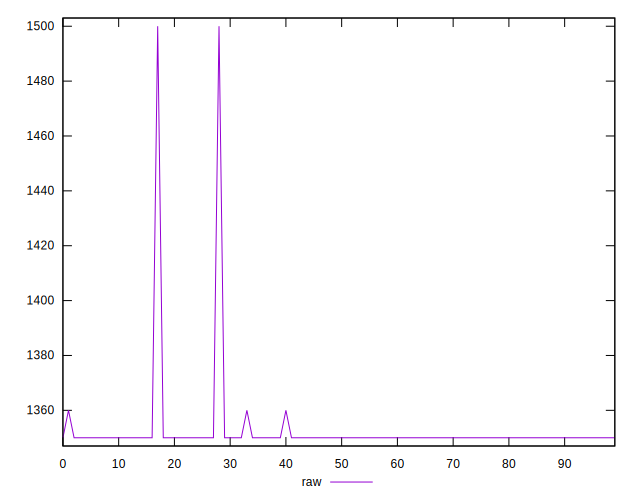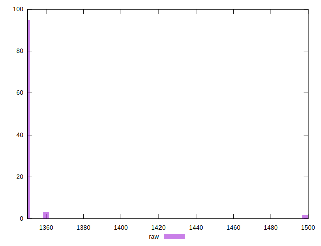
## Score


```yaml
p90min: 0.43
p90max: 0.43
p90range: 0
p90mean: 0.42999999999999977
p90median: 0.43
p90stdev: 2.220446049250313e-16
p90skewness: 1
p90eccentricity: 1
p90discretization: 94
outlandishness: 0.9981404002163334
confidence: 0.0010975798313424317
p90confidence: 8.977478740653372e-17

```

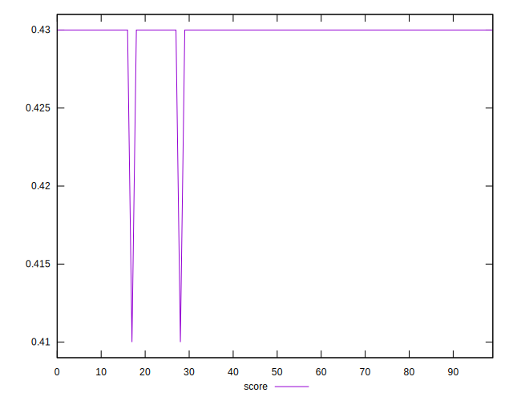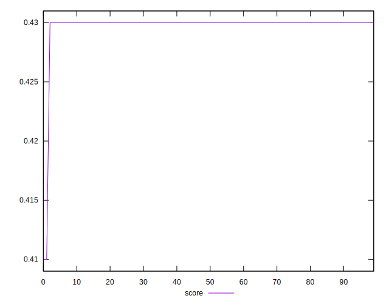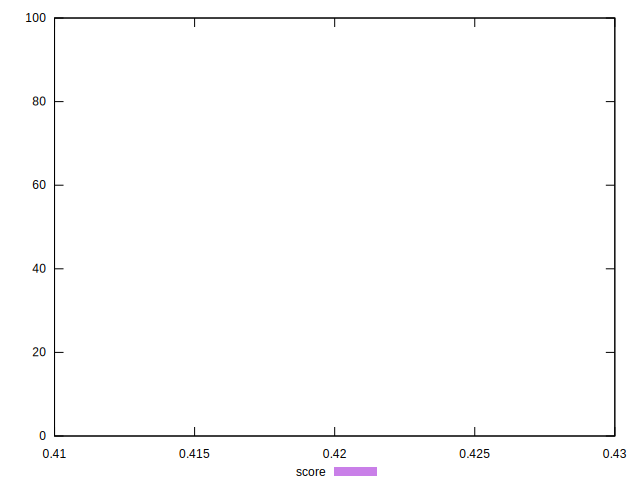
## Raw Estimate

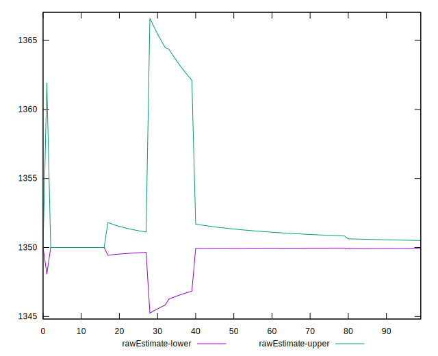
## Score Estimate

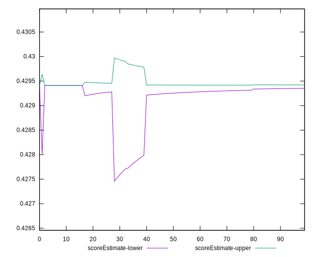
## P Score


```yaml
p90min: 0.42823529411764705
p90max: 0.4294117647058824
p90range: 0.0011764705882353343
p90mean: 0.42938673341677114
p90median: 0.4294117647058824
p90stdev: 0.00016977046265645804
p90skewness: -6.634888026972937
p90eccentricity: 0.9999999999999979
p90discretization: 47
outlandishness: 0.9983089817843092
confidence: 0.0009696708275252008
p90confidence: 0.00006863984467462396

```

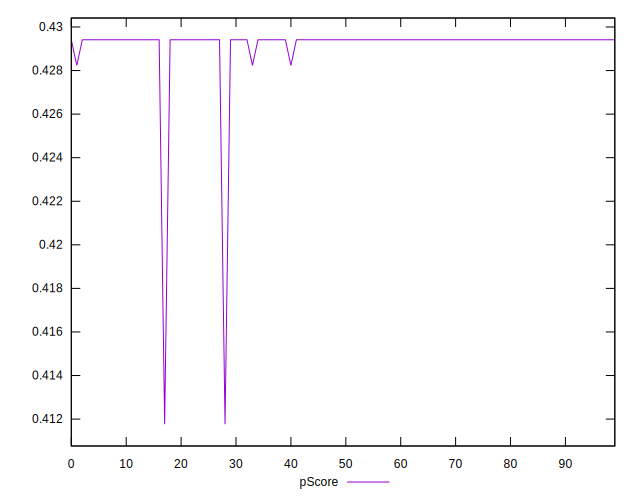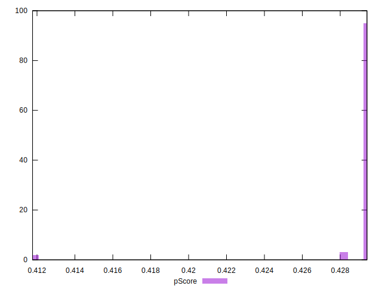
## Score Difference


```yaml
p90min: 0
p90max: 0
p90range: 0
p90mean: 0
p90median: 0
p90stdev: 0
p90skewness: .nan
p90eccentricity: .nan
p90discretization: 94
outlandishness: .inf
confidence: 3.0463960003014052e-18
p90confidence: 0

```

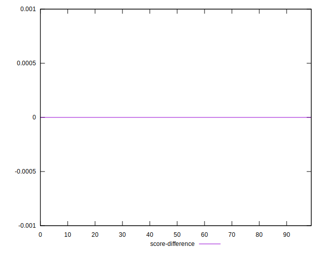
## P Score Difference


```yaml
p90min: -0.0005882352941176117
p90max: -0.0005882352941176117
p90range: 0
p90mean: -0.0005882352941176117
p90median: -0.0005882352941176117
p90stdev: 0
p90skewness: .nan
p90eccentricity: .nan
p90discretization: 94
outlandishness: 0.9604000000000039
confidence: 0.00015288258142604014
p90confidence: 0

```

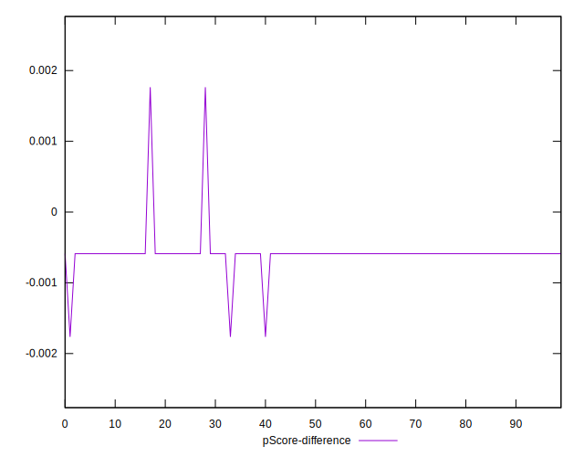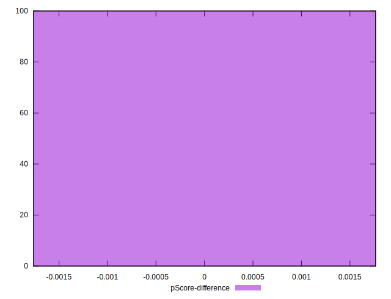