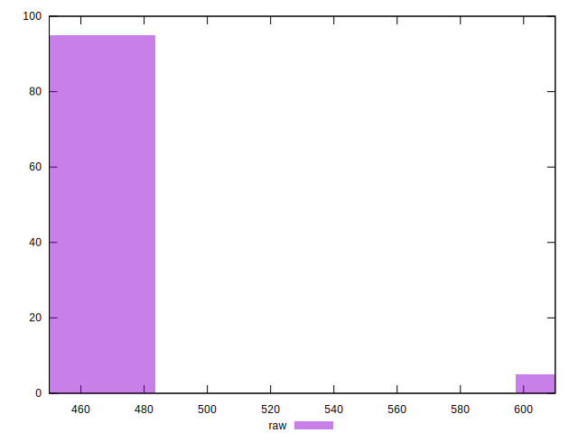
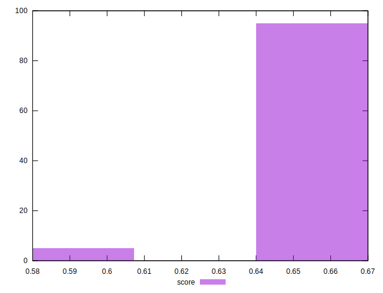
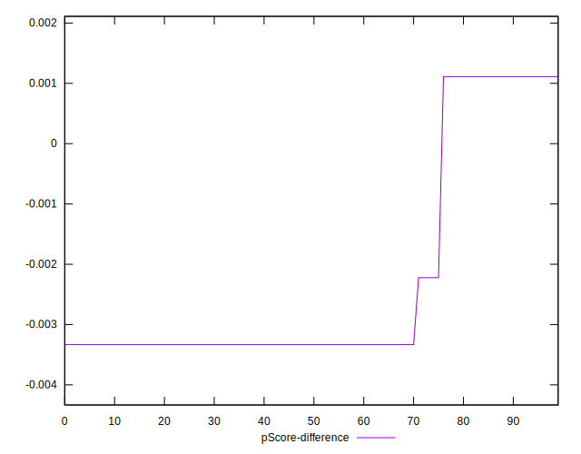

# //uses-webp-images/samples/pages+cached+noadtech

[→ Parent](../..)


## Raw


```yaml
p90min: 450
p90max: 610
p90range: 160
p90mean: 455.9574468085106
p90median: 450
p90stdev: 23.124047947563483
p90skewness: 6.278733985590541
p90eccentricity: 0.9999999999999967
p90discretization: 31.333333333333332
outlandishness: 1.0195816337644685
confidence: 13.555471391491878
p90confidence: 9.349276867915377

```


## Score


```yaml
p90min: 0.58
p90max: 0.67
p90range: 0.09000000000000008
p90mean: 0.6655319148936176
p90median: 0.67
p90stdev: 0.013338236611623394
p90skewness: -5.601391467591707
p90eccentricity: 1.000000000000001
p90discretization: 31.333333333333332
outlandishness: 0.9927051682456448
confidence: 0.007655309215504066
p90confidence: 0.00539277843112119

```


## Raw Estimate


## Score Estimate


## P Score


```yaml
p90min: 0.5777777777777777
p90max: 0.6666666666666666
p90range: 0.0888888888888889
p90mean: 0.6633569739952712
p90median: 0.6666666666666666
p90stdev: 0.012846693304201913
p90skewness: -6.278733985590426
p90eccentricity: 1.0000000000000016
p90discretization: 31.333333333333332
outlandishness: 0.9925726454207441
confidence: 0.007530817439717709
p90confidence: 0.005194042704397423

```


## Score Difference


```yaml
p90min: 0
p90max: 0
p90range: 0
p90mean: 0
p90median: 0
p90stdev: 0
p90skewness: .nan
p90eccentricity: .nan
p90discretization: 94
outlandishness: .nan
confidence: 0
p90confidence: 0

```


## P Score Difference


```yaml
p90min: -0.0033333333333334103
p90max: 0.0011111111111110628
p90range: 0.004444444444444473
p90mean: -0.0022813238770686252
p90median: -0.0033333333333334103
p90stdev: 0.0018362647334123933
p90skewness: 1.272677301384219
p90eccentricity: 1.0000000000000007
p90discretization: 31.333333333333332
outlandishness: 0.9393928320223375
confidence: 0.0007378514912810642
p90confidence: 0.0007424196418547126

```

