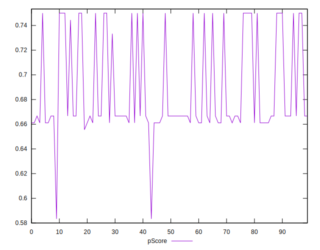

# //uses-webp-images/samples/pages+cached

[→ Parent](../..)


## Raw


```yaml
p90min: 300
p90max: 460
p90range: 160
p90mean: 410.21276595744683
p90median: 450
p90stdev: 69.22025781770448
p90skewness: -0.9346616396709674
p90eccentricity: 1.0000000000000002
p90discretization: 18.8
outlandishness: 1.0053078545748608
confidence: 29.395042984147846
p90confidence: 27.986421610684836

```


## Score


```yaml
p90min: 0.66
p90max: 0.75
p90range: 0.08999999999999997
p90mean: 0.6897872340425533
p90median: 0.67
p90stdev: 0.03781192886761934
p90skewness: 0.9102718930189838
p90eccentricity: 0.9999999999999991
p90discretization: 18.8
outlandishness: 0.9980083954486175
confidence: 0.016172684118596185
p90confidence: 0.015287729583286216

```


## Raw Estimate


## Score Estimate


## P Score


```yaml
p90min: 0.6611111111111111
p90max: 0.75
p90range: 0.0888888888888889
p90mean: 0.6887706855791961
p90median: 0.6666666666666666
p90stdev: 0.038455698787613624
p90skewness: 0.934661639670994
p90eccentricity: 0.9999999999999988
p90discretization: 18.8
outlandishness: 0.9982468648061317
confidence: 0.016330579435637694
p90confidence: 0.015548012005936031

```


## Score Difference


```yaml
p90min: 0
p90max: 0
p90range: 0
p90mean: 0
p90median: 0
p90stdev: 0
p90skewness: .nan
p90eccentricity: .nan
p90discretization: 94
outlandishness: .nan
confidence: 0
p90confidence: 0

```


## P Score Difference


```yaml
p90min: -0.0033333333333334103
p90max: 0.0033333333333332993
p90range: 0.00666666666666671
p90mean: -0.000992907801418485
p90median: 0
p90stdev: 0.001994661150414947
p90skewness: -0.17063239182644027
p90eccentricity: 1.0000000000000009
p90discretization: 23.5
outlandishness: 0.8835999999999999
confidence: 0.0008439288775958648
p90confidence: 0.000806460849553328

```

