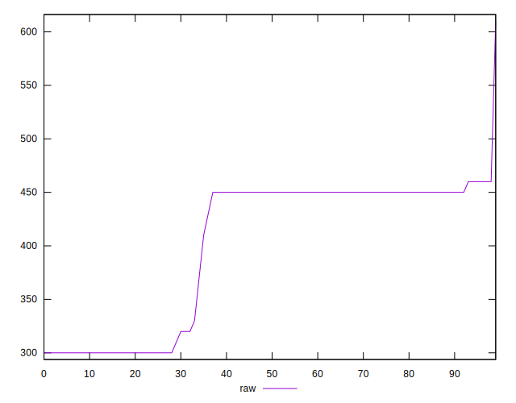
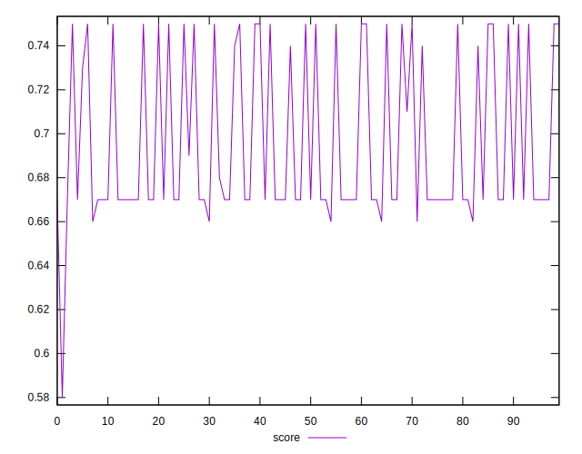
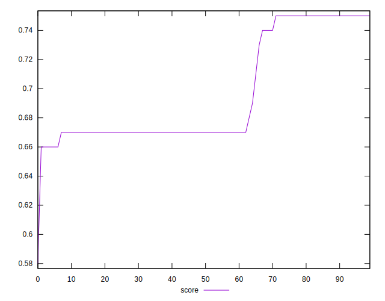

# //uses-webp-images/samples/pages

[→ Parent](../..)


## Raw


```yaml
p90min: 300
p90max: 460
p90range: 160
p90mean: 400.531914893617
p90median: 450
p90stdev: 69.07237988002605
p90skewness: -0.6927260989248066
p90eccentricity: 0.9999999999999994
p90discretization: 10.444444444444445
outlandishness: 1.0013390934112159
confidence: 28.530398033250265
p90confidence: 27.926633126196865

```


## Score


```yaml
p90min: 0.66
p90max: 0.75
p90range: 0.08999999999999997
p90mean: 0.6960638297872347
p90median: 0.67
p90stdev: 0.036936347925839746
p90skewness: 0.6918306667718133
p90eccentricity: 0.9999999999999992
p90discretization: 11.75
outlandishness: 0.9992420816134711
confidence: 0.015334686068958133
p90confidence: 0.014933723716167694

```


## Raw Estimate


## Score Estimate


## P Score


```yaml
p90min: 0.6611111111111111
p90max: 0.75
p90range: 0.0888888888888889
p90mean: 0.6941489361702121
p90median: 0.6666666666666666
p90stdev: 0.03837354437779231
p90skewness: 0.6927260989248364
p90eccentricity: 0.9999999999999978
p90discretization: 10.444444444444445
outlandishness: 0.999570927261785
confidence: 0.015850221129583474
p90confidence: 0.015514796181220506

```


## Score Difference


```yaml
p90min: 0
p90max: 0
p90range: 0
p90mean: 0
p90median: 0
p90stdev: 0
p90skewness: .nan
p90eccentricity: .nan
p90discretization: 94
outlandishness: .inf
confidence: 4.330179641073934e-18
p90confidence: 0

```


## P Score Difference


```yaml
p90min: -0.0033333333333334103
p90max: 0.0011111111111110628
p90range: 0.004444444444444473
p90mean: -0.0019030732860520541
p90median: -0.0033333333333334103
p90stdev: 0.0016969072163828646
p90skewness: 0.4594777042939716
p90eccentricity: 0.9999999999999997
p90discretization: 18.8
outlandishness: 0.8946104857065714
confidence: 0.0007360109301514792
p90confidence: 0.0006860760460756018

```

