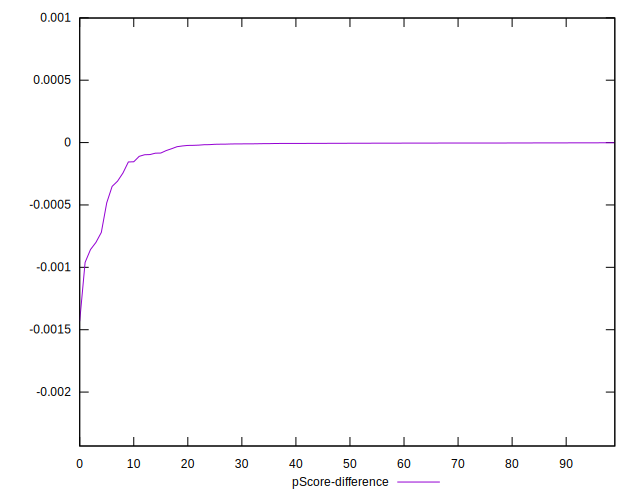

# //bootup-time/samples/pages+cached+noadtech+nomedia+nocss

[→ Parent](../..)


## Raw


```yaml
p90min: 93.02400000000003
p90max: 295.10799999999995
p90range: 202.08399999999992
p90mean: 128.79957446808504
p90median: 111.84400000000001
p90stdev: 43.197374665964226
p90skewness: 2.150138625973893
p90eccentricity: 1.0000000000000002
p90discretization: 1
outlandishness: 1.070629801857465
confidence: 20.842516485953805
p90confidence: 17.465117553595416

```


## Score


```yaml
p90min: 1
p90max: 1
p90range: 0
p90mean: 1
p90median: 1
p90stdev: 0
p90skewness: .nan
p90eccentricity: .nan
p90discretization: 94
outlandishness: 1
confidence: 0
p90confidence: 0

```


## Raw Estimate


## Score Estimate


## P Score


```yaml
p90min: 0.9991996475826683
p90max: 0.9999981602962282
p90range: 0.0007985127135599068
p90mean: 0.9999537676629231
p90median: 0.9999944263070266
p90stdev: 0.00012949234312799698
p90skewness: -4.265725539662856
p90eccentricity: 1
p90discretization: 1.010752688172043
outlandishness: 0.9999404516230398
confidence: 0.00008683956380717289
p90confidence: 0.00005235501028730165

```


## Score Difference


```yaml
p90min: 0
p90max: 0
p90range: 0
p90mean: 0
p90median: 0
p90stdev: 0
p90skewness: .nan
p90eccentricity: .nan
p90discretization: 94
outlandishness: .nan
confidence: 0
p90confidence: 0

```


## P Score Difference


```yaml
p90min: -0.0008003524173316734
p90max: -0.0000018397037717665654
p90range: 0.0007985127135599068
p90mean: -0.00004623233707708558
p90median: -0.000005573692973326327
p90stdev: 0.000129492343127997
p90skewness: -4.265725539668877
p90eccentricity: 0.9999999999999996
p90discretization: 1.010752688172043
outlandishness: 2.702709694269468
confidence: 0.00008683956380717289
p90confidence: 0.000052355010287301666

```

