# //bootup-time/samples/pages+cached+noadtech+nomedia

[→ Parent](../..)


## Raw


```yaml
p90min: 92.44
p90max: 251.88799999999998
p90range: 159.44799999999998
p90mean: 133.164
p90median: 117.088
p90stdev: 39.266234559868835
p90skewness: 1.3732662740632546
p90eccentricity: 1.0000000000000007
p90discretization: 1
outlandishness: 1.058433717013723
confidence: 19.08716182276824
p90confidence: 15.875719480135503

```

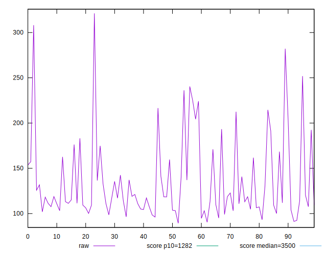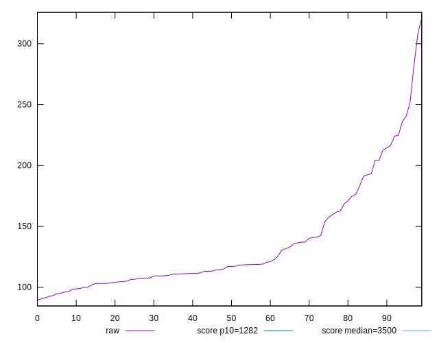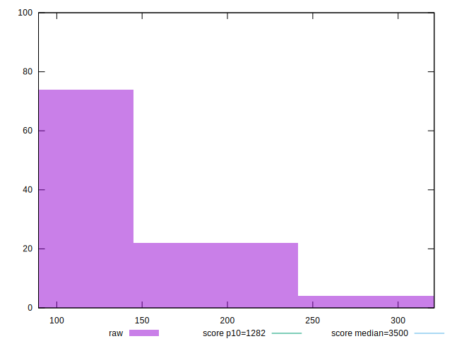
## Score


```yaml
p90min: 1
p90max: 1
p90range: 0
p90mean: 1
p90median: 1
p90stdev: 0
p90skewness: .nan
p90eccentricity: .nan
p90discretization: 94
outlandishness: 1
confidence: 0
p90confidence: 0

```


## Raw Estimate

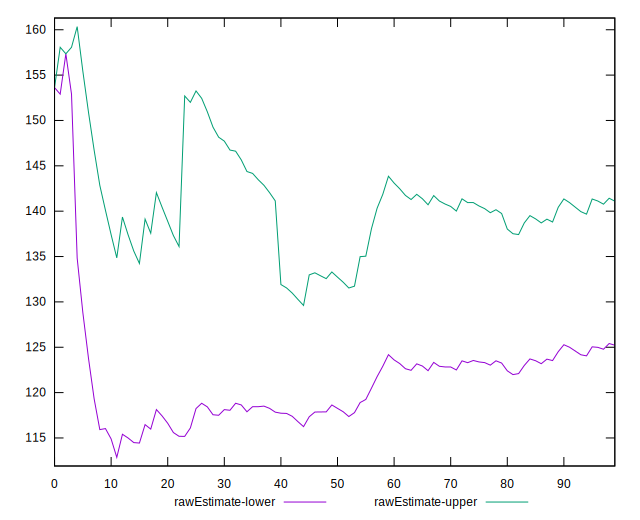
## Score Estimate

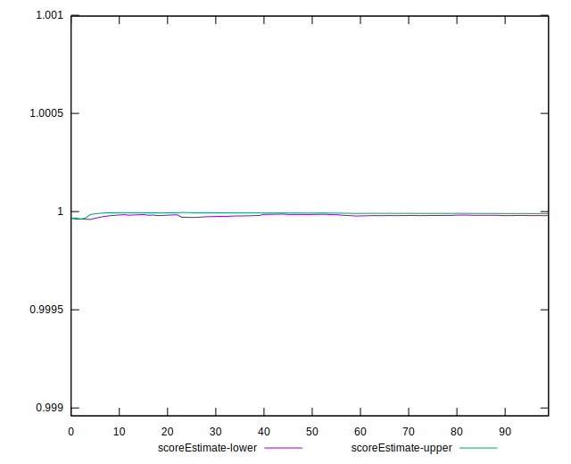
## P Score


```yaml
p90min: 0.9996072143071786
p90max: 0.9999982303486039
p90range: 0.0003910160414253294
p90mean: 0.999961141562337
p90median: 0.9999927186953094
p90stdev: 0.00007399614498207877
p90skewness: -2.7694373073720504
p90eccentricity: 1.0000000000000007
p90discretization: 1
outlandishness: 0.9999490878312554
confidence: 0.00006714192186829512
p90confidence: 0.00002991735911310267

```

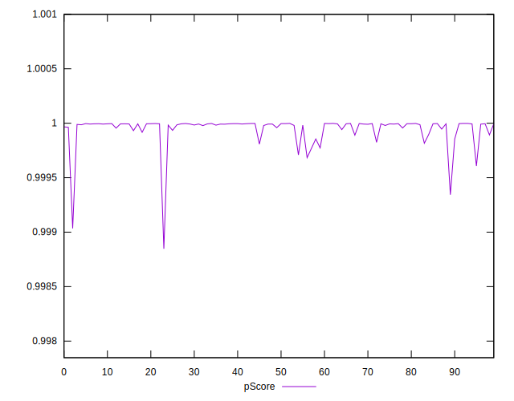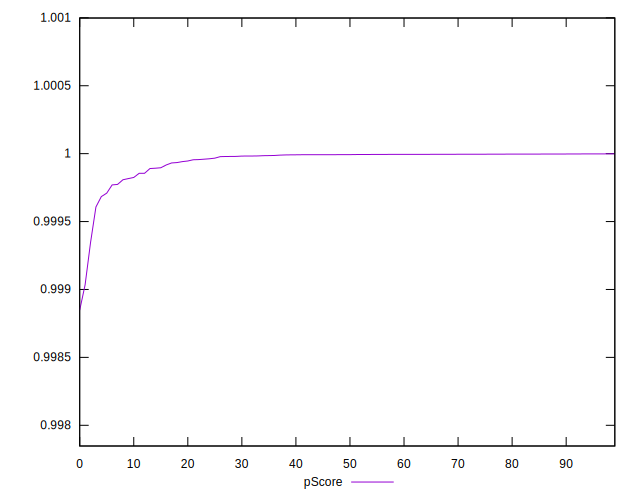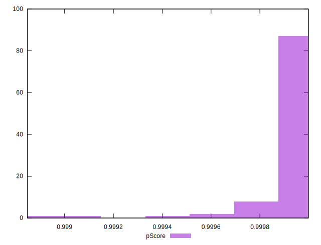
## Score Difference


```yaml
p90min: 0
p90max: 0
p90range: 0
p90mean: 0
p90median: 0
p90stdev: 0
p90skewness: .nan
p90eccentricity: .nan
p90discretization: 94
outlandishness: .nan
confidence: 0
p90confidence: 0

```


## P Score Difference


```yaml
p90min: -0.00039278569282141795
p90max: -0.000001769651396088534
p90range: 0.0003910160414253294
p90mean: -0.000038858437662818286
p90median: -0.000007281304690631707
p90stdev: 0.00007399614498207877
p90skewness: -2.769437307372338
p90eccentricity: 1.0000000000000007
p90discretization: 1
outlandishness: 2.7392926896155023
confidence: 0.00006714192186829513
p90confidence: 0.00002991735911310267

```

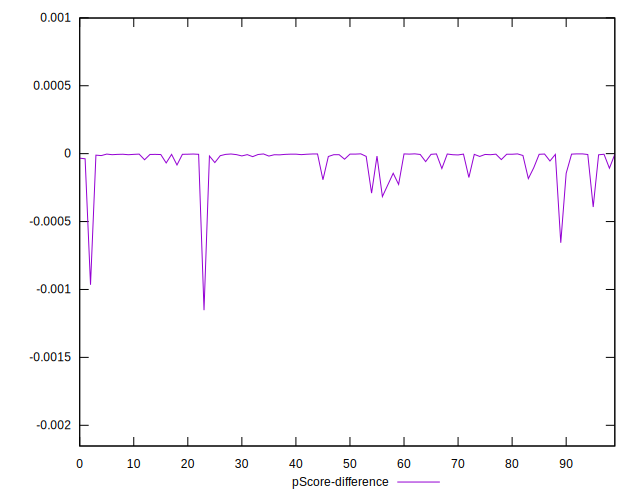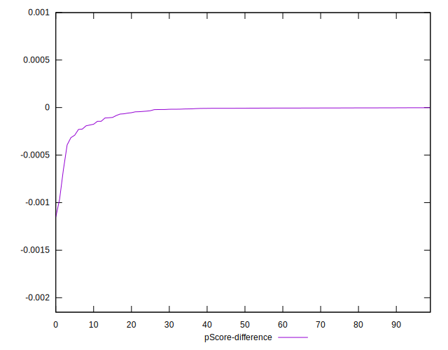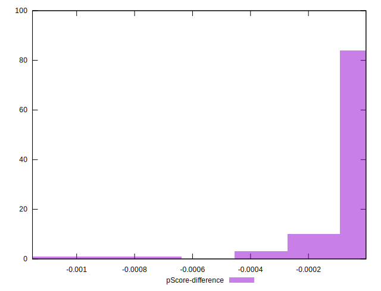