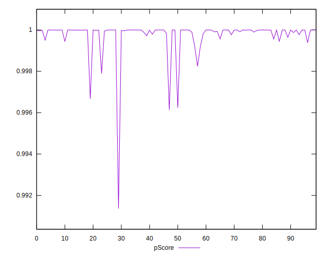

# //bootup-time/samples/pages+cached+noadtech

[→ Parent](../..)


## Raw


```yaml
p90min: 92.832
p90max: 417.576
p90range: 324.744
p90mean: 149.61944680851062
p90median: 114.30399999999996
p90stdev: 69.52159352188096
p90skewness: 1.6941147448129574
p90eccentricity: 0.9999999999999997
p90discretization: 1
outlandishness: 1.1075819730443668
confidence: 34.44071989877181
p90confidence: 28.10825455857193

```


## Score


```yaml
p90min: 1
p90max: 1
p90range: 0
p90mean: 1
p90median: 1
p90stdev: 0
p90skewness: .nan
p90eccentricity: .nan
p90discretization: 94
outlandishness: 0.9998000099999999
confidence: 0.00039002790835975795
p90confidence: 0

```


## Raw Estimate


## Score Estimate


## P Score


```yaml
p90min: 0.9966647518207148
p90max: 0.9999981835664751
p90range: 0.0033334317457602847
p90mean: 0.999841863361379
p90median: 0.9999936694115511
p90stdev: 0.00045770048280578446
p90skewness: -4.891812985340063
p90eccentricity: 0.9999999999999992
p90discretization: 1.010752688172043
outlandishness: 0.9996935616156993
confidence: 0.0004222106749273298
p90confidence: 0.00018505274448631751

```


## Score Difference


```yaml
p90min: 0
p90max: 0
p90range: 0
p90mean: 0
p90median: 0
p90stdev: 0
p90skewness: .nan
p90eccentricity: .nan
p90discretization: 94
outlandishness: .nan
confidence: 0
p90confidence: 0

```


## P Score Difference


```yaml
p90min: -0.0021009372204838783
p90max: -0.0000017564629675170806
p90range: 0.0020991807575163612
p90mean: -0.00012267396078776126
p90median: -0.000006222039115655331
p90stdev: 0.00031797626833401574
p90skewness: -4.312134153823876
p90eccentricity: 1.0000000000000009
p90discretization: 1.010752688172043
outlandishness: 2.9680578036690735
confidence: 0.0002731558346279215
p90confidence: 0.00012856088937466967

```

