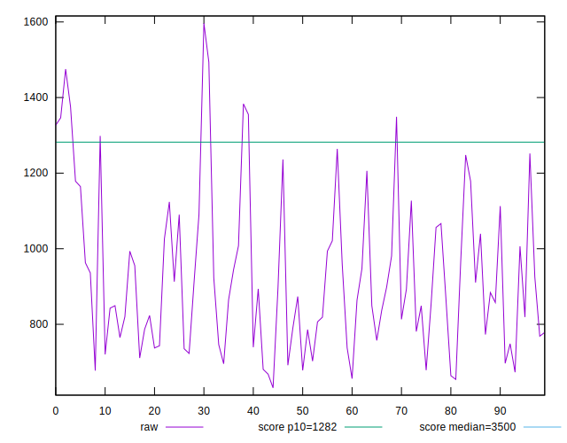
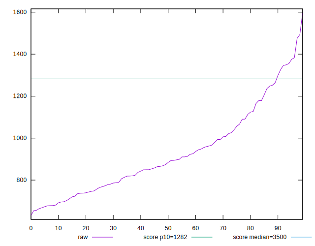
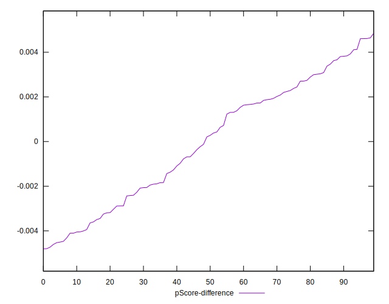

# //bootup-time/samples/pages+cached

[→ Parent](../..)


## Raw


```yaml
p90min: 664.0720000000001
p90max: 1383.307999999999
p90range: 719.235999999999
p90mean: 923.0362978723404
p90median: 878.8220000000003
p90stdev: 194.63996573727877
p90skewness: 0.7715919672403616
p90eccentricity: 0.9999999999999997
p90discretization: 1
outlandishness: 1.021120280183815
confidence: 86.45373227059683
p90confidence: 78.6948259822789

```


## Score


```yaml
p90min: 0.88
p90max: 0.98
p90range: 0.09999999999999998
p90mean: 0.952765957446808
p90median: 0.96
p90stdev: 0.026872601538462867
p90skewness: -1.1113517925632348
p90eccentricity: 1
p90discretization: 8.545454545454545
outlandishness: 0.995667944385344
confidence: 0.012411447751707402
p90confidence: 0.010864853442354603

```


## Raw Estimate


## Score Estimate


## P Score


```yaml
p90min: 0.8818928828706076
p90max: 0.9830347075176629
p90range: 0.10114182464705523
p90mean: 0.952604127598185
p90median: 0.9610782315876956
p90stdev: 0.02711572986652555
p90skewness: -1.0966372681323042
p90eccentricity: 0.9999999999999997
p90discretization: 1
outlandishness: 0.9959172826679168
confidence: 0.012400614787544895
p90confidence: 0.01096315258351907

```


## Score Difference


```yaml
p90min: 0
p90max: 1.1102230246251565e-16
p90range: 1.1102230246251565e-16
p90mean: 1.6535236536970416e-17
p90median: 0
p90stdev: 3.952677554219679e-17
p90skewness: 1.9721272054017525
p90eccentricity: 1.0000000000000002
p90discretization: 47
outlandishness: 1.3028591836734695
confidence: 1.6347517967638273e-17
p90confidence: 1.5981058726306692e-17

```


## P Score Difference


```yaml
p90min: -0.00460796823116949
p90max: 0.0046093450720053886
p90range: 0.009217313303174879
p90mean: -0.000042788875576310495
p90median: 0.00024373384557818678
p90stdev: 0.002741656836574828
p90skewness: -0.09089247780575803
p90eccentricity: 1.0000000000000007
p90discretization: 1
outlandishness: 0.9850569895934378
confidence: 0.0011370550021988538
p90confidence: 0.0011084784506620916

```

