# //bootup-time/samples/pages

[→ Parent](../..)


## Raw


```yaml
p90min: 654.0040000000004
p90max: 1266.7599999999993
p90range: 612.755999999999
p90mean: 932.0610212765957
p90median: 927.6079999999993
p90stdev: 168.99003594238317
p90skewness: 0.206895829114398
p90eccentricity: 1.0000000000000002
p90discretization: 1
outlandishness: 1.0071977111749477
confidence: 73.31362870683861
p90confidence: 68.3243105846779

```

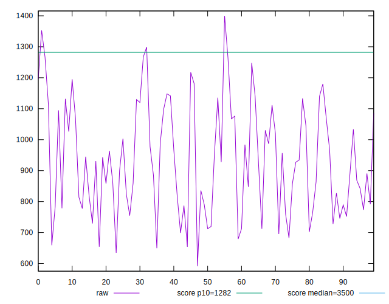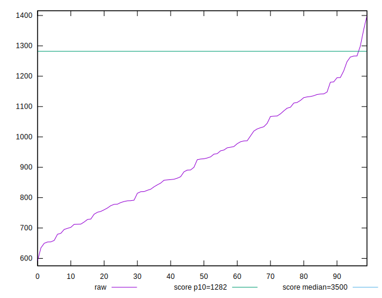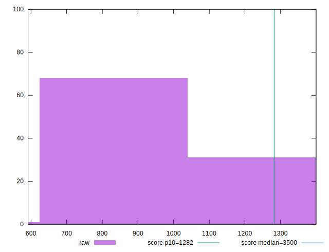
## Score


```yaml
p90min: 0.9
p90max: 0.98
p90range: 0.07999999999999996
p90mean: 0.9513829787234042
p90median: 0.95
p90stdev: 0.022719429487414268
p90skewness: -0.497623381879902
p90eccentricity: 1
p90discretization: 10.444444444444445
outlandishness: 0.9983546972164549
confidence: 0.009898419676751232
p90confidence: 0.009185685700037556

```

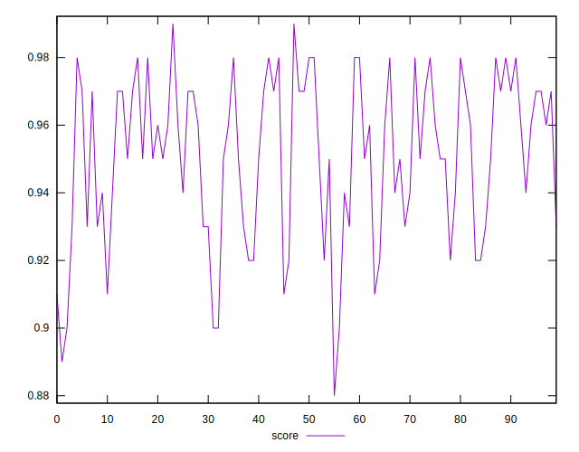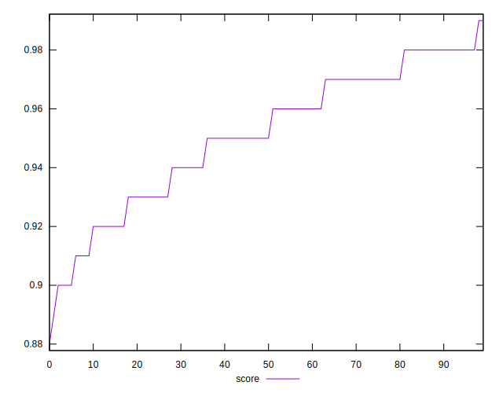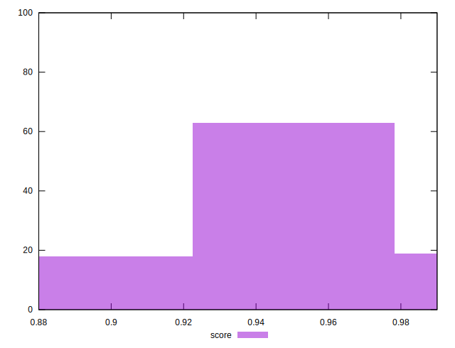
## Raw Estimate

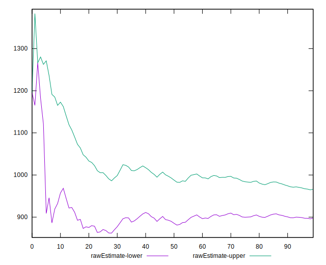
## Score Estimate

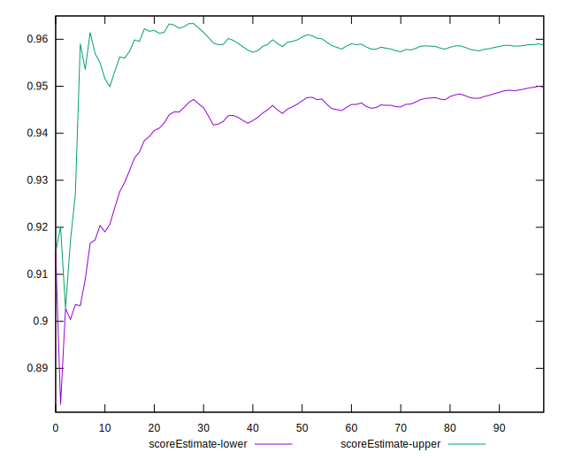
## P Score


```yaml
p90min: 0.9026518641936322
p90max: 0.9838383453640132
p90range: 0.08118648117038096
p90mean: 0.9520476366508206
p90median: 0.9549079570474721
p90stdev: 0.02243719691917258
p90skewness: -0.4744731485604797
p90eccentricity: 0.9999999999999994
p90discretization: 1
outlandishness: 0.9980873759407961
confidence: 0.009858728835627766
p90confidence: 0.009071576335292342

```

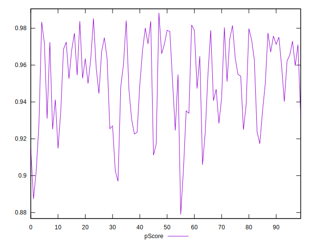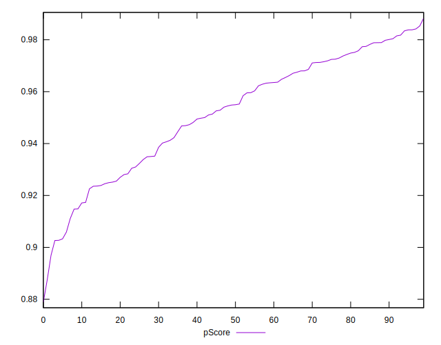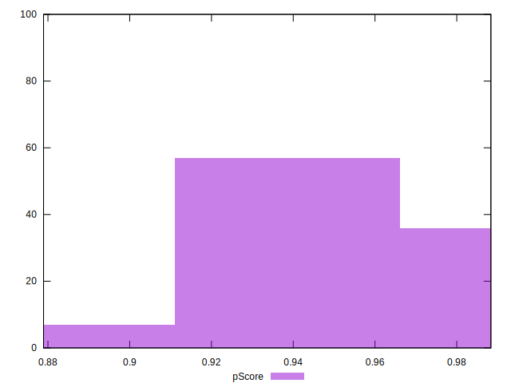
## Score Difference


```yaml
p90min: 0
p90max: 1.1102230246251565e-16
p90range: 1.1102230246251565e-16
p90mean: 2.362176648138631e-17
p90median: 0
p90stdev: 4.5437375048458033e-17
p90skewness: 1.4036631612571036
p90eccentricity: 1.0000000000000024
p90discretization: 47
outlandishness: 1.168561
confidence: 1.8314606713280823e-17
p90confidence: 1.8370771434250753e-17

```

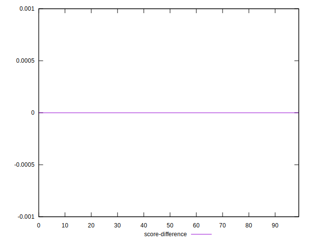
## P Score Difference


```yaml
p90min: -0.004835932992150571
p90max: 0.004866763660213991
p90range: 0.009702696652364562
p90mean: 0.0005697870777279389
p90median: 0.0009956813571874168
p90stdev: 0.00284851901246852
p90skewness: -0.20386792983923785
p90eccentricity: 1
p90discretization: 1
outlandishness: 0.8873866819032441
confidence: 0.0011821921882477964
p90confidence: 0.0011516838648440522

```

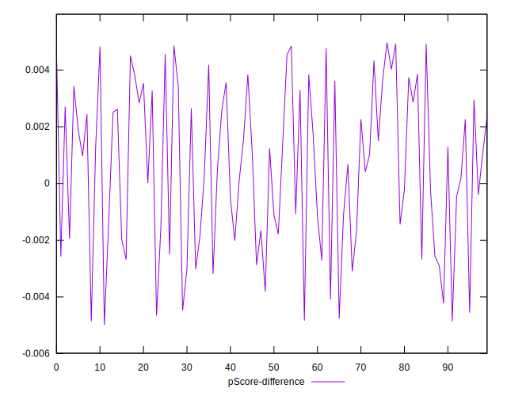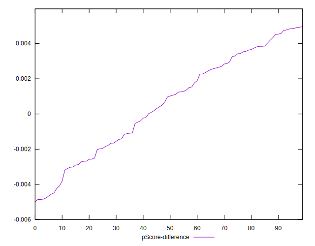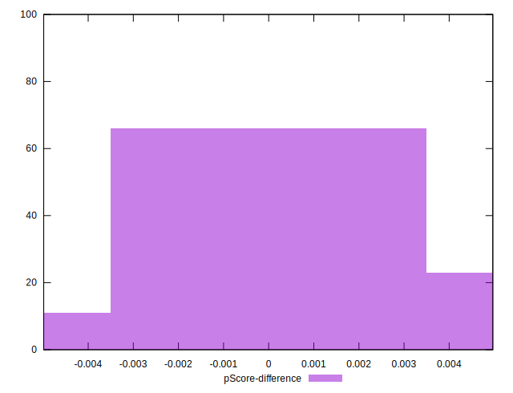