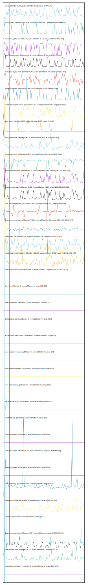

# //correlation/pages+cached+noadtech+nomedia

[→ Parent](../..)

[0. score, p90stdev=0.021, score:p90stdev=0.021, range=[0.47:0.71]](../../meta/score/samples/pages+cached+noadtech+nomedia)  
[1. first-cpu-idle, p90stdev=1832.809, score:p90stdev=0.197, range=[1903.336:6440.374]](../../first-cpu-idle/samples/pages+cached+noadtech+nomedia/)  
[2. interactive, p90stdev=1001.672, score:p90stdev=0.112, range=[3654.02:7062.219]](../../interactive/samples/pages+cached+noadtech+nomedia/)  
[3. uses-rel-preconnect, p90stdev=96.54, score:p90stdev=0.08, range=[0:415.898]](../../uses-rel-preconnect/samples/pages+cached+noadtech+nomedia/)  
[4. cumulative-layout-shift, p90stdev=0.368, score:p90stdev=0.079, range=[0.416:1.768]](../../cumulative-layout-shift/samples/pages+cached+noadtech+nomedia/)  
[5. unused-css-rules, p90stdev=65.406, score:p90stdev=0.052, range=[0:300]](../../unused-css-rules/samples/pages+cached+noadtech+nomedia/)  
[6. render-blocking-resources, p90stdev=63.05, score:p90stdev=0.035, range=[317:1267]](../../render-blocking-resources/samples/pages+cached+noadtech+nomedia/)  
[7. uses-http2, p90stdev=39.38, score:p90stdev=0.032, range=[0:1040]](../../uses-http2/samples/pages+cached+noadtech+nomedia/)  
[8. max-potential-fid, p90stdev=15.719, score:p90stdev=0.025, range=[66:202]](../../max-potential-fid/samples/pages+cached+noadtech+nomedia/)  
[9. unused-javascript, p90stdev=68.423, score:p90stdev=0.009, range=[1050:2300]](../../unused-javascript/samples/pages+cached+noadtech+nomedia/)  
[10. first-meaningful-paint, p90stdev=66.19, score:p90stdev=0.009, range=[1903.336:3404.819]](../../first-meaningful-paint/samples/pages+cached+noadtech+nomedia/)  
[11. first-contentful-paint, p90stdev=66.19, score:p90stdev=0.009, range=[1903.336:3404.819]](../../first-contentful-paint/samples/pages+cached+noadtech+nomedia/)  
[12. uses-text-compression, p90stdev=44.264, score:p90stdev=0.007, range=[1350:2750]](../../uses-text-compression/samples/pages+cached+noadtech+nomedia/)  
[13. largest-contentful-paint, p90stdev=97.198, score:p90stdev=0.006, range=[6834.801:10438.917]](../../largest-contentful-paint/samples/pages+cached+noadtech+nomedia/)  
[14. speed-index, p90stdev=66.19, score:p90stdev=0.004, range=[1903.336:7203.26]](../../speed-index/samples/pages+cached+noadtech+nomedia/)  
[15. mainthread-work-breakdown, p90stdev=133.297, score:p90stdev=0.003, range=[572.892:1530.408]](../../mainthread-work-breakdown/samples/pages+cached+noadtech+nomedia/)  
[16. uses-long-cache-ttl, p90stdev=0.546, score:p90stdev=0, range=[570855.733:571115.25]](../../uses-long-cache-ttl/samples/pages+cached+noadtech+nomedia/)  
[17. uses-passive-event-listeners, p90stdev=NaN, score:p90stdev=0, range=[NaN:NaN]](../../uses-passive-event-listeners/samples/pages+cached+noadtech+nomedia/)  
[18. no-document-write, p90stdev=NaN, score:p90stdev=0, range=[NaN:NaN]](../../no-document-write/samples/pages+cached+noadtech+nomedia/)  
[19. dom-size, p90stdev=0, score:p90stdev=0, range=[110:110]](../../dom-size/samples/pages+cached+noadtech+nomedia/)  
[20. legacy-javascript, p90stdev=0, score:p90stdev=0, range=[0:0]](../../legacy-javascript/samples/pages+cached+noadtech+nomedia/)  
[21. duplicated-javascript, p90stdev=0, score:p90stdev=0, range=[0:0]](../../duplicated-javascript/samples/pages+cached+noadtech+nomedia/)  
[22. efficient-animated-content, p90stdev=0, score:p90stdev=0, range=[0:0]](../../efficient-animated-content/samples/pages+cached+noadtech+nomedia/)  
[23. uses-responsive-images, p90stdev=0, score:p90stdev=0, range=[0:0]](../../uses-responsive-images/samples/pages+cached+noadtech+nomedia/)  
[24. uses-optimized-images, p90stdev=0, score:p90stdev=0, range=[0:0]](../../uses-optimized-images/samples/pages+cached+noadtech+nomedia/)  
[25. uses-webp-images, p90stdev=0, score:p90stdev=0, range=[0:0]](../../uses-webp-images/samples/pages+cached+noadtech+nomedia/)  
[26. unminified-javascript, p90stdev=0, score:p90stdev=0, range=[0:150]](../../unminified-javascript/samples/pages+cached+noadtech+nomedia/)  
[27. unminified-css, p90stdev=0, score:p90stdev=0, range=[0:0]](../../unminified-css/samples/pages+cached+noadtech+nomedia/)  
[28. offscreen-images, p90stdev=0, score:p90stdev=0, range=[0:0]](../../offscreen-images/samples/pages+cached+noadtech+nomedia/)  
[29. total-byte-weight, p90stdev=0.681, score:p90stdev=0, range=[825183:826485]](../../total-byte-weight/samples/pages+cached+noadtech+nomedia/)  
[30. preload-lcp-image, p90stdev=0, score:p90stdev=0, range=[0:0]](../../preload-lcp-image/samples/pages+cached+noadtech+nomedia/)  
[31. unsized-images, p90stdev=NaN, score:p90stdev=0, range=[NaN:NaN]](../../unsized-images/samples/pages+cached+noadtech+nomedia/)  
[32. third-party-summary, p90stdev=NaN, score:p90stdev=0, range=[NaN:NaN]](../../third-party-summary/samples/pages+cached+noadtech+nomedia/)  
[33. font-display, p90stdev=NaN, score:p90stdev=0, range=[NaN:NaN]](../../font-display/samples/pages+cached+noadtech+nomedia/)  
[34. uses-rel-preload, p90stdev=3.998, score:p90stdev=0, range=[0:909]](../../uses-rel-preload/samples/pages+cached+noadtech+nomedia/)  
[35. bootup-time, p90stdev=39.266, score:p90stdev=0, range=[89.3:321.156]](../../bootup-time/samples/pages+cached+noadtech+nomedia/)  
[36. redirects, p90stdev=0, score:p90stdev=0, range=[0:0]](../../redirects/samples/pages+cached+noadtech+nomedia/)  
[37. server-response-time, p90stdev=6.507, score:p90stdev=0, range=[1.768:319.091]](../../server-response-time/samples/pages+cached+noadtech+nomedia/)  
[38. total-blocking-time, p90stdev=15.211, score:p90stdev=0, range=[8:164.17]](../../total-blocking-time/samples/pages+cached+noadtech+nomedia/)  
[39. estimated-input-latency, p90stdev=0, score:p90stdev=0, range=[12.8:12.8]](../../estimated-input-latency/samples/pages+cached+noadtech+nomedia/)  
