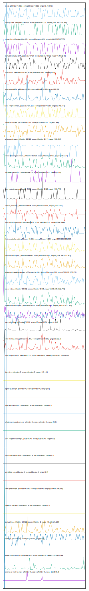

# //correlation/pages+cached+noadtech

[→ Parent](../..)

[0. score, p90stdev=0.022, score:p90stdev=0.022, range=[0.48:0.69]](../../meta/score/samples/pages+cached+noadtech)  
[1. first-cpu-idle, p90stdev=2047.459, score:p90stdev=0.221, range=[1898.205:7758.946]](../../first-cpu-idle/samples/pages+cached+noadtech/)  
[2. interactive, p90stdev=1063.051, score:p90stdev=0.126, range=[4198.083:7667.552]](../../interactive/samples/pages+cached+noadtech/)  
[3. cumulative-layout-shift, p90stdev=0.409, score:p90stdev=0.092, range=[0.401:1.75]](../../cumulative-layout-shift/samples/pages+cached+noadtech/)  
[4. uses-http2, p90stdev=113.141, score:p90stdev=0.091, range=[0:600]](../../uses-http2/samples/pages+cached+noadtech/)  
[5. max-potential-fid, p90stdev=35.084, score:p90stdev=0.085, range=[68:458]](../../max-potential-fid/samples/pages+cached+noadtech/)  
[6. uses-rel-preconnect, p90stdev=101.113, score:p90stdev=0.084, range=[0:391.564]](../../uses-rel-preconnect/samples/pages+cached+noadtech/)  
[7. unused-css-rules, p90stdev=84.333, score:p90stdev=0.071, range=[0:300]](../../unused-css-rules/samples/pages+cached+noadtech/)  
[8. offscreen-images, p90stdev=50.925, score:p90stdev=0.044, range=[150:450]](../../offscreen-images/samples/pages+cached+noadtech/)  
[9. render-blocking-resources, p90stdev=65.835, score:p90stdev=0.037, range=[315:1114]](../../render-blocking-resources/samples/pages+cached+noadtech/)  
[10. unminified-javascript, p90stdev=44.136, score:p90stdev=0.035, range=[0:300]](../../unminified-javascript/samples/pages+cached+noadtech/)  
[11. uses-webp-images, p90stdev=49.92, score:p90stdev=0.029, range=[450:770]](../../uses-webp-images/samples/pages+cached+noadtech/)  
[12. unused-javascript, p90stdev=92.638, score:p90stdev=0.011, range=[1840:2700]](../../unused-javascript/samples/pages+cached+noadtech/)  
[13. uses-text-compression, p90stdev=79.96, score:p90stdev=0.01, range=[2450:3300]](../../uses-text-compression/samples/pages+cached+noadtech/)  
[14. first-meaningful-paint, p90stdev=68.662, score:p90stdev=0.009, range=[1898.205:3181.562]](../../first-meaningful-paint/samples/pages+cached+noadtech/)  
[15. first-contentful-paint, p90stdev=68.662, score:p90stdev=0.009, range=[1898.205:3181.562]](../../first-contentful-paint/samples/pages+cached+noadtech/)  
[16. mainthread-work-breakdown, p90stdev=190.194, score:p90stdev=0.005, range=[596.616:1833.252]](../../mainthread-work-breakdown/samples/pages+cached+noadtech/)  
[17. speed-index, p90stdev=68.662, score:p90stdev=0.005, range=[1898.205:6822.778]](../../speed-index/samples/pages+cached+noadtech/)  
[18. largest-contentful-paint, p90stdev=76.999, score:p90stdev=0.004, range=[7661.58:9727.379]](../../largest-contentful-paint/samples/pages+cached+noadtech/)  
[19. uses-rel-preload, p90stdev=26.119, score:p90stdev=0.004, range=[0:918]](../../uses-rel-preload/samples/pages+cached+noadtech/)  
[20. total-blocking-time, p90stdev=34.801, score:p90stdev=0.001, range=[9:222.5]](../../total-blocking-time/samples/pages+cached+noadtech/)  
[21. uses-long-cache-ttl, p90stdev=0.475, score:p90stdev=0, range=[784475.983:784854.483]](../../uses-long-cache-ttl/samples/pages+cached+noadtech/)  
[22. uses-passive-event-listeners, p90stdev=NaN, score:p90stdev=0, range=[NaN:NaN]](../../uses-passive-event-listeners/samples/pages+cached+noadtech/)  
[23. no-document-write, p90stdev=NaN, score:p90stdev=0, range=[NaN:NaN]](../../no-document-write/samples/pages+cached+noadtech/)  
[24. dom-size, p90stdev=0, score:p90stdev=0, range=[110:110]](../../dom-size/samples/pages+cached+noadtech/)  
[25. legacy-javascript, p90stdev=0, score:p90stdev=0, range=[0:0]](../../legacy-javascript/samples/pages+cached+noadtech/)  
[26. duplicated-javascript, p90stdev=0, score:p90stdev=0, range=[0:0]](../../duplicated-javascript/samples/pages+cached+noadtech/)  
[27. efficient-animated-content, p90stdev=0, score:p90stdev=0, range=[0:0]](../../efficient-animated-content/samples/pages+cached+noadtech/)  
[28. uses-responsive-images, p90stdev=0, score:p90stdev=0, range=[0:0]](../../uses-responsive-images/samples/pages+cached+noadtech/)  
[29. uses-optimized-images, p90stdev=0, score:p90stdev=0, range=[0:0]](../../uses-optimized-images/samples/pages+cached+noadtech/)  
[30. unminified-css, p90stdev=0, score:p90stdev=0, range=[0:0]](../../unminified-css/samples/pages+cached+noadtech/)  
[31. total-byte-weight, p90stdev=0.538, score:p90stdev=0, range=[1060906:1062334]](../../total-byte-weight/samples/pages+cached+noadtech/)  
[32. preload-lcp-image, p90stdev=0, score:p90stdev=0, range=[0:0]](../../preload-lcp-image/samples/pages+cached+noadtech/)  
[33. unsized-images, p90stdev=NaN, score:p90stdev=0, range=[NaN:NaN]](../../unsized-images/samples/pages+cached+noadtech/)  
[34. third-party-summary, p90stdev=NaN, score:p90stdev=0, range=[NaN:NaN]](../../third-party-summary/samples/pages+cached+noadtech/)  
[35. font-display, p90stdev=NaN, score:p90stdev=0, range=[NaN:NaN]](../../font-display/samples/pages+cached+noadtech/)  
[36. bootup-time, p90stdev=69.522, score:p90stdev=0, range=[91.132:541.632]](../../bootup-time/samples/pages+cached+noadtech/)  
[37. redirects, p90stdev=0, score:p90stdev=0, range=[0:0]](../../redirects/samples/pages+cached+noadtech/)  
[38. server-response-time, p90stdev=1.95, score:p90stdev=0, range=[1.773:252.729]](../../server-response-time/samples/pages+cached+noadtech/)  
[39. estimated-input-latency, p90stdev=0, score:p90stdev=0, range=[12.8:35.2]](../../estimated-input-latency/samples/pages+cached+noadtech/)  
