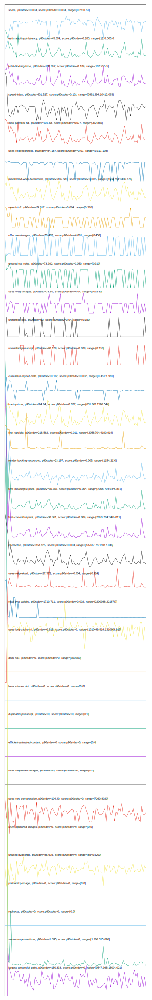

# //correlation/pages+cached

[→ Parent](../..)

[0. score, p90stdev=0.034, score:p90stdev=0.034, range=[0.24:0.51]](../../meta/score/samples/pages+cached)  
[1. estimated-input-latency, p90stdev=45.074, score:p90stdev=0.283, range=[12.8:305.6]](../../estimated-input-latency/samples/pages+cached/)  
[2. total-blocking-time, p90stdev=108.852, score:p90stdev=0.134, range=[187:755.5]](../../total-blocking-time/samples/pages+cached/)  
[3. speed-index, p90stdev=601.527, score:p90stdev=0.102, range=[3981.394:10412.083]](../../speed-index/samples/pages+cached/)  
[4. max-potential-fid, p90stdev=101.68, score:p90stdev=0.077, range=[312:866]](../../max-potential-fid/samples/pages+cached/)  
[5. uses-rel-preconnect, p90stdev=84.187, score:p90stdev=0.07, range=[0:317.198]](../../uses-rel-preconnect/samples/pages+cached/)  
[6. mainthread-work-breakdown, p90stdev=365.589, score:p90stdev=0.065, range=[1533.744:3406.476]](../../mainthread-work-breakdown/samples/pages+cached/)  
[7. uses-http2, p90stdev=79.817, score:p90stdev=0.064, range=[0:320]](../../uses-http2/samples/pages+cached/)  
[8. offscreen-images, p90stdev=70.482, score:p90stdev=0.061, range=[0:450]](../../offscreen-images/samples/pages+cached/)  
[9. unused-css-rules, p90stdev=73.392, score:p90stdev=0.059, range=[0:310]](../../unused-css-rules/samples/pages+cached/)  
[10. uses-webp-images, p90stdev=73.65, score:p90stdev=0.04, range=[300:630]](../../uses-webp-images/samples/pages+cached/)  
[11. unminified-css, p90stdev=50, score:p90stdev=0.04, range=[0:150]](../../unminified-css/samples/pages+cached/)  
[12. unminified-javascript, p90stdev=48.179, score:p90stdev=0.039, range=[0:150]](../../unminified-javascript/samples/pages+cached/)  
[13. cumulative-layout-shift, p90stdev=0.162, score:p90stdev=0.032, range=[0.451:1.981]](../../cumulative-layout-shift/samples/pages+cached/)  
[14. bootup-time, p90stdev=194.64, score:p90stdev=0.027, range=[631.868:1596.544]](../../bootup-time/samples/pages+cached/)  
[15. first-cpu-idle, p90stdev=218.562, score:p90stdev=0.011, range=[2058.704:4190.914]](../../first-cpu-idle/samples/pages+cached/)  
[16. render-blocking-resources, p90stdev=23.197, score:p90stdev=0.005, range=[1154:2130]](../../render-blocking-resources/samples/pages+cached/)  
[17. first-meaningful-paint, p90stdev=30.361, score:p90stdev=0.004, range=[2058.704:3445.811]](../../first-meaningful-paint/samples/pages+cached/)  
[18. first-contentful-paint, p90stdev=30.361, score:p90stdev=0.004, range=[2058.704:3445.811]](../../first-contentful-paint/samples/pages+cached/)  
[19. interactive, p90stdev=153.425, score:p90stdev=0.004, range=[13766.175:15917.046]](../../interactive/samples/pages+cached/)  
[20. uses-rel-preload, p90stdev=27.372, score:p90stdev=0.004, range=[0:924]](../../uses-rel-preload/samples/pages+cached/)  
[21. total-byte-weight, p90stdev=1719.711, score:p90stdev=0.002, range=[2200988:2218797]](../../total-byte-weight/samples/pages+cached/)  
[22. uses-long-cache-ttl, p90stdev=0.818, score:p90stdev=0, range=[1310449.814:1310609.915]](../../uses-long-cache-ttl/samples/pages+cached/)  
[23. uses-passive-event-listeners, p90stdev=NaN, score:p90stdev=0, range=[NaN:NaN]](../../uses-passive-event-listeners/samples/pages+cached/)  
[24. no-document-write, p90stdev=NaN, score:p90stdev=0, range=[NaN:NaN]](../../no-document-write/samples/pages+cached/)  
[25. dom-size, p90stdev=0, score:p90stdev=0, range=[360:360]](../../dom-size/samples/pages+cached/)  
[26. legacy-javascript, p90stdev=0, score:p90stdev=0, range=[0:0]](../../legacy-javascript/samples/pages+cached/)  
[27. duplicated-javascript, p90stdev=0, score:p90stdev=0, range=[0:0]](../../duplicated-javascript/samples/pages+cached/)  
[28. efficient-animated-content, p90stdev=0, score:p90stdev=0, range=[0:0]](../../efficient-animated-content/samples/pages+cached/)  
[29. uses-responsive-images, p90stdev=0, score:p90stdev=0, range=[0:0]](../../uses-responsive-images/samples/pages+cached/)  
[30. uses-text-compression, p90stdev=104.49, score:p90stdev=0, range=[7260:8020]](../../uses-text-compression/samples/pages+cached/)  
[31. uses-optimized-images, p90stdev=0, score:p90stdev=0, range=[0:0]](../../uses-optimized-images/samples/pages+cached/)  
[32. unused-javascript, p90stdev=86.675, score:p90stdev=0, range=[5540:6200]](../../unused-javascript/samples/pages+cached/)  
[33. preload-lcp-image, p90stdev=0, score:p90stdev=0, range=[0:0]](../../preload-lcp-image/samples/pages+cached/)  
[34. unsized-images, p90stdev=NaN, score:p90stdev=0, range=[NaN:NaN]](../../unsized-images/samples/pages+cached/)  
[35. third-party-summary, p90stdev=NaN, score:p90stdev=0, range=[NaN:NaN]](../../third-party-summary/samples/pages+cached/)  
[36. font-display, p90stdev=NaN, score:p90stdev=0, range=[NaN:NaN]](../../font-display/samples/pages+cached/)  
[37. redirects, p90stdev=0, score:p90stdev=0, range=[0:0]](../../redirects/samples/pages+cached/)  
[38. server-response-time, p90stdev=1.395, score:p90stdev=0, range=[1.766:315.696]](../../server-response-time/samples/pages+cached/)  
[39. largest-contentful-paint, p90stdev=150.333, score:p90stdev=0, range=[9547.365:15004.021]](../../largest-contentful-paint/samples/pages+cached/)  
