# //cumulative-layout-shift/samples/pages+cached+noadtech+nomedia+nocss

[→ Parent](../..)


## Raw


```yaml
p90min: 0.6958385416666666
p90max: 3.864670138888889
p90range: 3.1688315972222227
p90mean: 0.7295495161052009
p90median: 0.6958385416666666
p90stdev: 0.32509686429798523
p90skewness: 9.539955591519902
p90eccentricity: 1.0000000000000007
p90discretization: 47
outlandishness: 1.2569743480548738
confidence: 0.24446104681625563
p90confidence: 0.13143981538635552

```

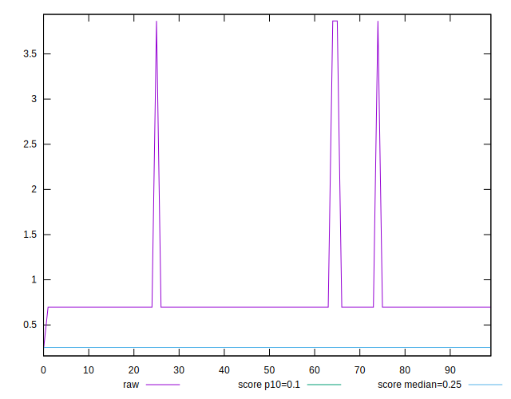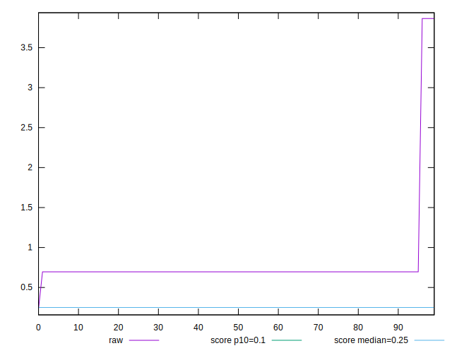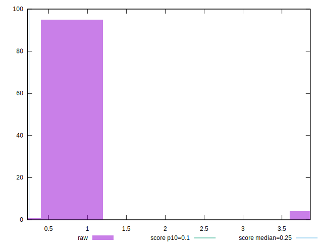
## Score


```yaml
p90min: 0
p90max: 0.08
p90range: 0.08
p90mean: 0.07914893617021282
p90median: 0.08
p90stdev: 0.008207362349781241
p90skewness: -9.539955591519906
p90eccentricity: 1.0000000000000038
p90discretization: 47
outlandishness: 1.060290947652908
confidence: 0.019453074523750183
p90confidence: 0.003318316202137718

```

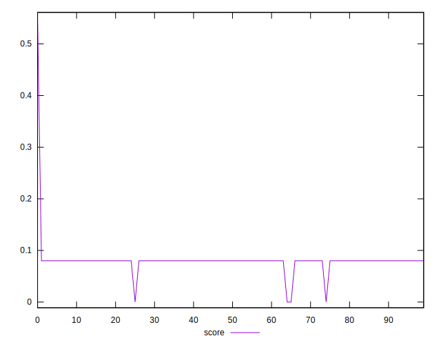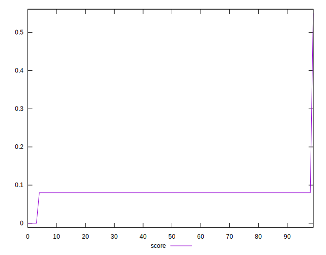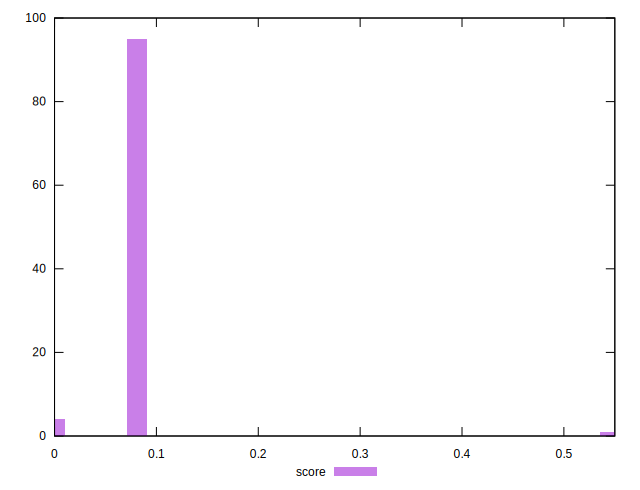
## Raw Estimate

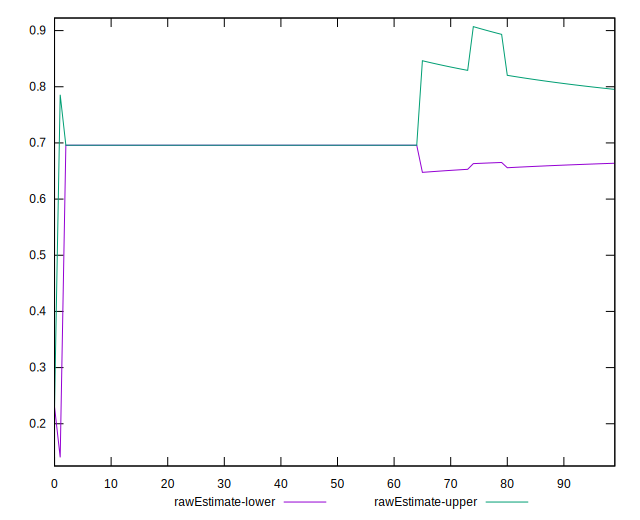
## Score Estimate

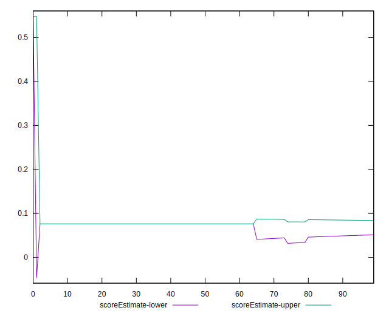
## P Score


```yaml
p90min: 0.00006417586681428666
p90max: 0.07611248195409825
p90range: 0.07604830608728397
p90mean: 0.07530345742125472
p90median: 0.07611248195409825
p90stdev: 0.007801950051817672
p90skewness: -9.539955591519863
p90eccentricity: 1.0000000000000016
p90discretization: 47
outlandishness: 1.066678119816236
confidence: 0.019364377804947056
p90confidence: 0.0031544040779320336

```

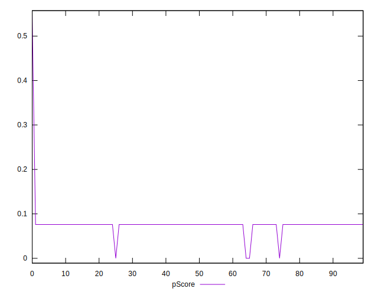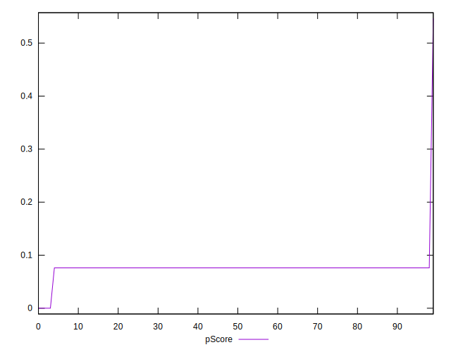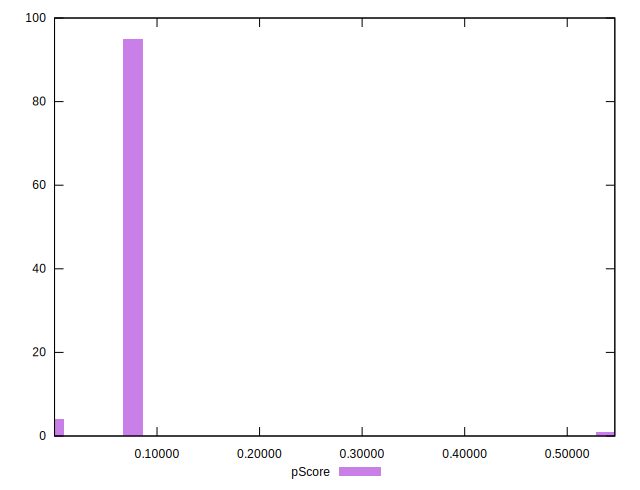
## Score Difference


```yaml
p90min: 0
p90max: 0
p90range: 0
p90mean: 0
p90median: 0
p90stdev: 0
p90skewness: .nan
p90eccentricity: .nan
p90discretization: 94
outlandishness: .nan
confidence: 0
p90confidence: 0

```


## P Score Difference


```yaml
p90min: -0.003887518045901747
p90max: 0.00006417586681428666
p90range: 0.003951693912716034
p90mean: -0.0038423465926395225
p90median: -0.003887518045901747
p90stdev: 0.0004062119539586507
p90skewness: 9.463157166462016
p90eccentricity: 0.999999999999993
p90discretization: 31.333333333333332
outlandishness: 0.9406121622828464
confidence: 0.0003035293602650341
p90confidence: 0.00016423543288044778

```

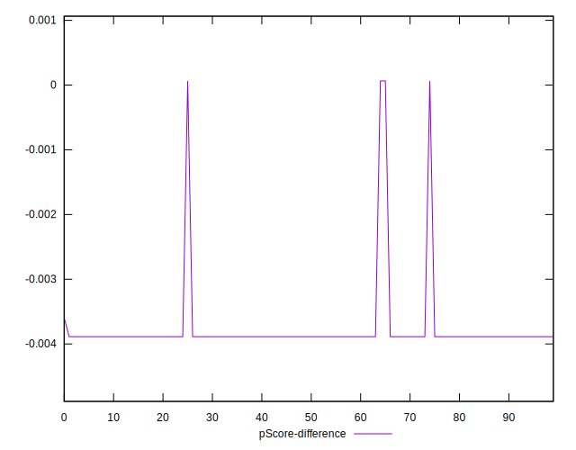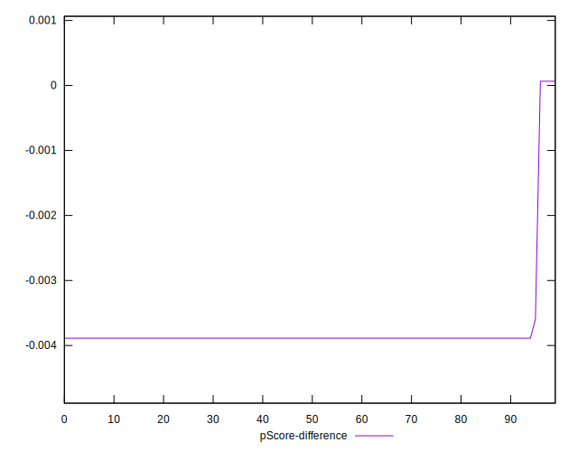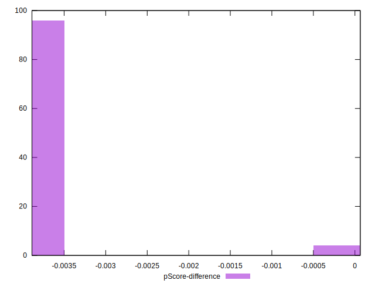