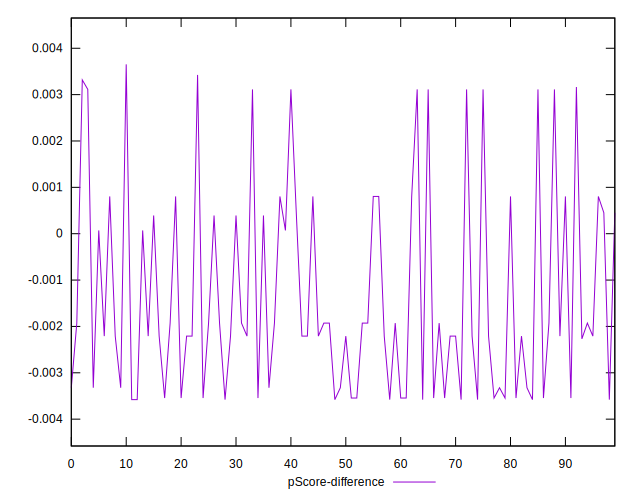
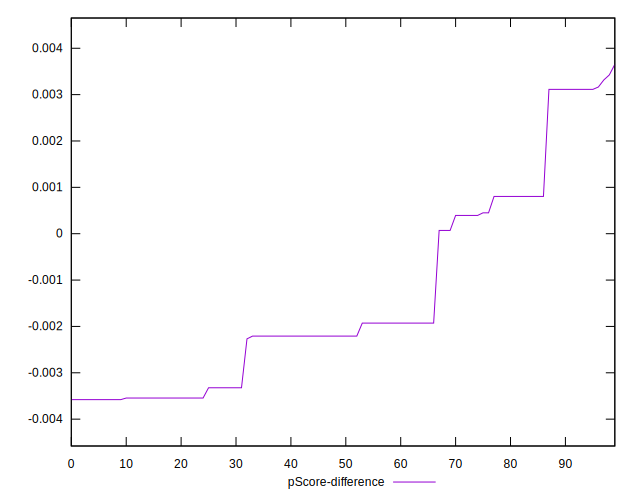

# //cumulative-layout-shift/samples/pages+cached+noadtech+nomedia

[→ Parent](../..)


## Raw


```yaml
p90min: 0.4553914388020833
p90max: 1.7676270548502604
p90range: 1.3122356160481772
p90mean: 1.0192240310560725
p90median: 1.1183046468098958
p90stdev: 0.3682852237723714
p90skewness: -0.08722548966213928
p90eccentricity: 0.9999999999999988
p90discretization: 6.714285714285714
outlandishness: 1.0101260655507267
confidence: 0.1539611739957155
p90confidence: 0.14890128801055658

```


## Score


```yaml
p90min: 0
p90max: 0.2
p90range: 0.2
p90mean: 0.062127659574468065
p90median: 0.02
p90stdev: 0.07868429160630622
p90skewness: 1.1679785426709564
p90eccentricity: 1.0000000000000009
p90discretization: 31.333333333333332
outlandishness: 1.0878775755301173
confidence: 0.0319058057592945
p90confidence: 0.03181282226413387

```


## Raw Estimate


## Score Estimate


## P Score


```yaml
p90min: 0.003113146976724157
p90max: 0.20080382120146933
p90range: 0.19769067422474518
p90mean: 0.06062089313499252
p90median: 0.018072155261745937
p90stdev: 0.0783038775239899
p90skewness: 1.1769285393212228
p90eccentricity: 1
p90discretization: 6.714285714285714
outlandishness: 1.0962212466618457
confidence: 0.031752408658923245
p90confidence: 0.03165901716097485

```


## Score Difference


```yaml
p90min: 0
p90max: 0
p90range: 0
p90mean: 0
p90median: 0
p90stdev: 0
p90skewness: .nan
p90eccentricity: .nan
p90discretization: 94
outlandishness: .nan
confidence: 0
p90confidence: 0

```


## P Score Difference


```yaml
p90min: -0.0035791534417845376
p90max: 0.0031641676942290205
p90range: 0.006743321136013558
p90mean: -0.001410789255154084
p90median: -0.002209008254524119
p90stdev: 0.0021337539325351424
p90skewness: 0.8880597457870539
p90eccentricity: 0.9999999999999987
p90discretization: 7.833333333333333
outlandishness: 0.8881746154436932
confidence: 0.0008876657095379481
p90confidence: 0.0008626974104409021

```

