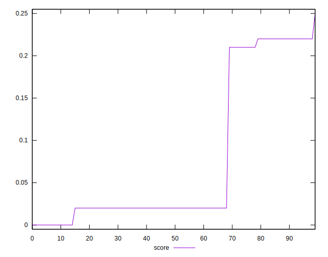

# //cumulative-layout-shift/samples/pages+cached+noadtech

[→ Parent](../..)


## Raw


```yaml
p90min: 0.43256591796875
p90max: 1.7495150756835938
p90range: 1.3169491577148438
p90mean: 0.9784813413822905
p90median: 1.0954791259765624
p90stdev: 0.4090038880689429
p90skewness: 0.09600022490571307
p90eccentricity: 1.0000000000000007
p90discretization: 5.875
outlandishness: 1.0132033556227118
confidence: 0.16829924684291114
p90confidence: 0.16536423892051869

```


## Score


```yaml
p90min: 0
p90max: 0.22
p90range: 0.22
p90mean: 0.07595744680851053
p90median: 0.02
p90stdev: 0.09175962062072808
p90skewness: 0.8696635826520875
p90eccentricity: 0.9999999999999996
p90discretization: 23.5
outlandishness: 1.0626317986017932
confidence: 0.036772413672522826
p90confidence: 0.03709930460373643

```


## Raw Estimate


## Score Estimate


## P Score


```yaml
p90min: 0.0032521211570840647
p90max: 0.22159060454387491
p90range: 0.21833848338679085
p90mean: 0.07692674869047712
p90median: 0.019392642673986105
p90stdev: 0.09275846700581769
p90skewness: 0.8740206588608189
p90eccentricity: 1.0000000000000002
p90discretization: 5.875
outlandishness: 1.0648908077273036
confidence: 0.03714186182260338
p90confidence: 0.03750314788515045

```


## Score Difference


```yaml
p90min: 0
p90max: 0
p90range: 0
p90mean: 0
p90median: 0
p90stdev: 0
p90skewness: .nan
p90eccentricity: .nan
p90discretization: 94
outlandishness: .nan
confidence: 0
p90confidence: 0

```


## P Score Difference


```yaml
p90min: -0.0025228769097088537
p90max: 0.004542675850018968
p90range: 0.007065552759727822
p90mean: 0.0010888465094489215
p90median: 0.0015906045438749128
p90stdev: 0.0020960391269546795
p90skewness: 0.01679430649301227
p90eccentricity: 1.000000000000001
p90discretization: 5.875
outlandishness: 0.9900945343412356
confidence: 0.0008662803495389668
p90confidence: 0.0008474489487446228

```

