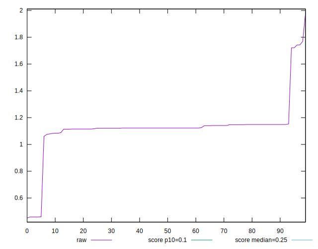

# //cumulative-layout-shift/samples/pages+cached

[→ Parent](../..)


## Raw


```yaml
p90min: 0.45831777000427243
p90max: 1.7428253173828125
p90range: 1.2845075473785401
p90mean: 1.124236907329965
p90median: 1.122510274887085
p90stdev: 0.16165670598208942
p90skewness: -0.558689267500717
p90eccentricity: 0.9999999999999996
p90discretization: 2.764705882352941
outlandishness: 1.002040810946357
confidence: 0.09048704236087197
p90confidence: 0.06535937415494743

```


## Score


```yaml
p90min: 0
p90max: 0.2
p90range: 0.2
p90mean: 0.02510638297872342
p90median: 0.02
p90stdev: 0.031948918033525044
p90skewness: 5.216053507651288
p90eccentricity: 0.9999999999999996
p90discretization: 31.333333333333332
outlandishness: 1.390001034185579
confidence: 0.016977587713466098
p90confidence: 0.012917257437067078

```


## Raw Estimate


## Score Estimate


## P Score


```yaml
p90min: 0.0033052237453327082
p90max: 0.1982991066631432
p90range: 0.1949938829178105
p90mean: 0.02296639324061161
p90median: 0.017840233168241015
p90stdev: 0.03188428679695229
p90skewness: 5.262307285475656
p90eccentricity: 0.9999999999999979
p90discretization: 3.357142857142857
outlandishness: 1.453127076284811
confidence: 0.017045629342188562
p90confidence: 0.012891126401255153

```


## Score Difference


```yaml
p90min: 0
p90max: 0
p90range: 0
p90mean: 0
p90median: 0
p90stdev: 0
p90skewness: .nan
p90eccentricity: .nan
p90discretization: 94
outlandishness: .nan
confidence: 0
p90confidence: 0

```


## P Score Difference


```yaml
p90min: -0.003535321098654825
p90max: 0.0033052237453327082
p90range: 0.006840544843987533
p90mean: -0.002046768112688889
p90median: -0.002159766831758985
p90stdev: 0.0014551953105721228
p90skewness: 1.926712447298105
p90eccentricity: 1.0000000000000002
p90discretization: 3.357142857142857
outlandishness: 0.8753834890845967
confidence: 0.0006924794974053136
p90confidence: 0.0005883495781656345

```

