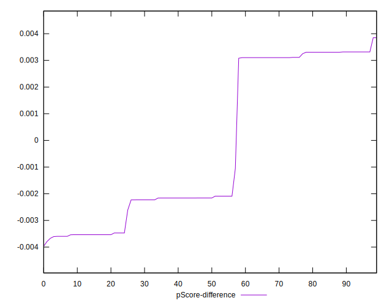

# //cumulative-layout-shift/samples/pages

[→ Parent](../..)


## Raw


```yaml
p90min: 1.121230978012085
p90max: 1.7690829467773437
p90range: 0.6478519687652586
p90mean: 1.3902512506728482
p90median: 1.1494648113250734
p90stdev: 0.30355314325446703
p90skewness: 0.34762053806688653
p90eccentricity: 0.9999999999999999
p90discretization: 3.4814814814814814
outlandishness: 1.0045227940025105
confidence: 0.11967423153236174
p90confidence: 0.12272948001351222

```


## Score


```yaml
p90min: 0
p90max: 0.02
p90range: 0.02
p90mean: 0.011702127659574475
p90median: 0.02
p90stdev: 0.00985407334205057
p90skewness: -0.3454668136700254
p90eccentricity: 0.9999999999999971
p90discretization: 47
outlandishness: 0.9826216198347106
confidence: 0.003869427593267182
p90confidence: 0.003984097427945451

```


## Raw Estimate


## Score Estimate


## P Score


```yaml
p90min: 0.0031022719549900213
p90max: 0.01791041875881938
p90range: 0.014808146803829358
p90mean: 0.011404817494150557
p90median: 0.016432134757249472
p90stdev: 0.006887156603453972
p90skewness: -0.32814808311546834
p90eccentricity: 1.0000000000000007
p90discretization: 4.086956521739131
outlandishness: 0.992344945872463
confidence: 0.002717847337886601
p90confidence: 0.00278454421407509

```


## Score Difference


```yaml
p90min: 0
p90max: 0
p90range: 0
p90mean: 0
p90median: 0
p90stdev: 0
p90skewness: .nan
p90eccentricity: .nan
p90discretization: 94
outlandishness: .nan
confidence: 0
p90confidence: 0

```


## P Score Difference


```yaml
p90min: -0.0036046527493987894
p90max: 0.0033156671300033635
p90range: 0.006920319879402153
p90mean: -0.0002498055857889843
p90median: -0.002158417828834896
p90stdev: 0.002961053996873122
p90skewness: 0.24669353408362166
p90eccentricity: 1.0000000000000002
p90discretization: 4.476190476190476
outlandishness: 0.914735820191868
confidence: 0.001181547362813684
p90confidence: 0.0011971828505281752

```

