# //estimated-input-latency/samples/pages+cached

[→ Parent](../..)


## Raw


```yaml
p90min: 14.600000000000001
p90max: 221.59999999999854
p90range: 206.99999999999855
p90mean: 64.50808510638299
p90median: 52.800000000000004
p90stdev: 45.07394160376488
p90skewness: 1.6080759828606264
p90eccentricity: 0.9999999999999994
p90discretization: 1.032967032967033
outlandishness: 1.1748824451334419
confidence: 23.42077020782483
p90confidence: 18.22383176757987

```

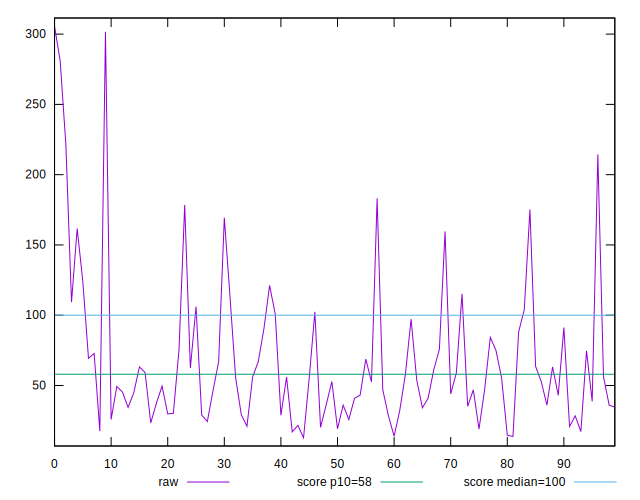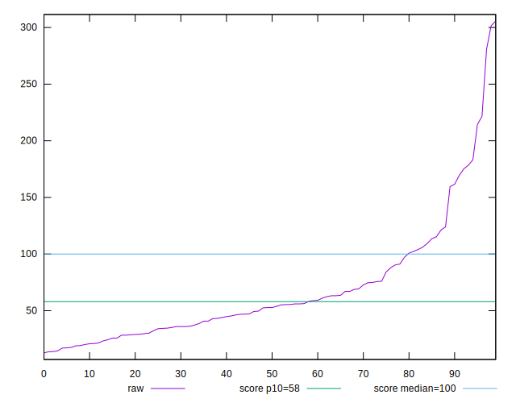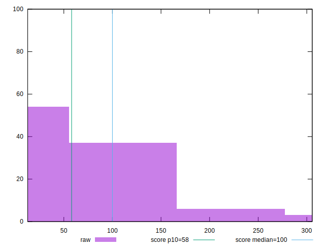
## Score


```yaml
p90min: 0.03
p90max: 1
p90range: 0.97
p90mean: 0.7991489361702127
p90median: 0.93
p90stdev: 0.2825102505181085
p90skewness: -1.4998936293538243
p90eccentricity: 1.0000000000000002
p90discretization: 2.35
outlandishness: 0.9558289875779863
confidence: 0.12076642825196374
p90confidence: 0.1142216343828431

```

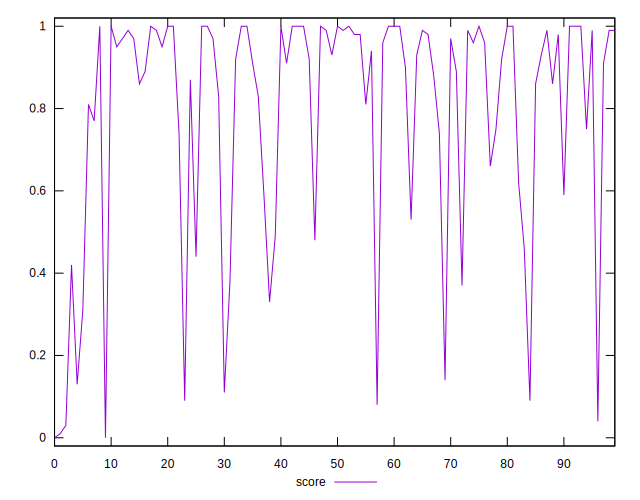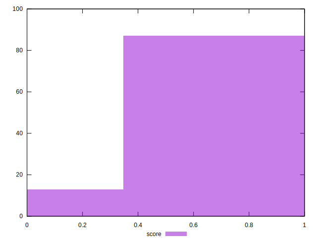
## Raw Estimate

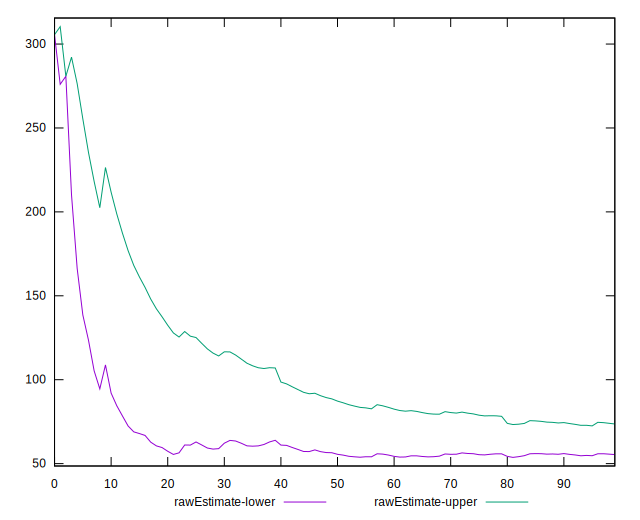
## Score Estimate

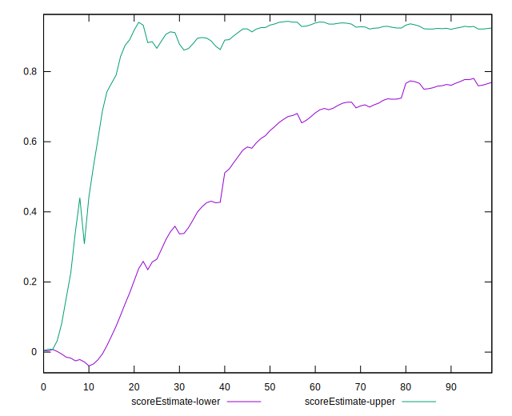
## P Score


```yaml
p90min: 0.030602459135181004
p90max: 0.9999970036174177
p90range: 0.9693945444822367
p90mean: 0.7989085594745915
p90median: 0.9335211335993086
p90stdev: 0.2829604874154898
p90skewness: -1.5012998211947874
p90eccentricity: 1.0000000000000004
p90discretization: 1.0444444444444445
outlandishness: 0.9560116587672162
confidence: 0.12084828387808959
p90confidence: 0.11440366952735216

```

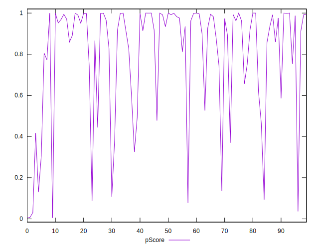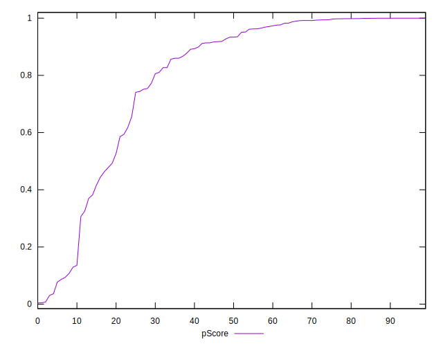
## Score Difference


```yaml
p90min: 0
p90max: 1.1102230246251565e-16
p90range: 1.1102230246251565e-16
p90mean: 2.362176648138631e-18
p90median: 0
p90stdev: 1.6021061506108986e-17
p90skewness: 6.634888026970374
p90eccentricity: 0.9999999999999988
p90discretization: 47
outlandishness: 5.522500000000001
confidence: 9.484951648085955e-18
p90confidence: 6.477470556979047e-18

```

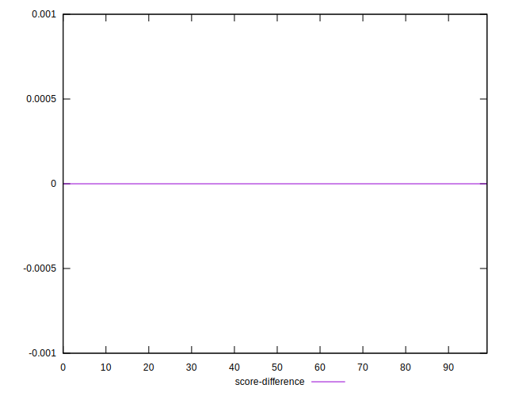
## P Score Difference


```yaml
p90min: -0.004441593829342727
p90max: 0.004278163999279938
p90range: 0.008719757828622665
p90mean: -0.00016072158366382594
p90median: -0.00011542934096109292
p90stdev: 0.0024726607502918397
p90skewness: 0.08276724680318884
p90eccentricity: 1
p90discretization: 1.0444444444444445
outlandishness: 0.9957003880036313
confidence: 0.0010381109600572846
p90confidence: 0.000999720723954891

```

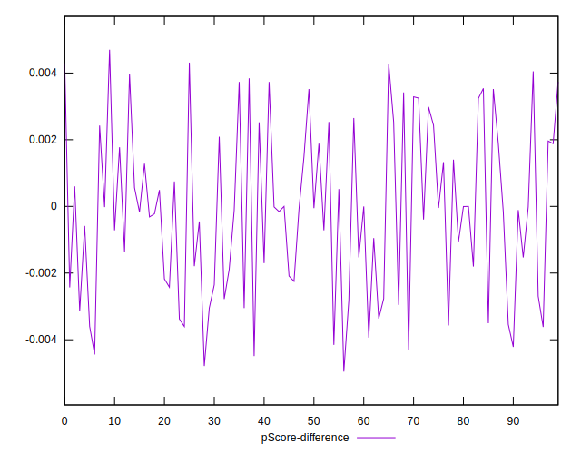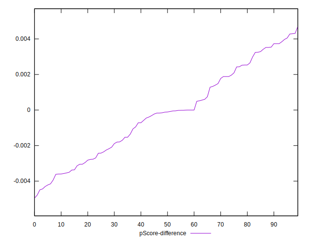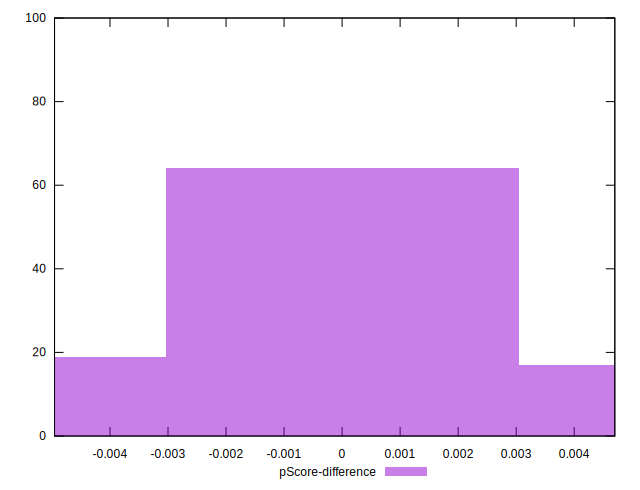