# //estimated-input-latency/samples/pages

[→ Parent](../..)


## Raw


```yaml
p90min: 19.6
p90max: 151.19999999999854
p90range: 131.59999999999854
p90mean: 64.8418237082067
p90median: 59.226666666666596
p90stdev: 31.015963132221717
p90skewness: 0.6904266852920926
p90eccentricity: 1
p90discretization: 1.0444444444444445
outlandishness: 1.112061686538471
confidence: 17.072912231382585
p90confidence: 12.54005472163669

```

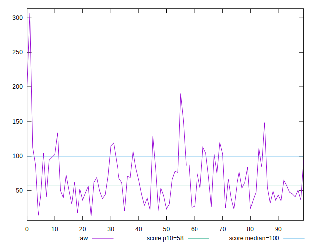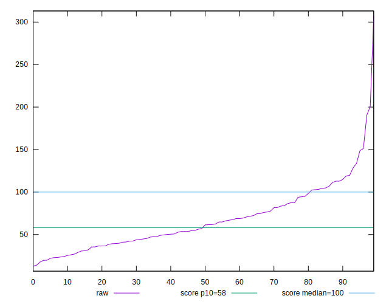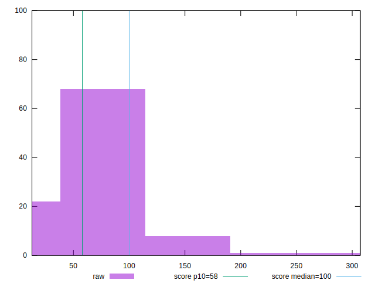
## Score


```yaml
p90min: 0.17
p90max: 1
p90range: 0.83
p90mean: 0.792446808510638
p90median: 0.89
p90stdev: 0.23189178588763085
p90skewness: -1.0490518743797235
p90eccentricity: 1.0000000000000009
p90discretization: 2.473684210526316
outlandishness: 0.9589218203901085
confidence: 0.10276343686565266
p90confidence: 0.09375609817861716

```

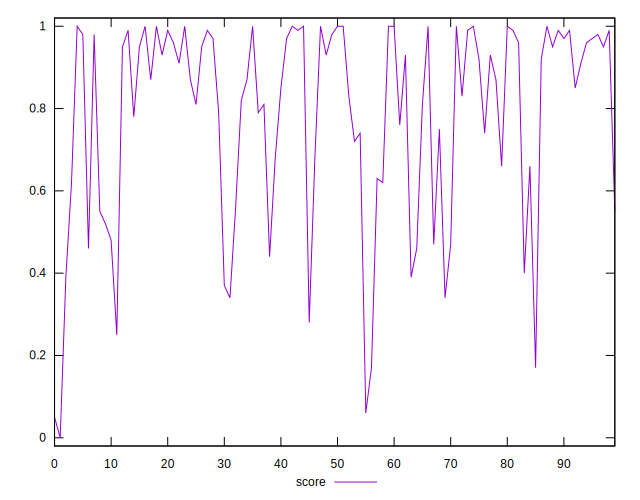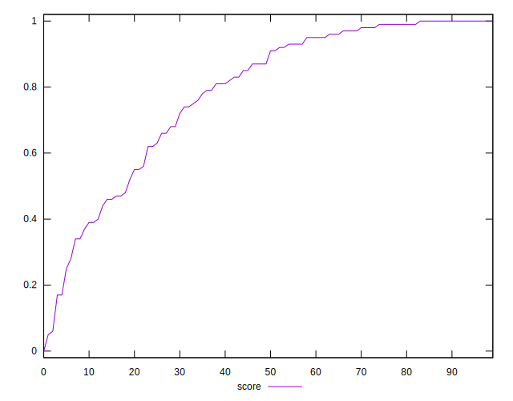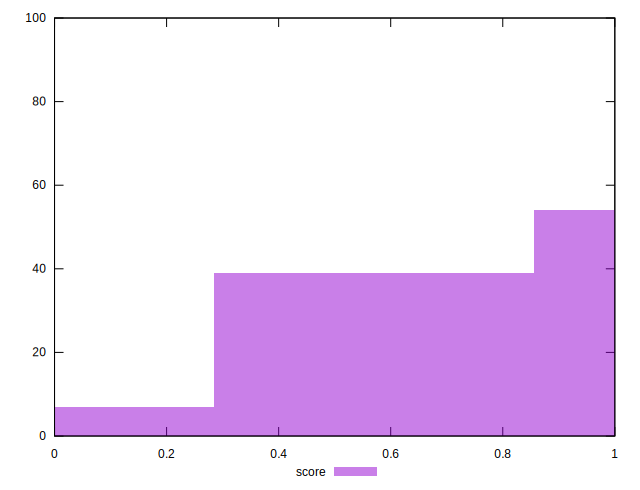
## Raw Estimate

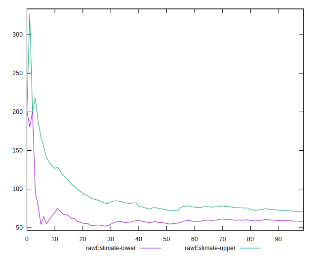
## Score Estimate

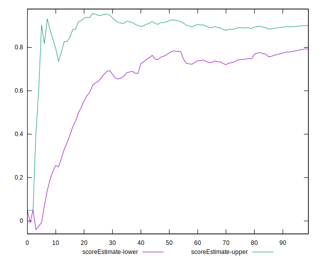
## P Score


```yaml
p90min: 0.16536036556883915
p90max: 0.9999369321034417
p90range: 0.8345765665346025
p90mean: 0.7923330490224961
p90median: 0.8905566150774793
p90stdev: 0.23178164285375774
p90skewness: -1.0545218498070925
p90eccentricity: 1
p90discretization: 1.0444444444444445
outlandishness: 0.9591674718630608
confidence: 0.1026193922435068
p90confidence: 0.09371156628173272

```

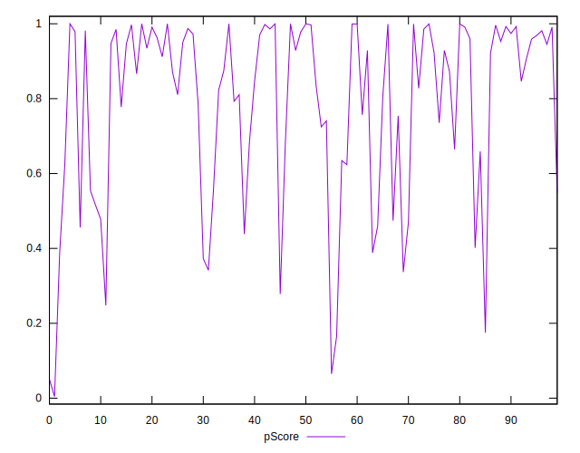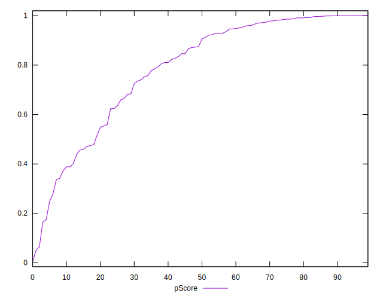
## Score Difference


```yaml
p90min: 0
p90max: 1.1102230246251565e-16
p90range: 1.1102230246251565e-16
p90mean: 7.086529944415892e-18
p90median: 0
p90stdev: 2.5903289205632336e-17
p90skewness: 3.556209487177137
p90eccentricity: 0.9999999999999988
p90discretization: 31.333333333333332
outlandishness: 1.9881000000000004
confidence: 1.2068449747603987e-17
p90confidence: 1.047295106472299e-17

```

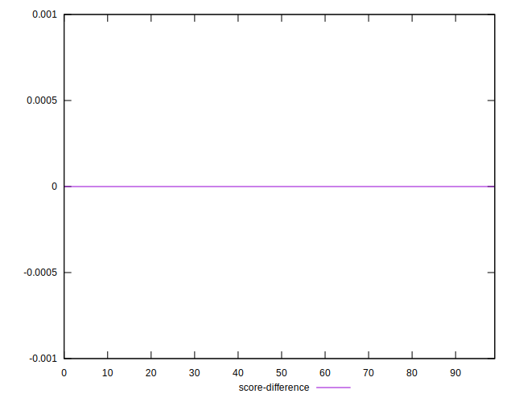
## P Score Difference


```yaml
p90min: -0.004662660416320241
p90max: 0.004677061964102447
p90range: 0.009339722380422688
p90mean: -0.000013423159931390675
p90median: -0.00012669774664619826
p90stdev: 0.002613169671085407
p90skewness: 0.08404697382409967
p90eccentricity: 0.9999999999999997
p90discretization: 1.0444444444444445
outlandishness: 0.8023065897680317
confidence: 0.0010988221080352697
p90confidence: 0.001056529843443396

```

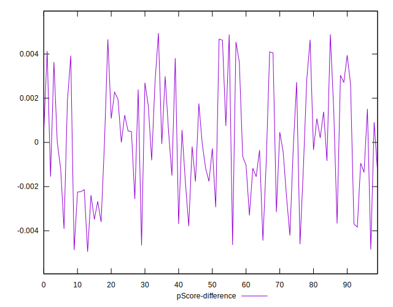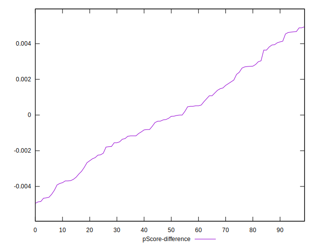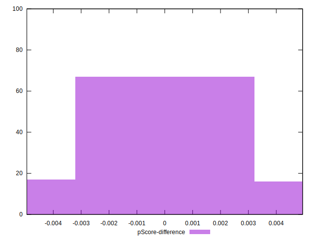