# //first-contentful-paint/samples/pages+cached+noadtech+nomedia+nocss

[→ Parent](../..)


## Raw


```yaml
p90min: 1584.911
p90max: 1619.6889999999999
p90range: 34.77799999999979
p90mean: 1590.8393601063829
p90median: 1589.381675
p90stdev: 5.5426894979677215
p90skewness: 2.1039455882885787
p90eccentricity: 1.0000000000000004
p90discretization: 1
outlandishness: 1.0088510215639486
confidence: 24.09079453593116
p90confidence: 2.240963123190862

```

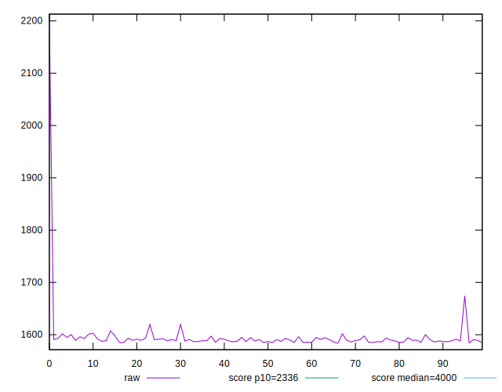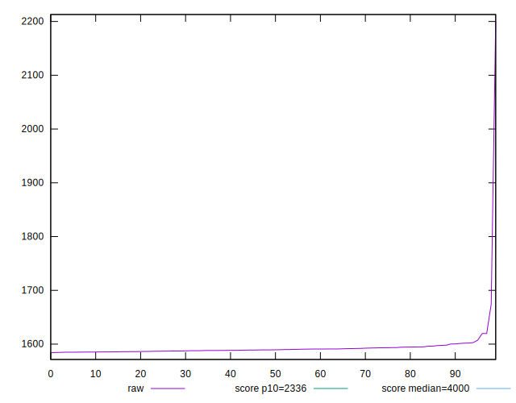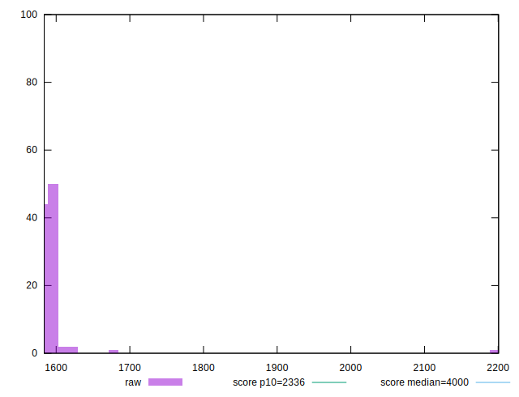
## Score


```yaml
p90min: 0.98
p90max: 0.99
p90range: 0.010000000000000009
p90mean: 0.9898936170212755
p90median: 0.99
p90stdev: 0.0010259202937226552
p90skewness: -9.539955591516877
p90eccentricity: 1.000000000000006
p90discretization: 47
outlandishness: 0.9981953340161073
confidence: 0.0027993885036228915
p90confidence: 0.00041478952526721475

```

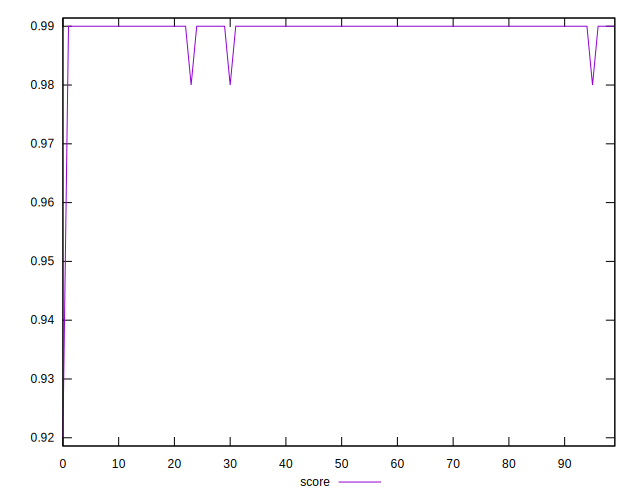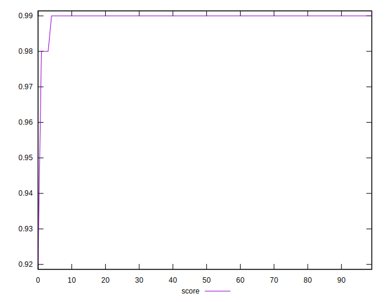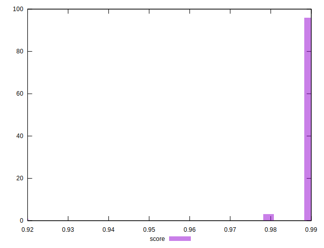
## Raw Estimate

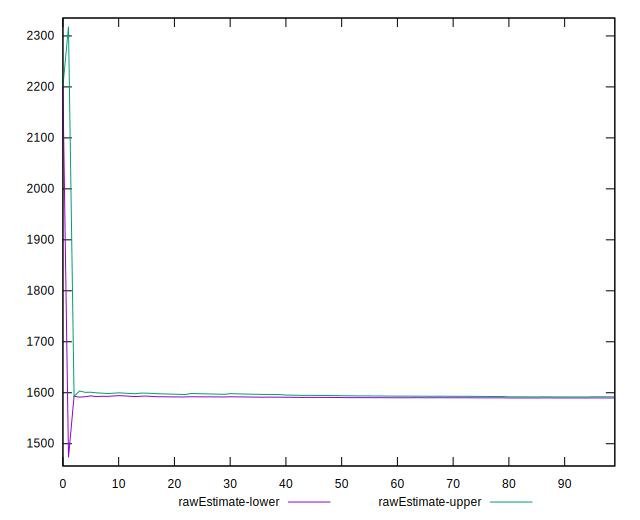
## Score Estimate

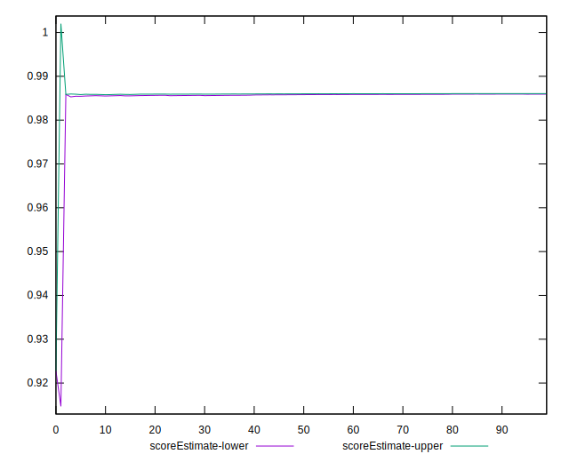
## P Score


```yaml
p90min: 0.9843844610831856
p90max: 0.9863022157796881
p90range: 0.0019177546965025716
p90mean: 0.9859853982509654
p90median: 0.9860654175695249
p90stdev: 0.00030117075366232387
p90skewness: -2.2021713621720433
p90eccentricity: 0.9999999999999999
p90discretization: 1
outlandishness: 0.9986056518331355
confidence: 0.002475298184287358
p90confidence: 0.00012176625679434685

```

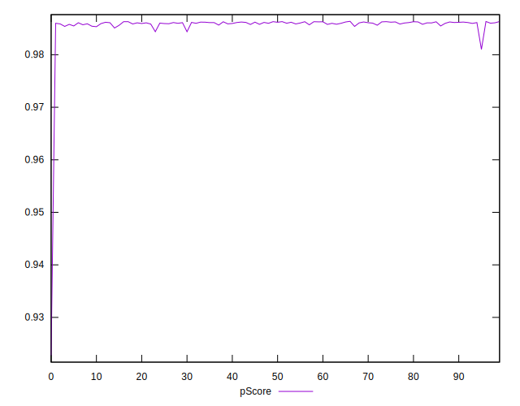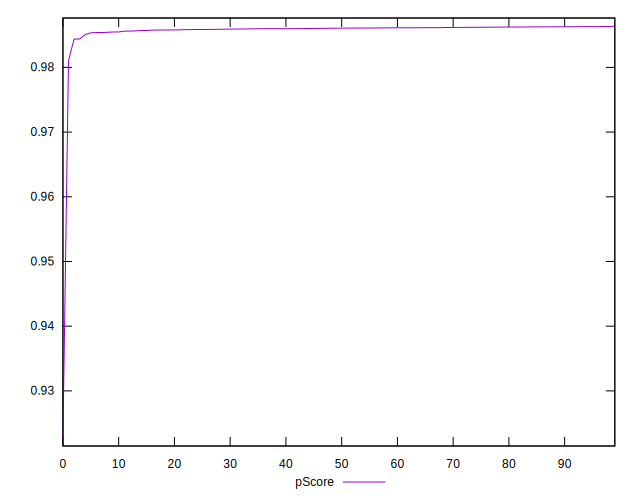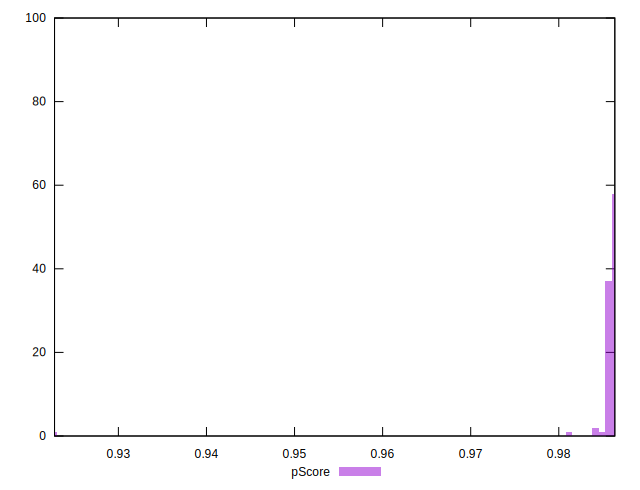
## Score Difference


```yaml
p90min: 0
p90max: 0
p90range: 0
p90mean: 0
p90median: 0
p90stdev: 0
p90skewness: .nan
p90eccentricity: .nan
p90discretization: 94
outlandishness: .nan
confidence: 0
p90confidence: 0

```


## P Score Difference


```yaml
p90min: -0.004606345432068615
p90max: 0.00100867245892855
p90range: 0.005615017890997165
p90mean: -0.0039101190248920226
p90median: -0.003915530528242783
p90stdev: 0.0005550098305470531
p90skewness: 7.303012001368239
p90eccentricity: 0.9999999999999999
p90discretization: 1
outlandishness: 0.8965001279488776
confidence: 0.0005661305545132426
p90confidence: 0.0002243958575923097

```

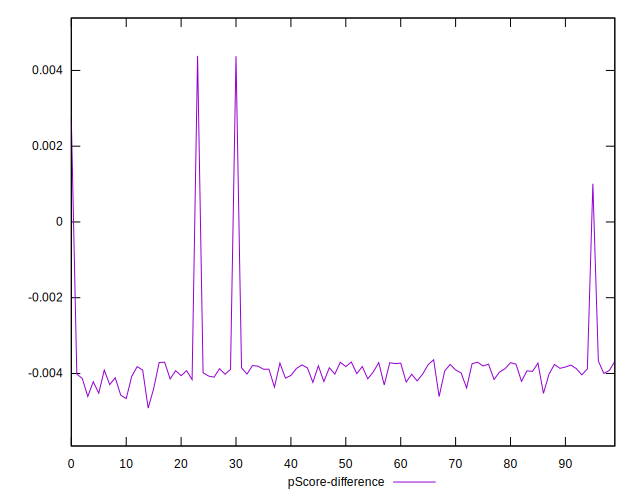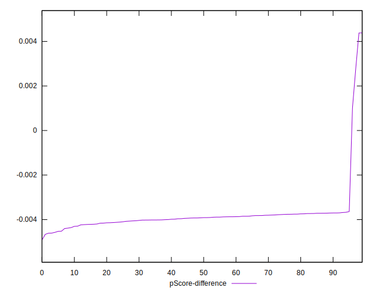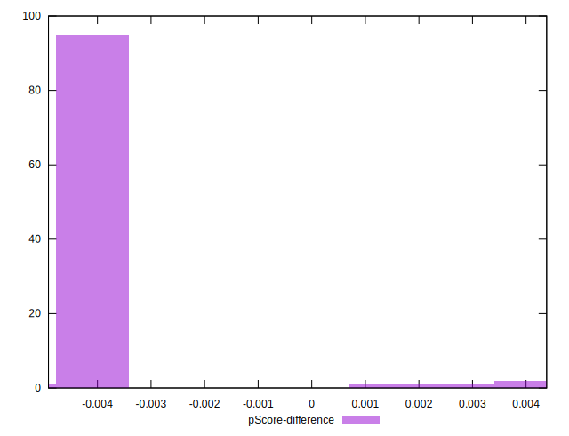