# //first-contentful-paint/samples/pages+cached+noadtech+nomedia

[→ Parent](../..)


## Raw


```yaml
p90min: 1906.2454500000003
p90max: 2128.5815000000002
p90range: 222.3360499999999
p90mean: 1966.5754606382982
p90median: 1936.2313749999996
p90stdev: 66.18991999573099
p90skewness: 1.1621804178377444
p90eccentricity: 0.9999999999999992
p90discretization: 1
outlandishness: 1.027305790983319
confidence: 76.97277577510631
p90confidence: 26.76122663767705

```

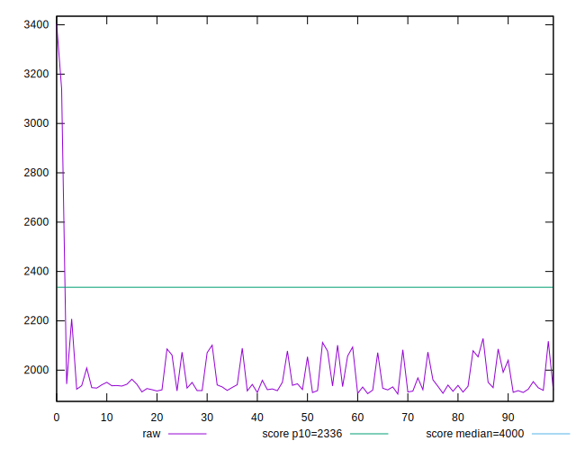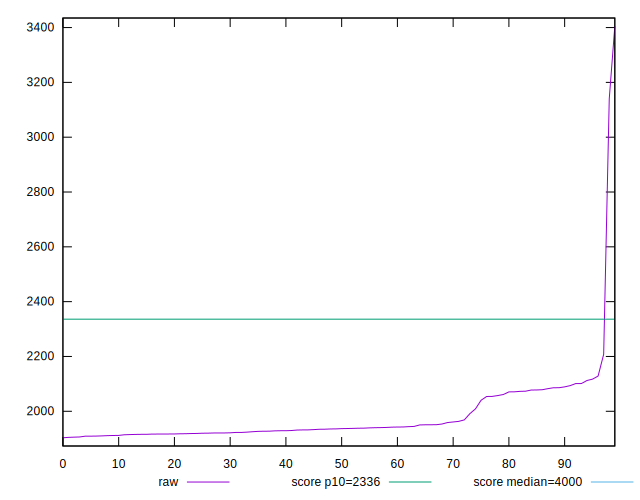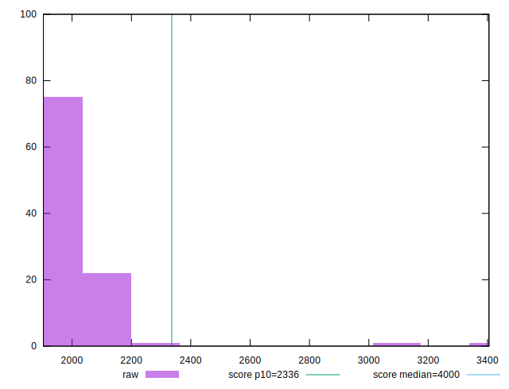
## Score


```yaml
p90min: 0.93
p90max: 0.96
p90range: 0.029999999999999916
p90mean: 0.9549999999999988
p90median: 0.96
p90stdev: 0.008598614435638231
p90skewness: -1.2550123031153002
p90eccentricity: 0.9999999999999978
p90discretization: 23.5
outlandishness: 0.9883066363312408
confidence: 0.015351110586233613
p90confidence: 0.003476503215247238

```

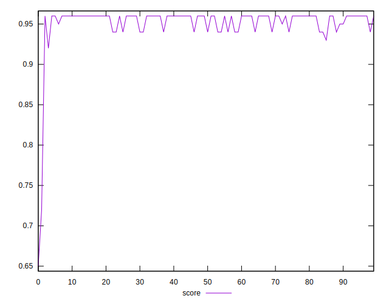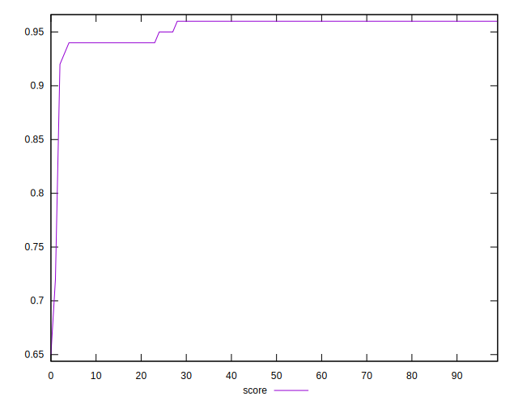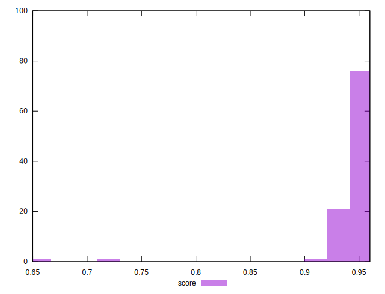
## Raw Estimate

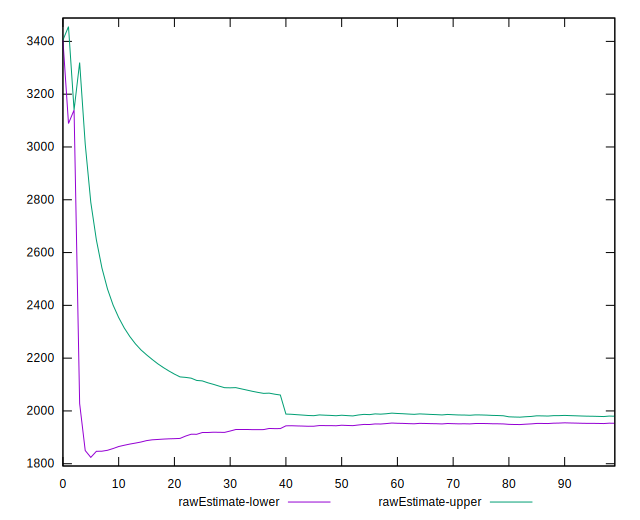
## Score Estimate

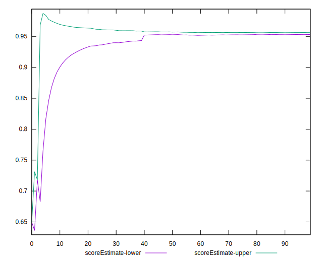
## P Score


```yaml
p90min: 0.9335941468486546
p90max: 0.9612993941693596
p90range: 0.027705247320705007
p90mean: 0.9542609474353579
p90median: 0.958075630632224
p90stdev: 0.008105864486174402
p90skewness: -1.213155747698068
p90eccentricity: 0.9999999999999994
p90discretization: 1
outlandishness: 0.9884622061795557
confidence: 0.01533736245771998
p90confidence: 0.0032772796314423937

```

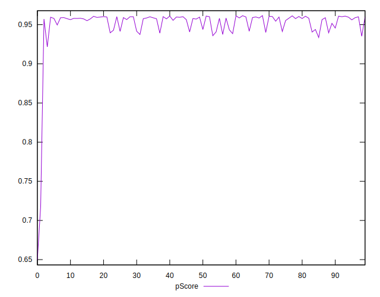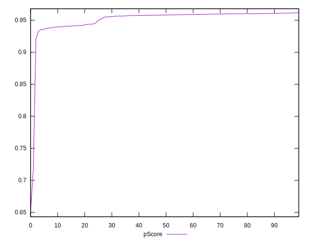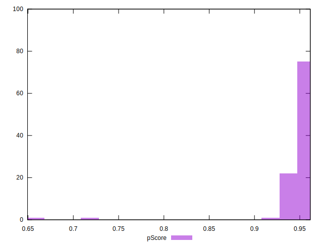
## Score Difference


```yaml
p90min: 0
p90max: 1.1102230246251565e-16
p90range: 1.1102230246251565e-16
p90mean: 2.4802854805455624e-17
p90median: 0
p90stdev: 4.624379354729281e-17
p90skewness: 1.3281045550208723
p90eccentricity: 1.0000000000000016
p90discretization: 47
outlandishness: 1.1540897959183674
confidence: 1.8586633418224772e-17
p90confidence: 1.8696814254872453e-17

```

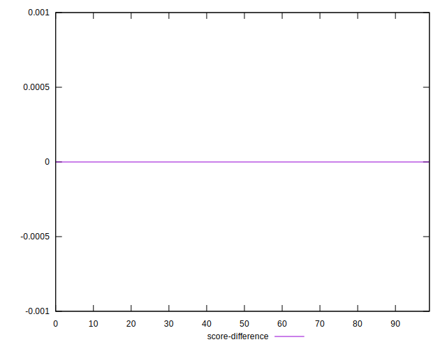
## P Score Difference


```yaml
p90min: -0.0044650568950332925
p90max: 0.003594146848654556
p90range: 0.008059203743687848
p90mean: -0.000677642039321052
p90median: -0.0004324583678473326
p90stdev: 0.0017009944183215121
p90skewness: -0.04674472684866082
p90eccentricity: 1
p90discretization: 1
outlandishness: 0.9487723147875622
confidence: 0.0007744824879624963
p90confidence: 0.0006877285414616237

```

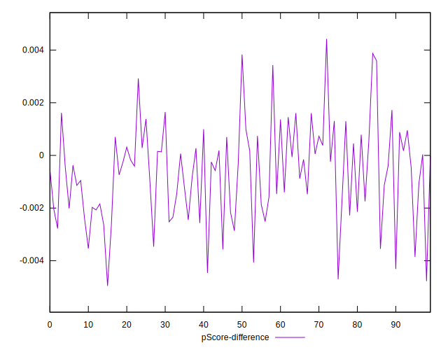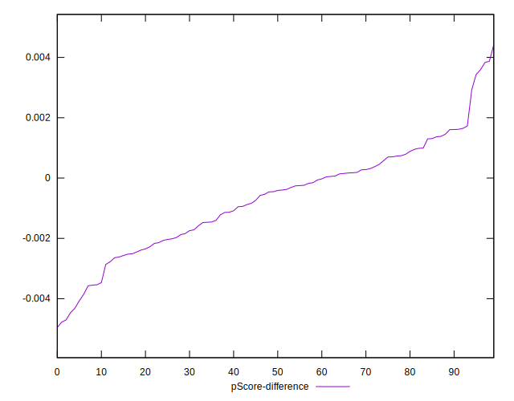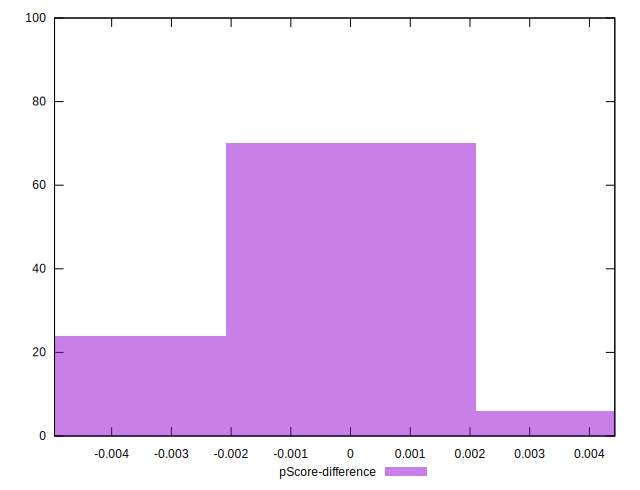