# //first-contentful-paint/samples/pages+cached

[→ Parent](../..)


## Raw


```yaml
p90min: 2061.3495000000003
p90max: 2232.3520000000003
p90range: 171.00250000000005
p90mean: 2092.8701452127666
p90median: 2085.0223000000005
p90stdev: 30.3609649328234
p90skewness: 2.0398483309961177
p90eccentricity: 0.9999999999999999
p90discretization: 1
outlandishness: 1.024126799883449
confidence: 65.05992377711154
p90confidence: 12.275232596719492

```

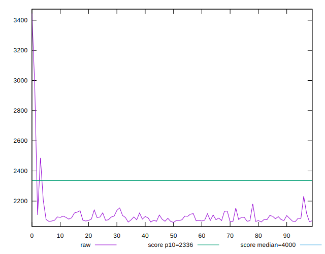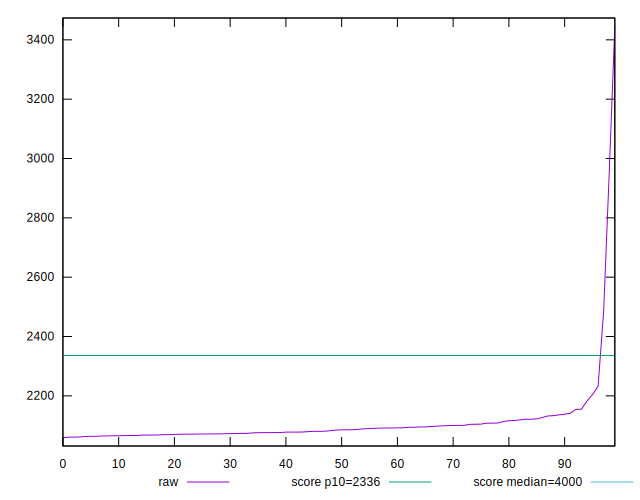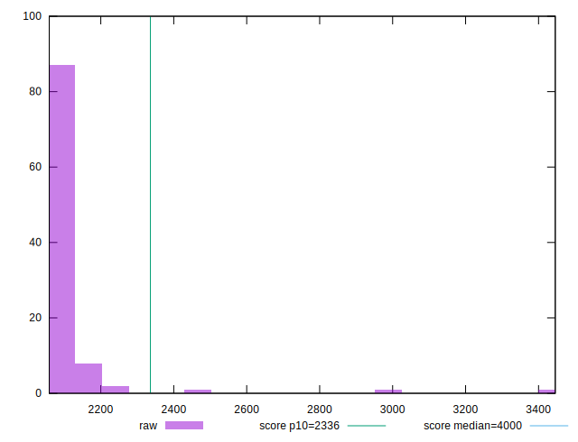
## Score


```yaml
p90min: 0.92
p90max: 0.94
p90range: 0.019999999999999907
p90mean: 0.9381914893617012
p90median: 0.94
p90stdev: 0.004366888457824179
p90skewness: -2.391250888421875
p90eccentricity: 0.9999999999999983
p90discretization: 31.333333333333332
outlandishness: 0.9885396577740692
confidence: 0.013815507936682481
p90confidence: 0.0017655753584356368

```

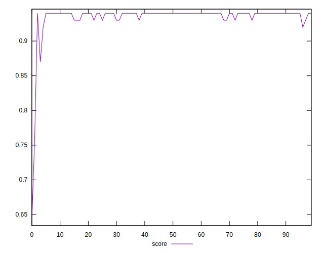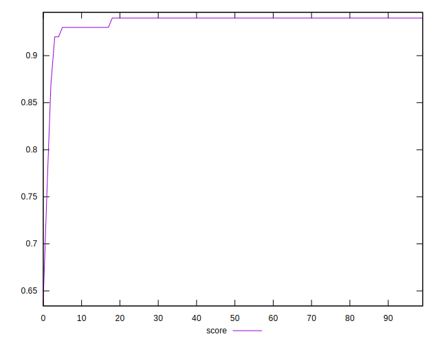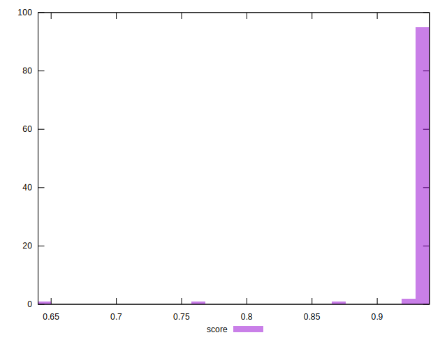
## Raw Estimate

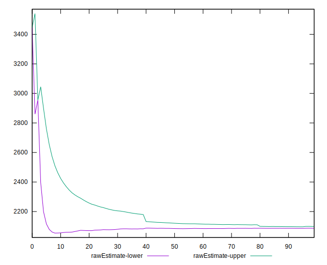
## Score Estimate

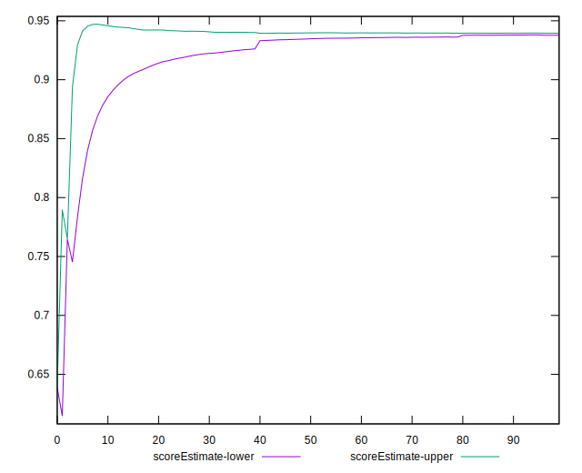
## P Score


```yaml
p90min: 0.9176883235584656
p90max: 0.9428983613587647
p90range: 0.025210037800299068
p90mean: 0.938554644008527
p90median: 0.9397133236777642
p90stdev: 0.004357110856047716
p90skewness: -2.2179404557172817
p90eccentricity: 0.9999999999999997
p90discretization: 1
outlandishness: 0.98879923306481
confidence: 0.013781312941713825
p90confidence: 0.0017616221792033648

```

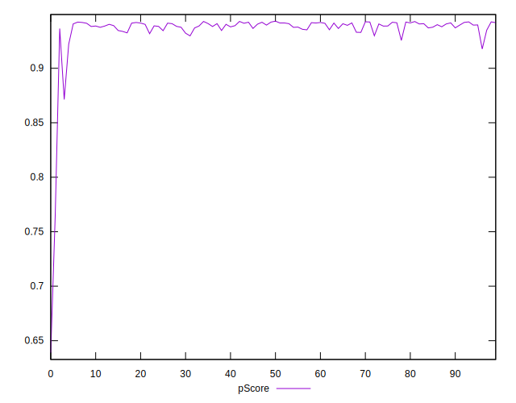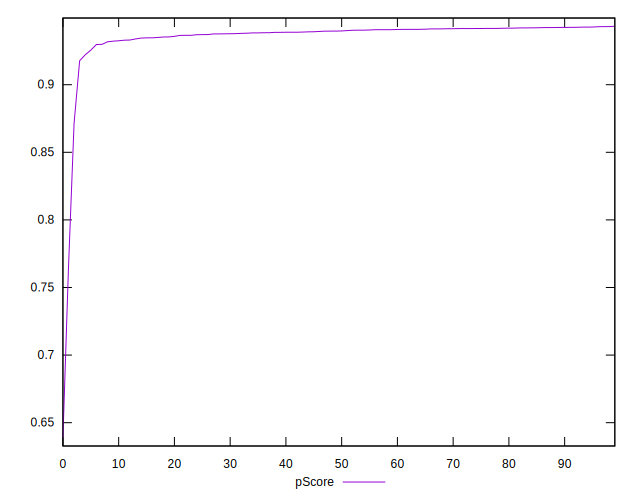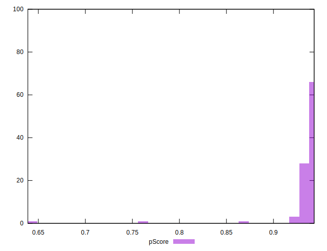
## Score Difference


```yaml
p90min: 0
p90max: 1.1102230246251565e-16
p90range: 1.1102230246251565e-16
p90mean: 9.330597760147593e-17
p90median: 1.1102230246251565e-16
p90stdev: 4.065758244982901e-17
p90skewness: -1.8591772600771967
p90eccentricity: 0.9999999999999979
p90discretization: 47
outlandishness: 0.9519830796346738
confidence: 1.6719816056870084e-17
p90confidence: 1.6438254926884487e-17

```

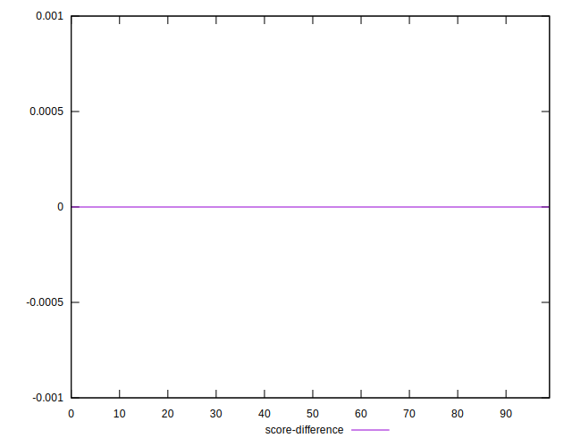
## P Score Difference


```yaml
p90min: -0.004219117519355553
p90max: 0.0046573613091903665
p90range: 0.00887647882854592
p90mean: 0.0005077593654188241
p90median: 0.0009372548928662794
p90stdev: 0.001994132393980989
p90skewness: -0.3783253316946118
p90eccentricity: 0.9999999999999997
p90discretization: 1
outlandishness: 0.9070151682735811
confidence: 0.0008830046693303463
p90confidence: 0.0008062470681986112

```

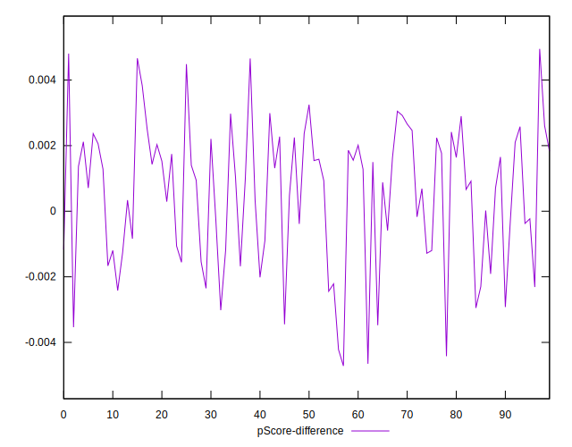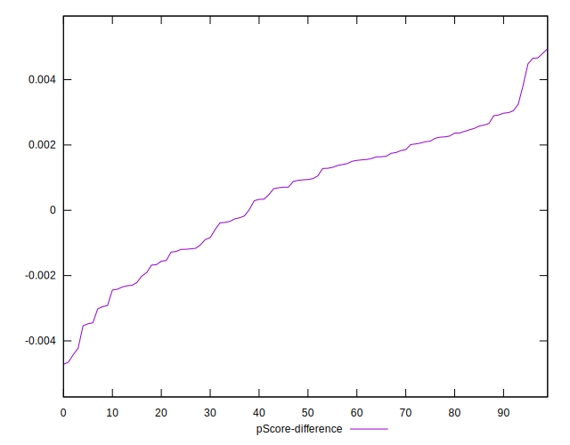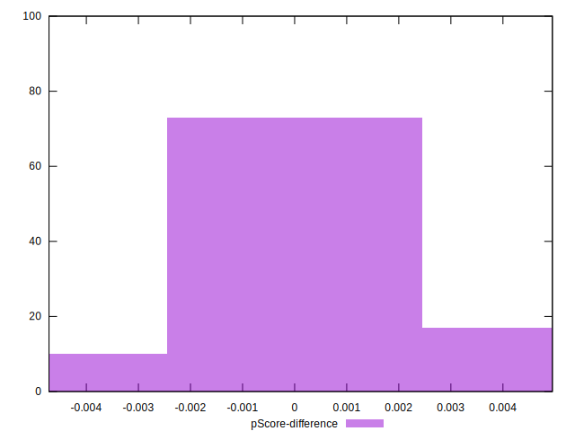