# //first-contentful-paint/samples/pages

[→ Parent](../..)


## Raw


```yaml
p90min: 2333.9035
p90max: 2612.2569999999996
p90range: 278.3534999999997
p90mean: 2458.395250531915
p90median: 2481.188025
p90stdev: 74.47937962534145
p90skewness: -0.1322357384086888
p90eccentricity: 0.9999999999999996
p90discretization: 1
outlandishness: 1.0064756500955128
confidence: 41.632365779251266
p90confidence: 30.112735566320378

```

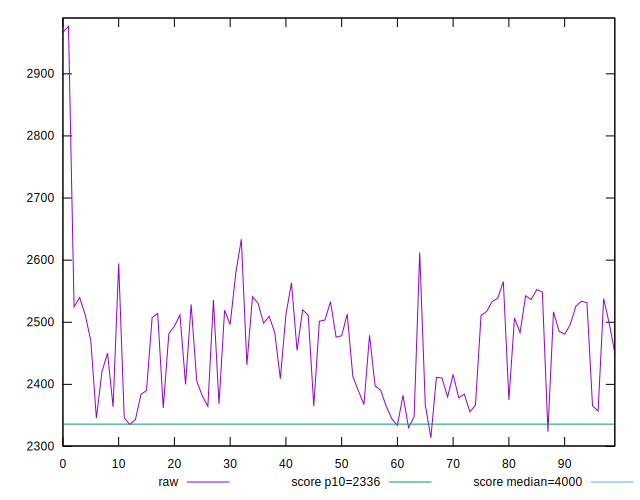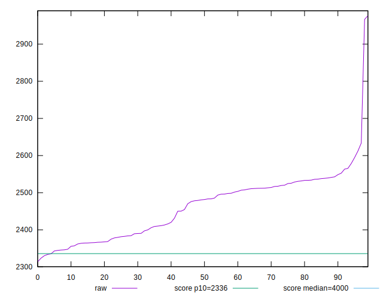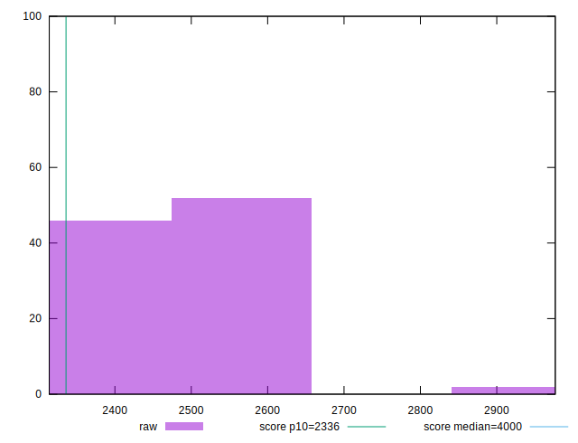
## Score


```yaml
p90min: 0.85
p90max: 0.9
p90range: 0.050000000000000044
p90mean: 0.8765957446808513
p90median: 0.87
p90stdev: 0.01440694214232359
p90skewness: 0.11727990260865744
p90eccentricity: 0.9999999999999987
p90discretization: 15.666666666666666
outlandishness: 0.9954517853002168
confidence: 0.008702240091357845
p90confidence: 0.005824866442677201

```

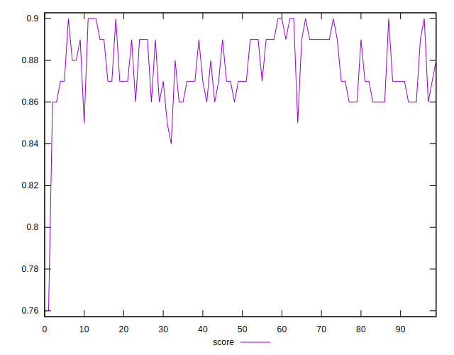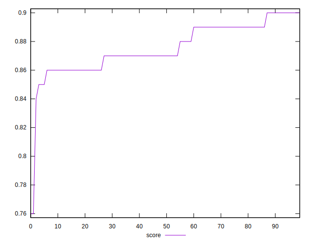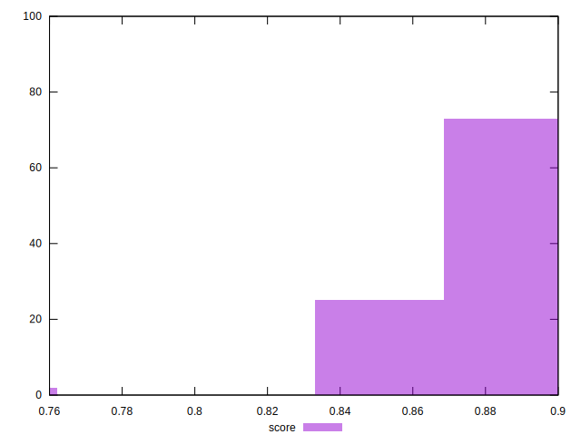
## Raw Estimate

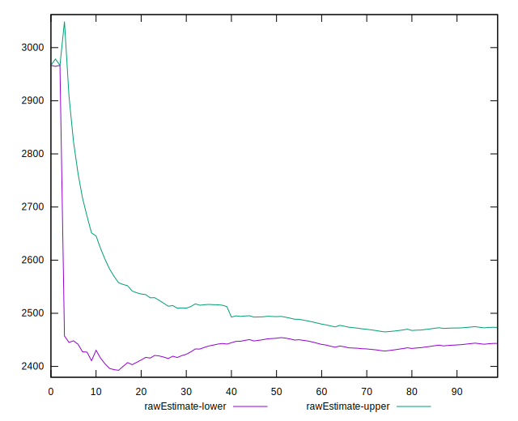
## Score Estimate

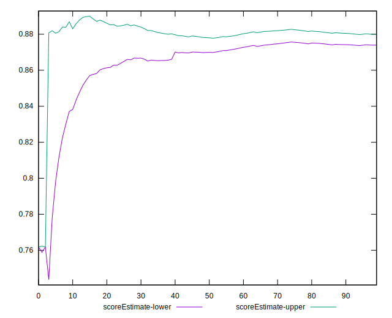
## P Score


```yaml
p90min: 0.8450007173093474
p90max: 0.9003748749961104
p90range: 0.055374157686762904
p90mean: 0.8765554207592859
p90median: 0.8724146787412785
p90stdev: 0.01463260563376761
p90skewness: 0.08042798670947506
p90eccentricity: 1.0000000000000002
p90discretization: 1
outlandishness: 0.9956511438574156
confidence: 0.008764097099891835
p90confidence: 0.0059161043810033445

```

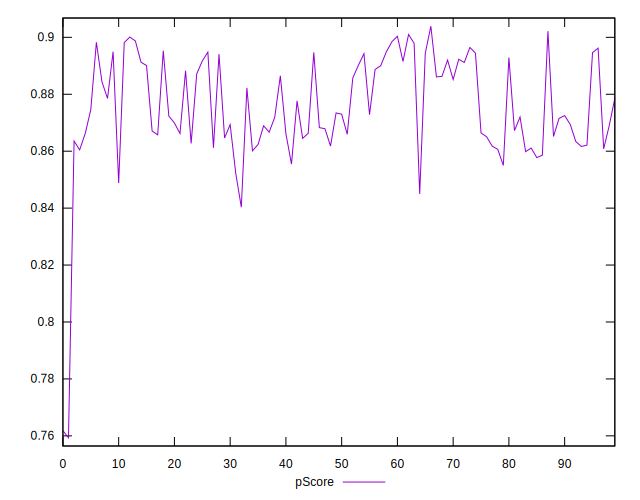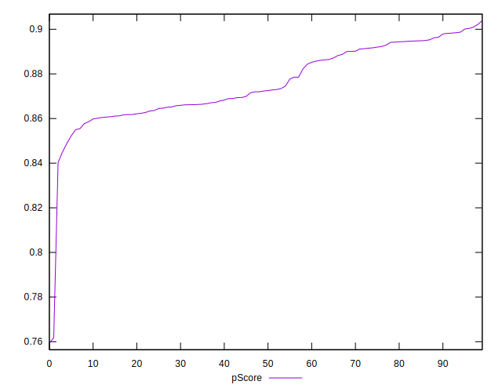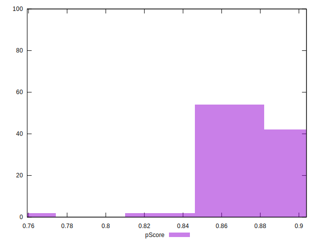
## Score Difference


```yaml
p90min: 0
p90max: 0
p90range: 0
p90mean: 0
p90median: 0
p90stdev: 0
p90skewness: .nan
p90eccentricity: .nan
p90discretization: 94
outlandishness: .nan
confidence: 0
p90confidence: 0

```


## P Score Difference


```yaml
p90min: -0.004817249323444073
p90max: 0.004686389573649197
p90range: 0.00950363889709327
p90mean: 0.000053675478086181826
p90median: 0.00016158969944191082
p90stdev: 0.0027857964087998443
p90skewness: -0.06710774287620219
p90eccentricity: 1.0000000000000002
p90discretization: 1
outlandishness: 0.7777767493903077
confidence: 0.0011595178339223276
p90confidence: 0.0011263245078272908

```

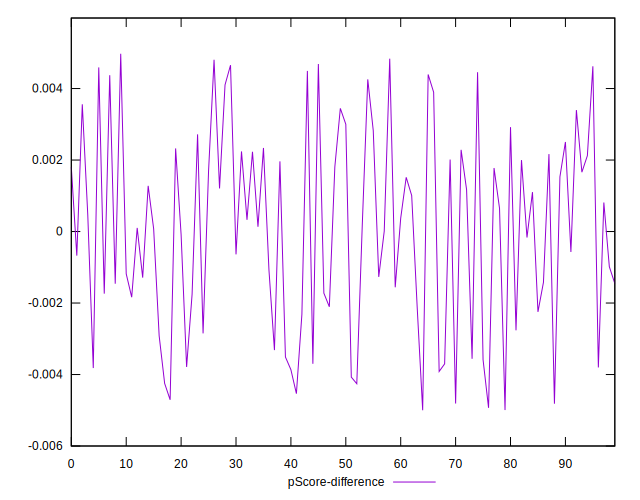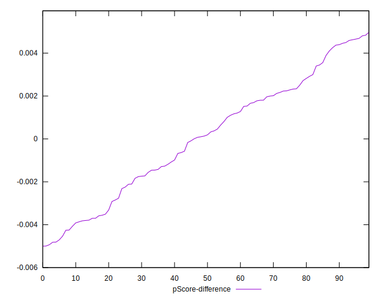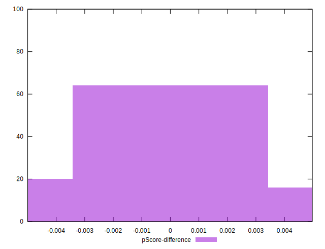