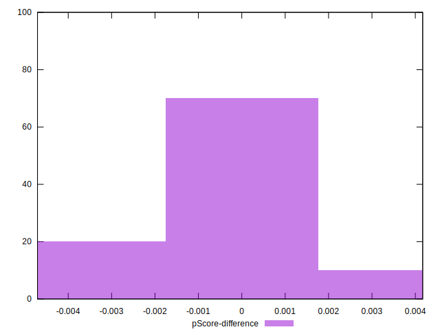

# //first-cpu-idle/samples/pages+cached+noadtech+nomedia+nocss

[→ Parent](../..)


## Raw


```yaml
p90min: 1584.9945
p90max: 3927.3190000000004
p90range: 2342.3245000000006
p90mean: 3162.0289393617027
p90median: 3845.2063
p90stdev: 1042.7486609725127
p90skewness: -0.8316598305573756
p90eccentricity: 0.9999999999999997
p90discretization: 1
outlandishness: 0.9908864550408395
confidence: 418.1657797081293
p90confidence: 421.5933973665396

```


## Score


```yaml
p90min: 0.86
p90max: 1
p90range: 0.14
p90mean: 0.909148936170213
p90median: 0.87
p90stdev: 0.06057630276201306
p90skewness: 0.8179459425228099
p90eccentricity: 1.0000000000000009
p90discretization: 18.8
outlandishness: 0.9996723881754112
confidence: 0.025029284937424793
p90confidence: 0.024491586742986373

```


## Raw Estimate


## Score Estimate


## P Score


```yaml
p90min: 0.8596061498008448
p90max: 0.9987398836602985
p90range: 0.1391337338594537
p90mean: 0.9082394175905381
p90median: 0.8694473814450396
p90stdev: 0.06041649254354581
p90skewness: 0.8208213086988763
p90eccentricity: 1.0000000000000002
p90discretization: 1
outlandishness: 0.9998206412763269
confidence: 0.024907568595121346
p90confidence: 0.024426973921642964

```


## Score Difference


```yaml
p90min: 0
p90max: 0
p90range: 0
p90mean: 0
p90median: 0
p90stdev: 0
p90skewness: .nan
p90eccentricity: .nan
p90discretization: 94
outlandishness: .nan
confidence: 0
p90confidence: 0

```


## P Score Difference


```yaml
p90min: -0.003716265228862592
p90max: 0.0036217340511676133
p90range: 0.007337999280030205
p90mean: -0.0008813815136772652
p90median: -0.0012609300060232864
p90stdev: 0.0014312218199493535
p90skewness: 1.0306876279427004
p90eccentricity: 0.9999999999999994
p90discretization: 1
outlandishness: 0.9127121886166654
confidence: 0.0006776621449592673
p90confidence: 0.0005786568633852942

```

