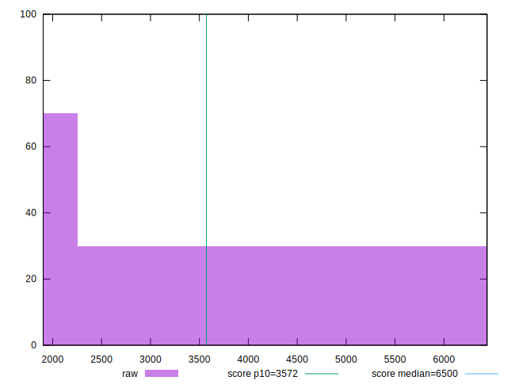

# //first-cpu-idle/samples/pages+cached+noadtech+nomedia

[→ Parent](../..)


## Raw


```yaml
p90min: 1906.2454500000003
p90max: 6324.768
p90range: 4418.52255
p90mean: 3090.8679063829786
p90median: 1941.5243249999999
p90stdev: 1832.8085961179515
p90skewness: 1.0297018583454631
p90eccentricity: 1
p90discretization: 1
outlandishness: 1.0416276743673036
confidence: 735.8930089923153
p90confidence: 741.0222920251094

```


## Score


```yaml
p90min: 0.52
p90max: 1
p90range: 0.48
p90mean: 0.8777659574468083
p90median: 1
p90stdev: 0.1969779891328132
p90skewness: -1.0552870382792225
p90eccentricity: 1.0000000000000016
p90discretization: 9.4
outlandishness: 0.9835129526944735
confidence: 0.07922983196678178
p90confidence: 0.07964011151784267

```


## Raw Estimate


## Score Estimate


## P Score


```yaml
p90min: 0.5233253667830179
p90max: 0.9956783545559578
p90range: 0.4723529877729399
p90mean: 0.8756004246294257
p90median: 0.995153536990165
p90stdev: 0.19525261426695348
p90skewness: -1.0558531424101618
p90eccentricity: 0.9999999999999997
p90discretization: 1
outlandishness: 0.9834716092079718
confidence: 0.07855031022210551
p90confidence: 0.07894252572497268

```


## Score Difference


```yaml
p90min: 0
p90max: 1.1102230246251565e-16
p90range: 1.1102230246251565e-16
p90mean: 3.543264972207946e-18
p90median: 0
p90stdev: 1.9514781802162945e-17
p90skewness: 5.326002287485504
p90eccentricity: 1.0000000000000058
p90discretization: 47
outlandishness: 3.5344000000000007
confidence: 1.0335413782903688e-17
p90confidence: 7.890015558655772e-18

```


## P Score Difference


```yaml
p90min: -0.004895732658254381
p90max: 0.004376018249283353
p90range: 0.009271750907537735
p90mean: -0.0022949029848384254
p90median: -0.0043952535544136695
p90stdev: 0.003159862031560703
p90skewness: 0.853122900550019
p90eccentricity: 1.0000000000000004
p90discretization: 1
outlandishness: 0.8907000629683383
confidence: 0.00130336417992325
p90confidence: 0.001277562867213626

```

