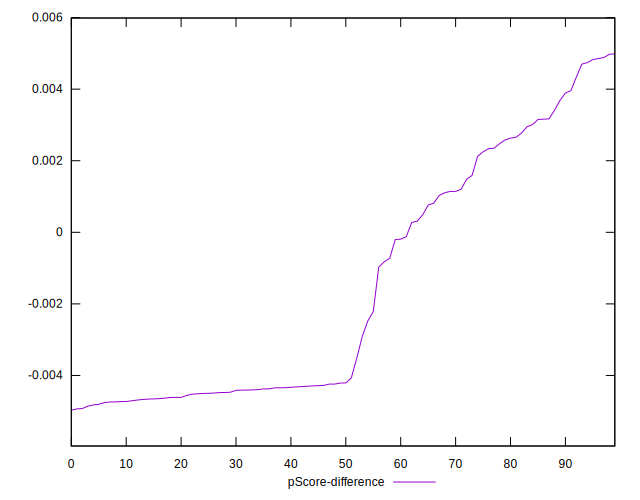

# //first-cpu-idle/samples/pages+cached+noadtech

[→ Parent](../..)


## Raw


```yaml
p90min: 1903.0279999999998
p90max: 6574.4619999999995
p90range: 4671.433999999999
p90mean: 3490.351838829788
p90median: 1956.67375
p90stdev: 2047.4592475632296
p90skewness: 0.5794052034027881
p90eccentricity: 1
p90discretization: 1
outlandishness: 1.0383867573764463
confidence: 827.2590065500397
p90confidence: 827.807632325001

```


## Score


```yaml
p90min: 0.49
p90max: 1
p90range: 0.51
p90mean: 0.8315957446808511
p90median: 0.99
p90stdev: 0.220725607994282
p90skewness: -0.583710971544594
p90eccentricity: 0.9999999999999988
p90discretization: 9.4
outlandishness: 0.9815772608513121
confidence: 0.08948585995011757
p90confidence: 0.0892415041543337

```


## Raw Estimate


## Score Estimate


## P Score


```yaml
p90min: 0.49027345639634895
p90max: 0.9957240459132746
p90range: 0.5054505895169257
p90mean: 0.830197075537114
p90median: 0.9949142029956586
p90stdev: 0.21915433783006055
p90skewness: -0.5842843057500596
p90eccentricity: 1
p90discretization: 1
outlandishness: 0.9813793739607485
confidence: 0.08888976664176229
p90confidence: 0.08860622438701471

```


## Score Difference


```yaml
p90min: 0
p90max: 0
p90range: 0
p90mean: 0
p90median: 0
p90stdev: 0
p90skewness: .nan
p90eccentricity: .nan
p90discretization: 94
outlandishness: .inf
confidence: 4.821687579291883e-18
p90confidence: 0

```


## P Score Difference


```yaml
p90min: -0.004858056027601643
p90max: 0.004854472358048589
p90range: 0.009712528385650232
p90mean: -0.0015625749503334375
p90median: -0.004209563643603975
p90stdev: 0.003384072446085906
p90skewness: 0.5147807170874742
p90eccentricity: 0.9999999999999992
p90discretization: 1
outlandishness: 0.8833824157574676
confidence: 0.0013787177452405036
p90confidence: 0.0013682133124479376

```

