# //first-cpu-idle/samples/pages+cached

[→ Parent](../..)


## Raw


```yaml
p90min: 2061.3495000000003
p90max: 3222.4269999999988
p90range: 1161.0774999999985
p90mean: 2139.740884574468
p90median: 2085.7007500000004
p90stdev: 218.56180881070267
p90skewness: 4.368237662410132
p90eccentricity: 1.0000000000000002
p90discretization: 1
outlandishness: 1.0413583351168314
confidence: 134.7841357088309
p90confidence: 88.3666591574834

```

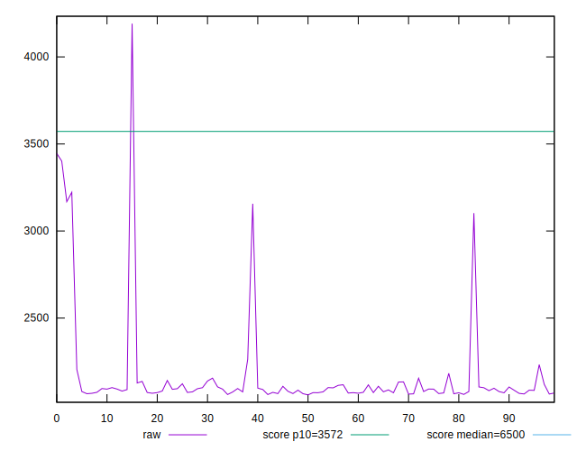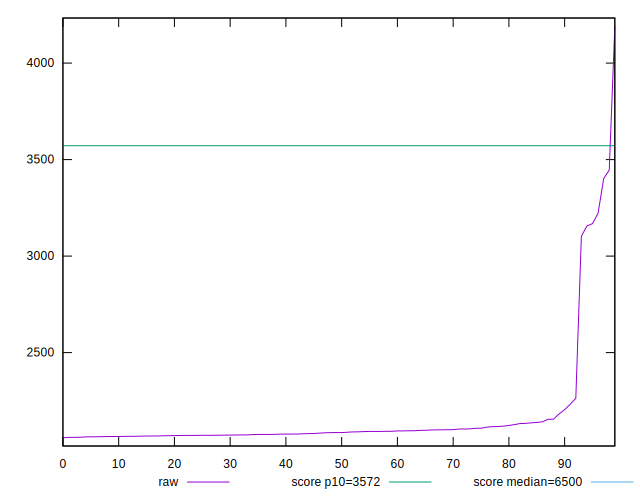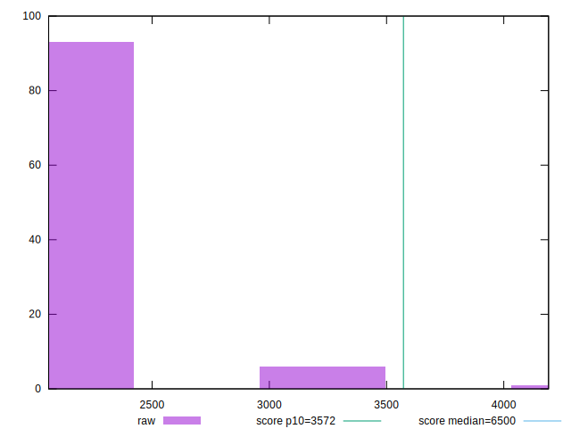
## Score


```yaml
p90min: 0.93
p90max: 0.99
p90range: 0.05999999999999994
p90mean: 0.9877659574468074
p90median: 0.99
p90stdev: 0.010634573816261204
p90skewness: -4.588072633107708
p90eccentricity: 0.9999999999999982
p90discretization: 31.333333333333332
outlandishness: 0.9940036311327203
confidence: 0.008342726622445715
p90confidence: 0.004299661339829803

```

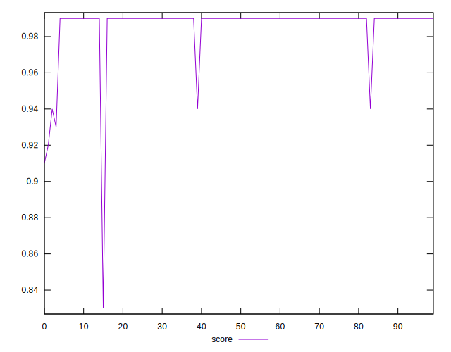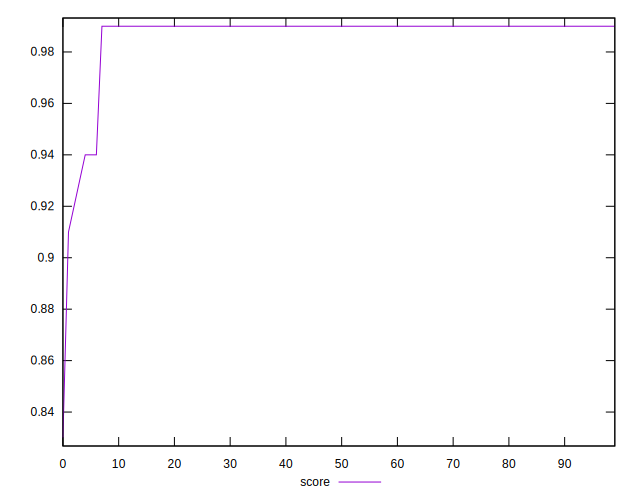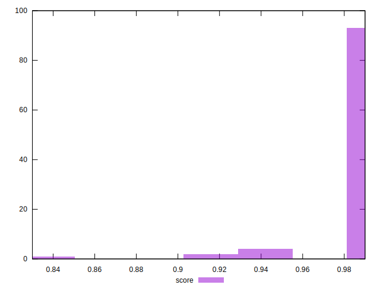
## Raw Estimate

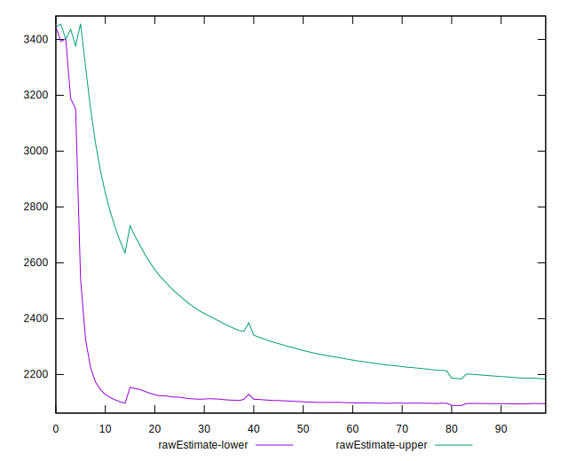
## Score Estimate

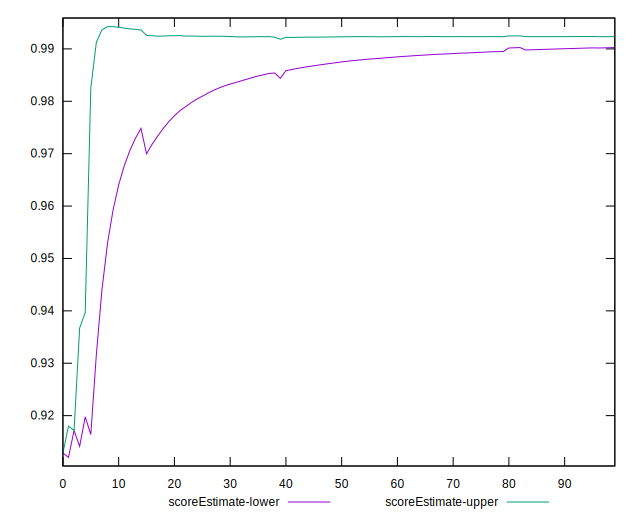
## P Score


```yaml
p90min: 0.9334537455641021
p90max: 0.9930221257322875
p90range: 0.05956838016818544
p90mean: 0.9900142952239178
p90median: 0.9925182433061006
p90stdev: 0.010928144579545622
p90skewness: -4.5244184605971025
p90eccentricity: 0.9999999999999996
p90discretization: 1
outlandishness: 0.9938546791715506
confidence: 0.008624022838479172
p90confidence: 0.00441835484680121

```

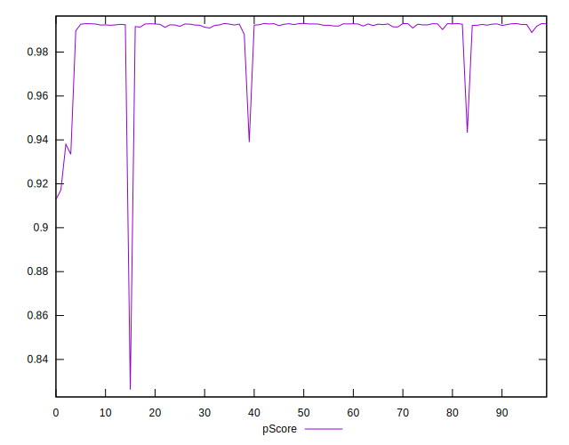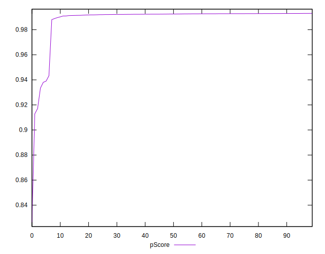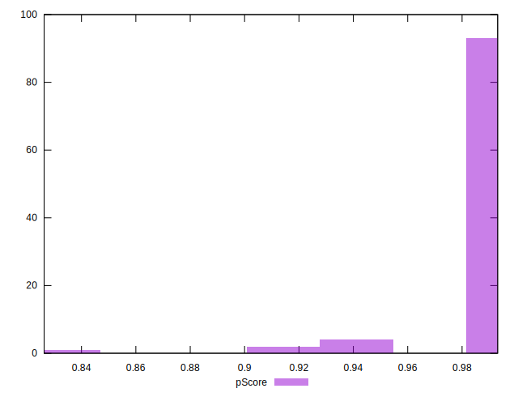
## Score Difference


```yaml
p90min: 0
p90max: 1.1102230246251565e-16
p90range: 1.1102230246251565e-16
p90mean: 1.1810883240693154e-18
p90median: 0
p90stdev: 1.139000331521095e-17
p90skewness: 9.539955591519904
p90eccentricity: 1.0000000000000002
p90discretization: 47
outlandishness: 14.137600000000003
confidence: 8.528132291650278e-18
p90confidence: 4.605088813249998e-18

```

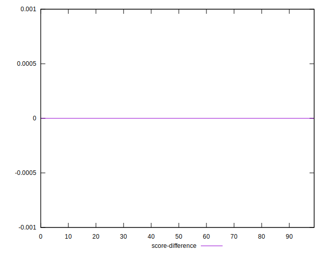
## P Score Difference


```yaml
p90min: -0.0019648129163004624
p90max: 0.003035989500715708
p90range: 0.00500080241701617
p90mean: 0.002292653151355001
p90median: 0.002560815442577913
p90stdev: 0.0008952087510594243
p90skewness: -2.652481207089674
p90eccentricity: 0.9999999999999996
p90discretization: 1
outlandishness: 0.8939092458567338
confidence: 0.0004923904528915431
p90confidence: 0.000361941580782666

```

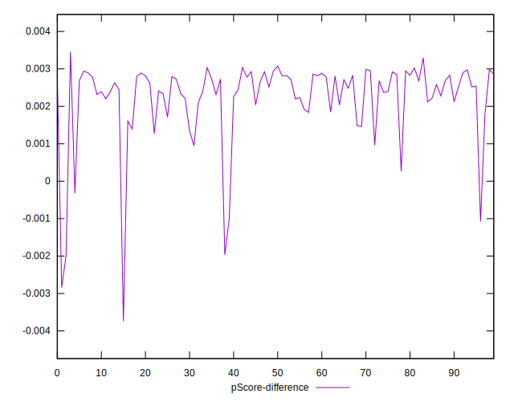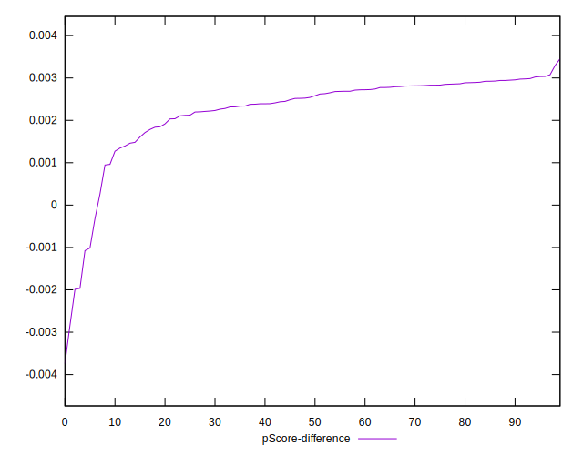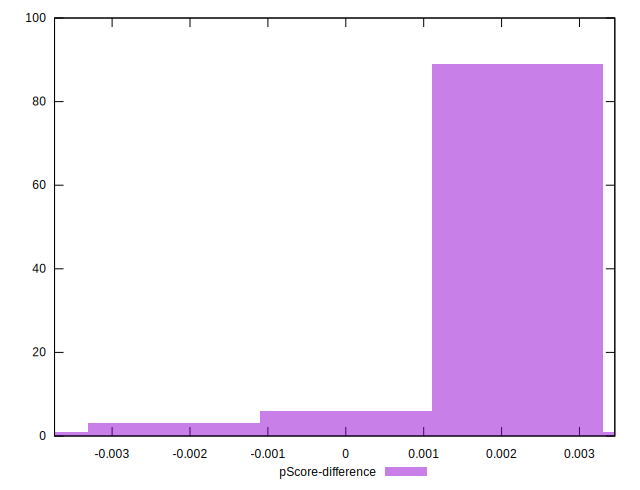