# //first-cpu-idle/samples/pages

[→ Parent](../..)


## Raw


```yaml
p90min: 2333.9035
p90max: 4419.687999999999
p90range: 2085.7844999999993
p90mean: 2601.497245212766
p90median: 2496.1712500000003
p90stdev: 456.39335600240054
p90skewness: 3.1925736775951017
p90eccentricity: 1.0000000000000016
p90discretization: 1
outlandishness: 1.1136984904710203
confidence: 491.0984407812008
p90confidence: 184.524260441741

```

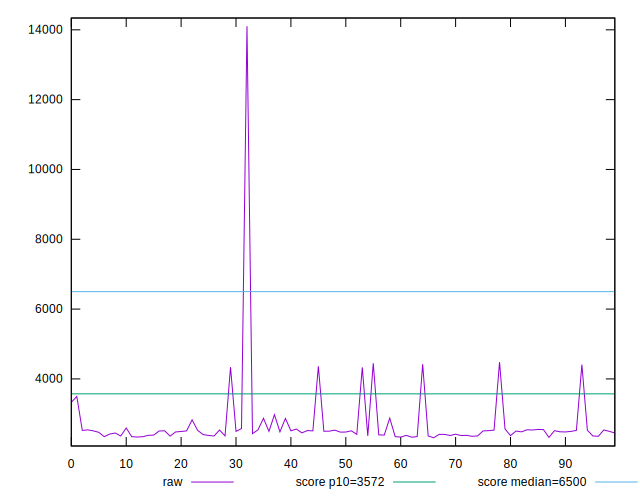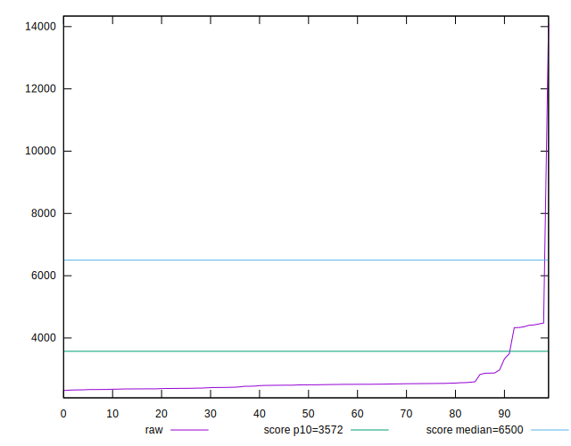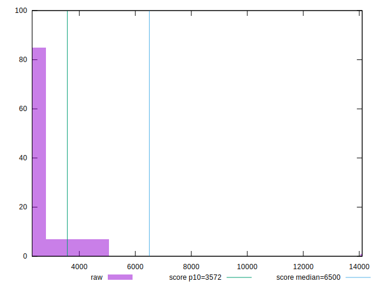
## Score


```yaml
p90min: 0.8
p90max: 0.99
p90range: 0.18999999999999995
p90mean: 0.9690425531914896
p90median: 0.98
p90stdev: 0.04068742157390015
p90skewness: -3.58396118272652
p90eccentricity: 1.0000000000000018
p90discretization: 11.75
outlandishness: 0.9750960837856921
confidence: 0.0401852654168737
p90confidence: 0.01645031917415944

```

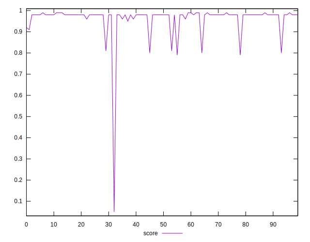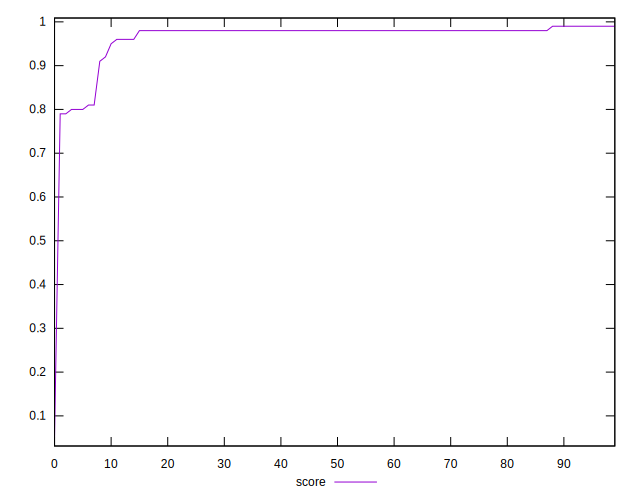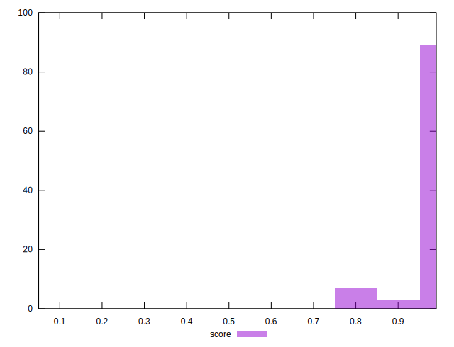
## Raw Estimate

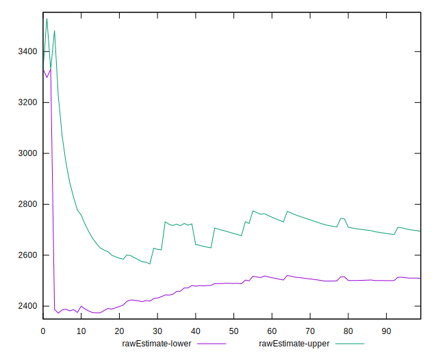
## Score Estimate

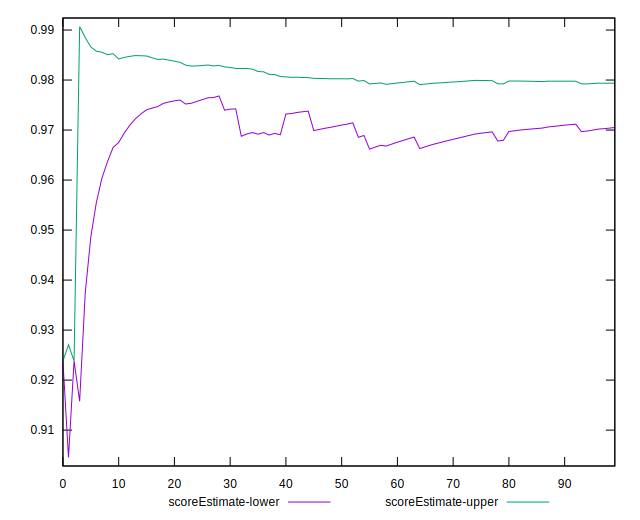
## P Score


```yaml
p90min: 0.7955174682371425
p90max: 0.985830972207657
p90range: 0.1903135039705145
p90mean: 0.9691174915074126
p90median: 0.9797537494653541
p90stdev: 0.04108089328049505
p90skewness: -3.6062579918026723
p90eccentricity: 0.9999999999999999
p90discretization: 1
outlandishness: 0.9748000061934409
confidence: 0.0402884820652653
p90confidence: 0.016609403601461643

```

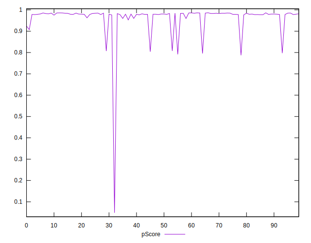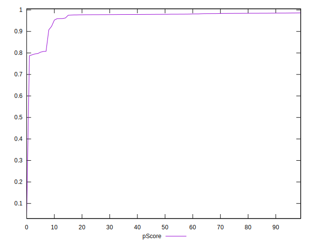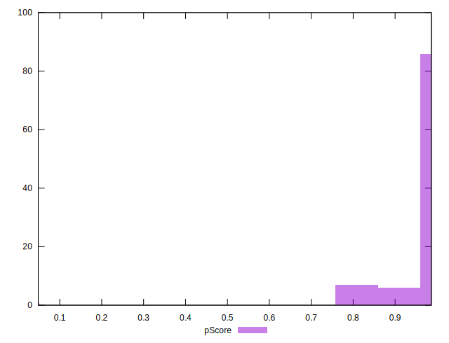
## Score Difference


```yaml
p90min: 0
p90max: 0
p90range: 0
p90mean: 0
p90median: 0
p90stdev: 0
p90skewness: .nan
p90eccentricity: .nan
p90discretization: 94
outlandishness: .inf
confidence: 4.3301796410739334e-18
p90confidence: 0

```

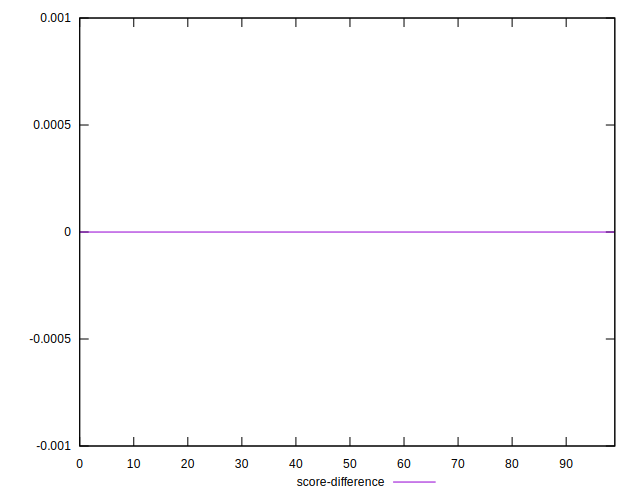
## P Score Difference


```yaml
p90min: -0.004632261269857496
p90max: 0.004754332248887105
p90range: 0.009386593518744601
p90mean: -0.00007567735315967459
p90median: -0.0005190233271598621
p90stdev: 0.002812908947362057
p90skewness: 0.2308353893111944
p90eccentricity: 0.9999999999999999
p90discretization: 1
outlandishness: 0.887642011102106
confidence: 0.0011654730929934664
p90confidence: 0.0011372863701355233

```

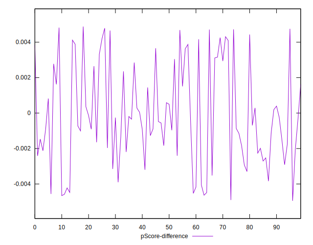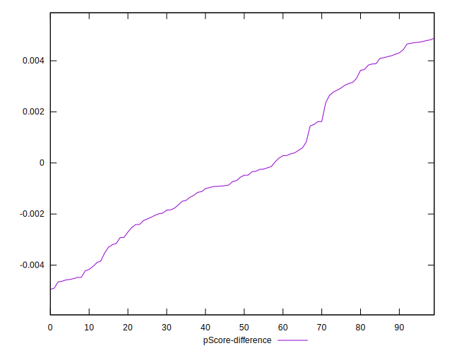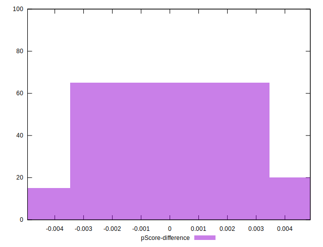