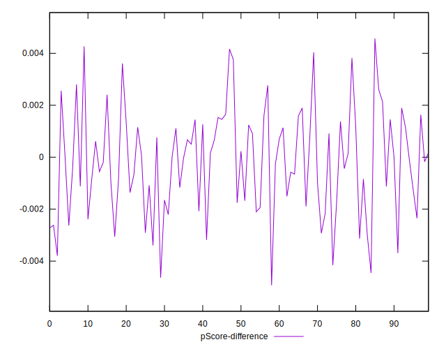

# //first-meaningful-paint/samples/pages+cached+noadtech

[→ Parent](../..)


## Raw


```yaml
p90min: 1903.0279999999998
p90max: 2152.6495
p90range: 249.6215000000002
p90mean: 1967.930915957447
p90median: 1934.5833749999997
p90stdev: 68.66160118316857
p90skewness: 1.0636965119562098
p90eccentricity: 0.9999999999999994
p90discretization: 1
outlandishness: 1.0247505521230356
confidence: 72.09490047975851
p90confidence: 27.760551314869073

```


## Score


```yaml
p90min: 0.93
p90max: 0.96
p90range: 0.029999999999999916
p90mean: 0.9542553191489348
p90median: 0.96
p90stdev: 0.009049434177930533
p90skewness: -1.112722674702372
p90eccentricity: 0.9999999999999991
p90discretization: 23.5
outlandishness: 0.9896412356361907
confidence: 0.013872945739831326
p90confidence: 0.0036587740096068865

```


## Raw Estimate


## Score Estimate


## P Score


```yaml
p90min: 0.9300704177100363
p90max: 0.9616358548281282
p90range: 0.0315654371180919
p90mean: 0.9540745423008309
p90median: 0.9582569583154164
p90stdev: 0.008402851180588302
p90skewness: -1.1364385971562736
p90eccentricity: 1
p90discretization: 1
outlandishness: 0.989633766553095
confidence: 0.01395892333717829
p90confidence: 0.0033973542325009464

```


## Score Difference


```yaml
p90min: 0
p90max: 1.1102230246251565e-16
p90range: 1.1102230246251565e-16
p90mean: 2.834611977766357e-17
p90median: 0
p90stdev: 4.8410215627952e-17
p90skewness: 1.1222850838908152
p90eccentricity: 1.0000000000000009
p90discretization: 47
outlandishness: 1.1183062500000003
confidence: 1.932109022792003e-17
p90confidence: 1.9572719714451914e-17

```


## P Score Difference


```yaml
p90min: -0.004156083312402581
p90max: 0.00403860273574097
p90range: 0.008194686048143551
p90mean: -0.0001842279139981681
p90median: -0.00005569402247107558
p90stdev: 0.0018937557160161153
p90skewness: 0.024140604455981204
p90eccentricity: 1.0000000000000002
p90discretization: 1
outlandishness: 0.991245557883504
confidence: 0.0008398775980381882
p90confidence: 0.0007656638037328383

```

