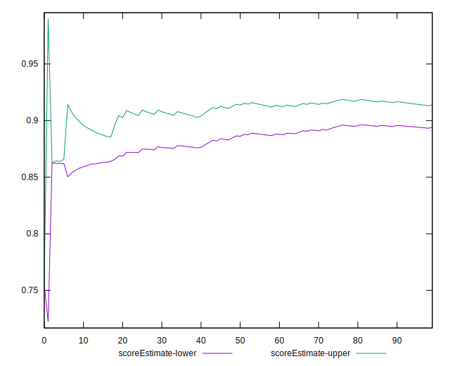

# //interactive/samples/pages+cached+noadtech+nomedia+nocss

[→ Parent](../..)


## Raw


```yaml
p90min: 2893.3330000000005
p90max: 4195.283
p90range: 1301.9499999999998
p90mean: 3740.024871808511
p90median: 4071.9835749999997
p90stdev: 553.1189183399927
p90skewness: -0.8249268884281001
p90eccentricity: 0.9999999999999999
p90discretization: 1
outlandishness: 0.9991888550802889
confidence: 226.35549139739615
p90confidence: 223.63134344682712

```


## Score


```yaml
p90min: 0.86
p90max: 0.96
p90range: 0.09999999999999998
p90mean: 0.8963829787234043
p90median: 0.87
p90stdev: 0.042246769077767185
p90skewness: 0.8096975641115361
p90eccentricity: 0.9999999999999987
p90discretization: 18.8
outlandishness: 0.9991456845592647
confidence: 0.017739568951675867
p90confidence: 0.01708077849425792

```


## Raw Estimate


## Score Estimate


## P Score


```yaml
p90min: 0.8600962737364513
p90max: 0.9645170012808866
p90range: 0.10442072754443532
p90mean: 0.8980776761443285
p90median: 0.8726390182938701
p90stdev: 0.043746346558774504
p90skewness: 0.8117797438935034
p90eccentricity: 1.0000000000000002
p90discretization: 1
outlandishness: 0.9993403314954136
confidence: 0.018277940682034487
p90confidence: 0.01768707221439812

```


## Score Difference


```yaml
p90min: 0
p90max: 0
p90range: 0
p90mean: 0
p90median: 0
p90stdev: 0
p90skewness: .nan
p90eccentricity: .nan
p90discretization: 94
outlandishness: .inf
confidence: 4.330179641073934e-18
p90confidence: 0

```


## P Score Difference


```yaml
p90min: -0.0048423178233319986
p90max: 0.0045907444182893276
p90range: 0.009433062241621326
p90mean: 0.0018984489792836677
p90median: 0.002892289217315769
p90stdev: 0.002843839264444404
p90skewness: -1.224979957804478
p90eccentricity: 1.0000000000000002
p90discretization: 1
outlandishness: 0.8805016106733614
confidence: 0.0011914527274096177
p90confidence: 0.001149791797328505

```

