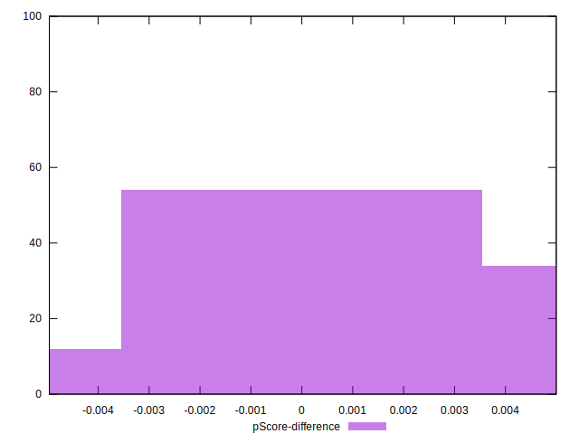

# //interactive/samples/pages+cached+noadtech+nomedia

[→ Parent](../..)


## Raw


```yaml
p90min: 3727.5165500000007
p90max: 6086.219499999999
p90range: 2358.7029499999985
p90mean: 5289.570558767542
p90median: 5895.038025
p90stdev: 1001.6724849961264
p90skewness: -0.8726379816221913
p90eccentricity: 1.0000000000000007
p90discretization: 1
outlandishness: 1.0005261937551582
confidence: 411.70889342199365
p90confidence: 404.9859010168828

```


## Score


```yaml
p90min: 0.64
p90max: 0.91
p90range: 0.27
p90mean: 0.728085106382978
p90median: 0.66
p90stdev: 0.11225234296701529
p90skewness: 0.8693352640685013
p90eccentricity: 0.9999999999999997
p90discretization: 10.444444444444445
outlandishness: 0.9994915900603277
confidence: 0.046222899045228805
p90confidence: 0.04538471100953585

```


## Raw Estimate


## Score Estimate


## P Score


```yaml
p90min: 0.638632426253003
p90max: 0.9051404421108424
p90range: 0.26650801585783945
p90mean: 0.7296110771414336
p90median: 0.6616893217425188
p90stdev: 0.11299201770457096
p90skewness: 0.8704277705521406
p90eccentricity: 1.0000000000000002
p90discretization: 1
outlandishness: 0.9990961254512422
confidence: 0.046483815655967826
p90confidence: 0.04568376868011723

```


## Score Difference


```yaml
p90min: 0
p90max: 0
p90range: 0
p90mean: 0
p90median: 0
p90stdev: 0
p90skewness: .nan
p90eccentricity: .nan
p90discretization: 94
outlandishness: .inf
confidence: 4.330179641073934e-18
p90confidence: 0

```


## P Score Difference


```yaml
p90min: -0.004828315514716963
p90max: 0.004911992109599361
p90range: 0.009740307624316324
p90mean: 0.0014679099540297795
p90median: 0.0022491594630908995
p90stdev: 0.002884066016688105
p90skewness: -0.7726952887059463
p90eccentricity: 1.0000000000000002
p90discretization: 1
outlandishness: 0.8854308565546841
confidence: 0.0012014935605389862
p90confidence: 0.001166055863424382

```

