# //interactive/samples/pages+cached+noadtech

[→ Parent](../..)


## Raw


```yaml
p90min: 4286.303
p90max: 6893.9898
p90range: 2607.6868000000004
p90mean: 5745.2534356382985
p90median: 6437.063000000001
p90stdev: 1063.050655264448
p90skewness: -0.553020886343475
p90eccentricity: 0.9999999999999997
p90discretization: 1
outlandishness: 1.0012936604112852
confidence: 431.97673174752293
p90confidence: 429.80169057007197

```

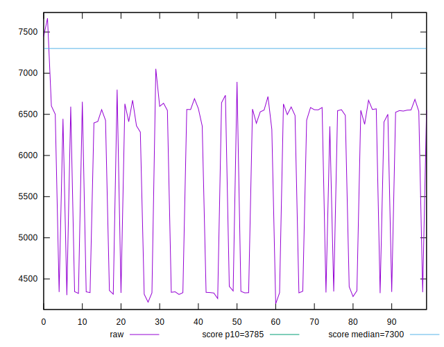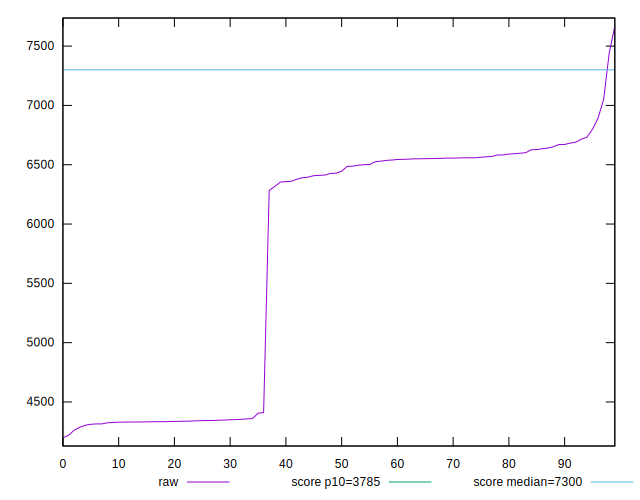
## Score


```yaml
p90min: 0.54
p90max: 0.85
p90range: 0.30999999999999994
p90mean: 0.6786170212765961
p90median: 0.6
p90stdev: 0.1264709289935395
p90skewness: 0.5517032678168693
p90eccentricity: 0.9999999999999999
p90discretization: 9.4
outlandishness: 0.9990659025130006
confidence: 0.05122988940762062
p90confidence: 0.051133423247708434

```

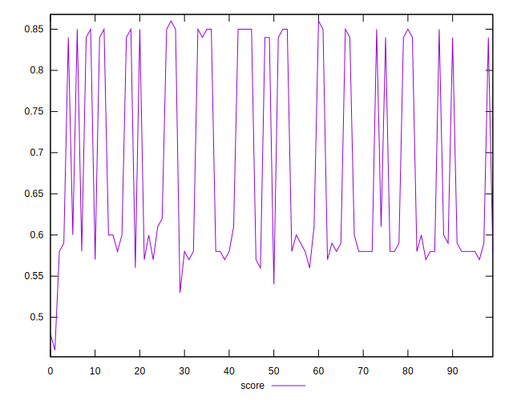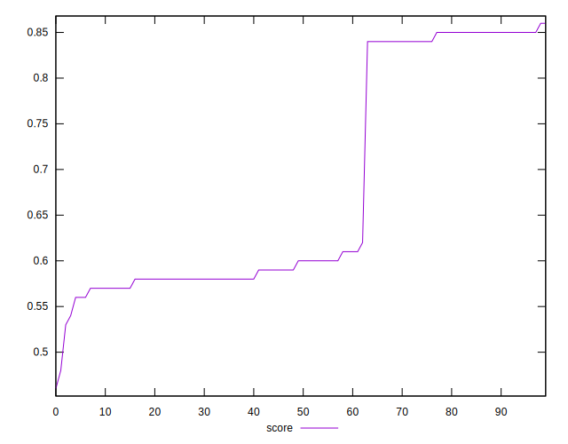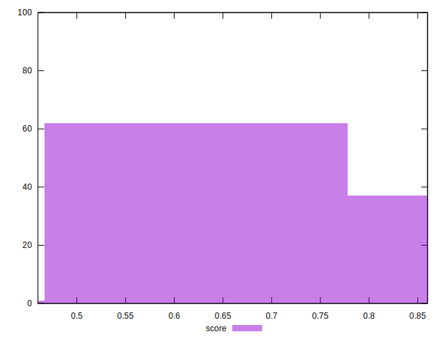
## Raw Estimate

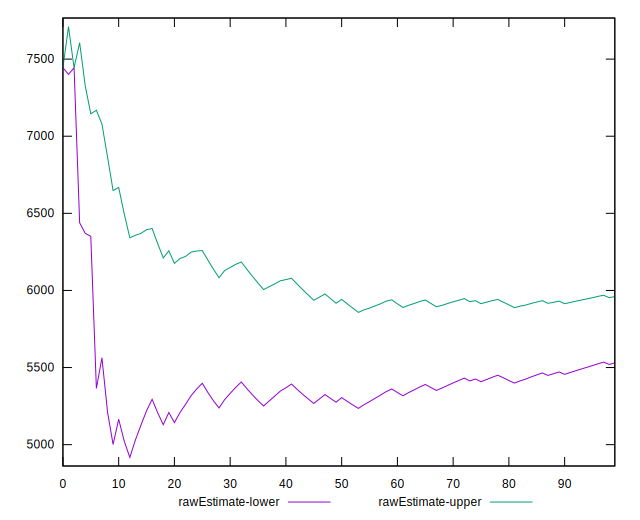
## Score Estimate

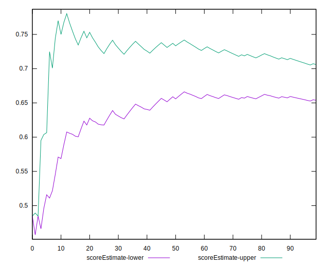
## P Score


```yaml
p90min: 0.5444502322430048
p90max: 0.8505682385411577
p90range: 0.3061180062981529
p90mean: 0.6788572466294117
p90median: 0.596948126481138
p90stdev: 0.12553382041408828
p90skewness: 0.5537302996711659
p90eccentricity: 0.9999999999999999
p90discretization: 1
outlandishness: 0.9991425697584317
confidence: 0.05087287546474297
p90confidence: 0.05075454115991586

```

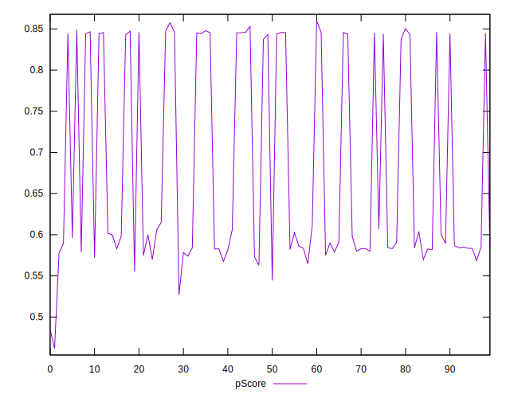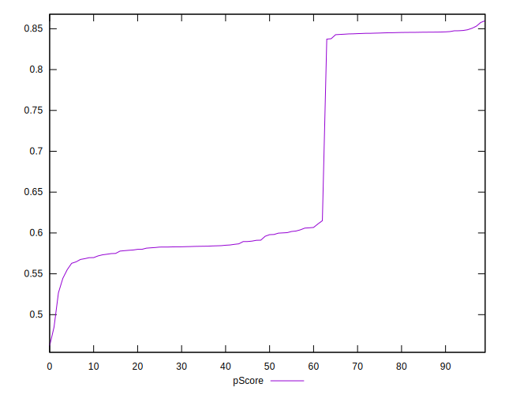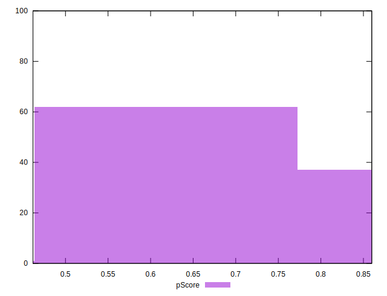
## Score Difference


```yaml
p90min: 0
p90max: 1.1102230246251565e-16
p90range: 1.1102230246251565e-16
p90mean: 7.086529944415892e-18
p90median: 0
p90stdev: 2.7139343474843178e-17
p90skewness: 3.568591947091805
p90eccentricity: 0.9999999999999992
p90discretization: 47
outlandishness: 1.9881000000000004
confidence: 1.2454613861688434e-17
p90confidence: 1.0972699794392902e-17

```

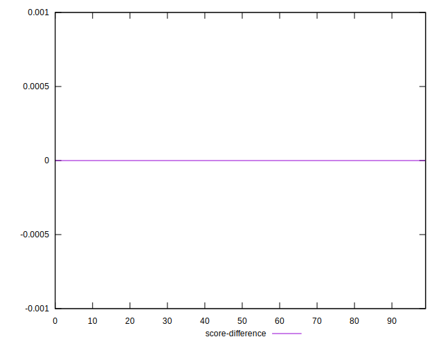
## P Score Difference


```yaml
p90min: -0.00485020730447927
p90max: 0.004793334977073349
p90range: 0.00964354228155262
p90mean: 0.0002819263155478352
p90median: 0.00022802952465389437
p90stdev: 0.0031911086785807513
p90skewness: -0.15981410997232312
p90eccentricity: 0.9999999999999991
p90discretization: 1
outlandishness: 0.8911990074494958
confidence: 0.0013023801444445704
p90confidence: 0.0012901961896685397

```

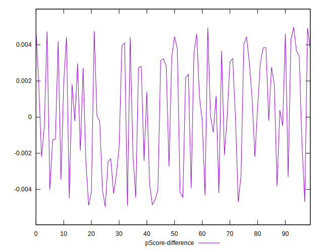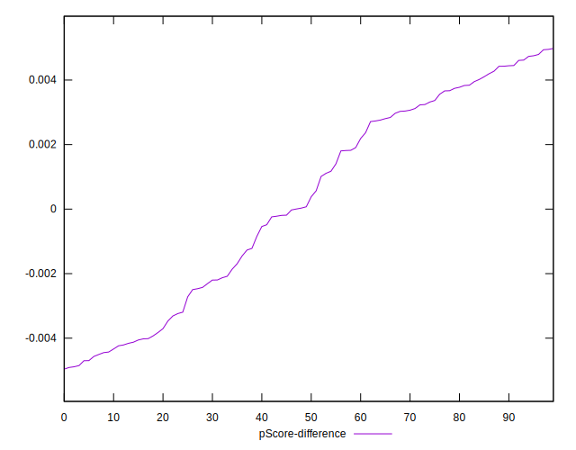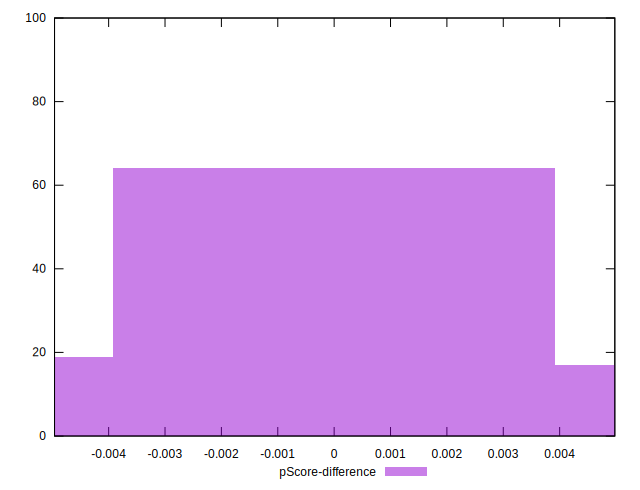