# //interactive/samples/pages+cached

[→ Parent](../..)


## Raw


```yaml
p90min: 13845.716
p90max: 14597.712500000001
p90range: 751.9965000000011
p90mean: 14071.203944148932
p90median: 14040.348675000001
p90stdev: 153.42513948534545
p90skewness: 1.113651855717225
p90eccentricity: 0.9999999999999991
p90discretization: 1
outlandishness: 1.0049867682759233
confidence: 116.08143661519817
p90confidence: 62.03127198143396

```

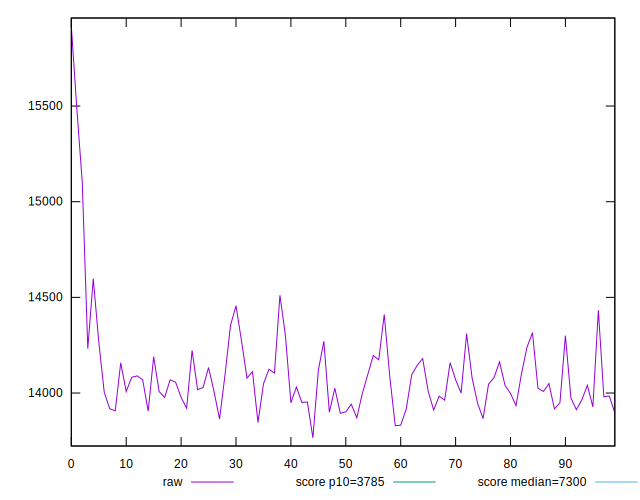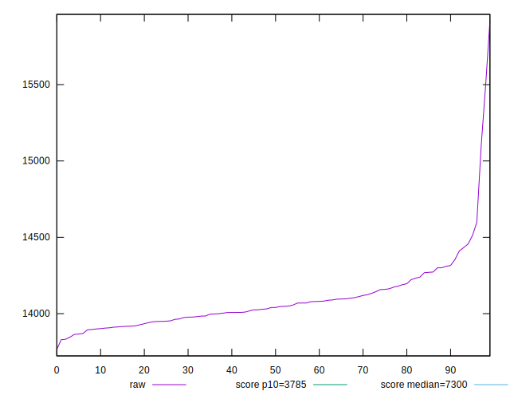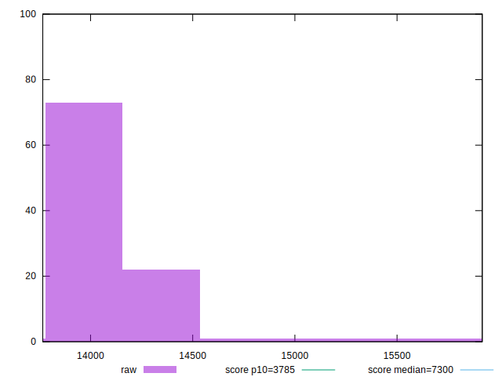
## Score


```yaml
p90min: 0.09
p90max: 0.11
p90range: 0.020000000000000004
p90mean: 0.09936170212765943
p90median: 0.1
p90stdev: 0.0038060731531911335
p90skewness: -0.6498572559607552
p90eccentricity: 1.0000000000000004
p90discretization: 31.333333333333332
outlandishness: 0.9887257477451863
confidence: 0.0026166803782665575
p90confidence: 0.001538832291362421

```

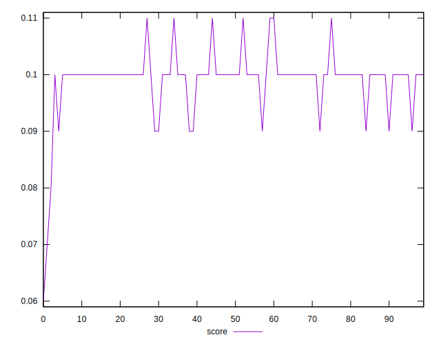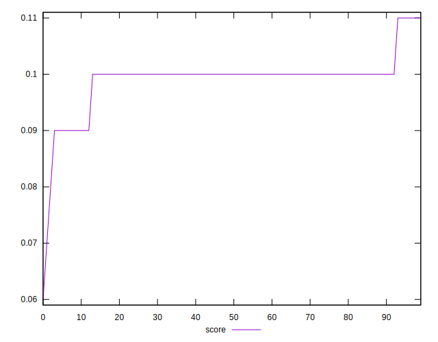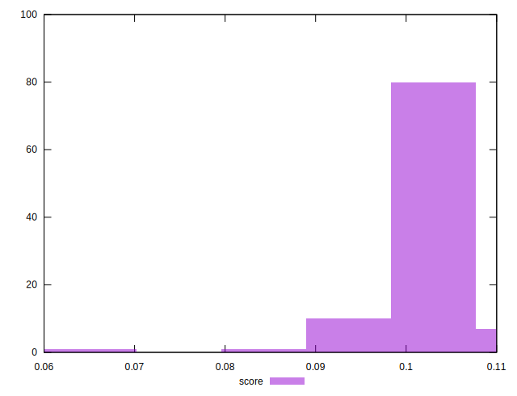
## Raw Estimate

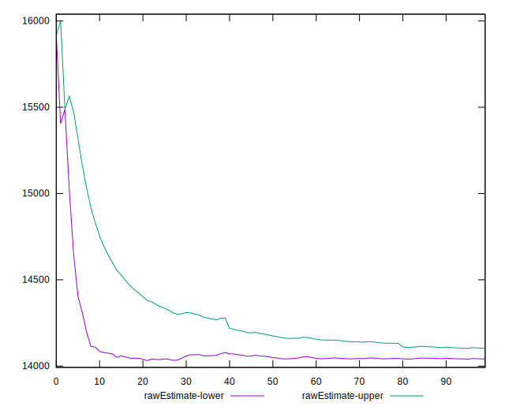
## Score Estimate

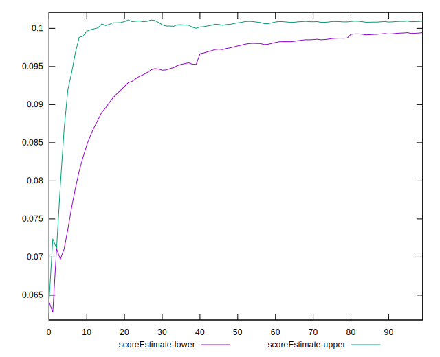
## P Score


```yaml
p90min: 0.08817043952650555
p90max: 0.10584809775586279
p90range: 0.01767765822935724
p90mean: 0.10026655165874335
p90median: 0.10095102012300983
p90stdev: 0.0036642310816766667
p90skewness: -1.010394886093864
p90eccentricity: 1
p90discretization: 1
outlandishness: 0.9865094871141558
confidence: 0.002477002583906924
p90confidence: 0.001481484166107079

```

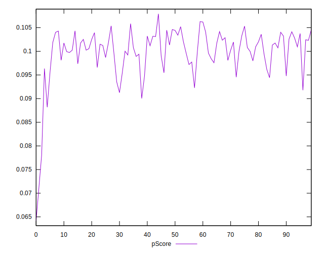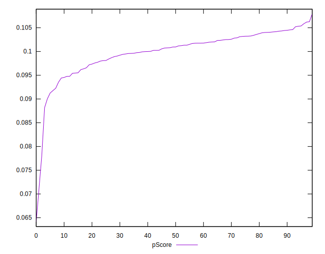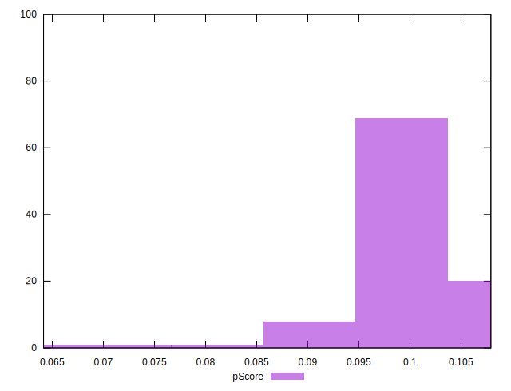
## Score Difference


```yaml
p90min: 0
p90max: 0
p90range: 0
p90mean: 0
p90median: 0
p90stdev: 0
p90skewness: .nan
p90eccentricity: .nan
p90discretization: 94
outlandishness: .nan
confidence: 0
p90confidence: 0

```


## P Score Difference


```yaml
p90min: -0.004587731105241993
p90max: 0.004554173084622609
p90range: 0.009141904189864603
p90mean: 0.0008376387003251416
p90median: 0.0012038359377754548
p90stdev: 0.0025268114470255645
p90skewness: -0.4153241318907425
p90eccentricity: 1.0000000000000002
p90discretization: 1
outlandishness: 0.8848374857680784
confidence: 0.0010641745711675507
p90confidence: 0.0010216143758579722

```

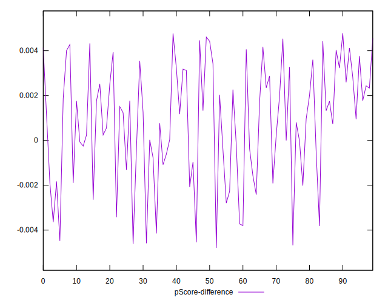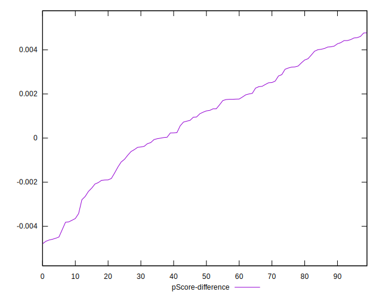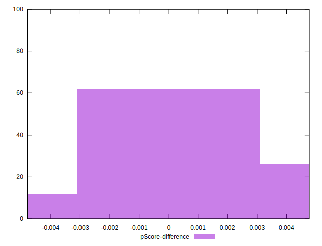