# //interactive/samples/pages

[→ Parent](../..)


## Raw


```yaml
p90min: 14088.369999999999
p90max: 14757.641000000003
p90range: 669.2710000000043
p90mean: 14368.34156702128
p90median: 14362.969500000001
p90stdev: 157.56845318508624
p90skewness: 0.33163400497430695
p90eccentricity: 0.9999999999999996
p90discretization: 1
outlandishness: 0.9987013716093913
confidence: 158.6646281959119
p90confidence: 63.706453896700026

```

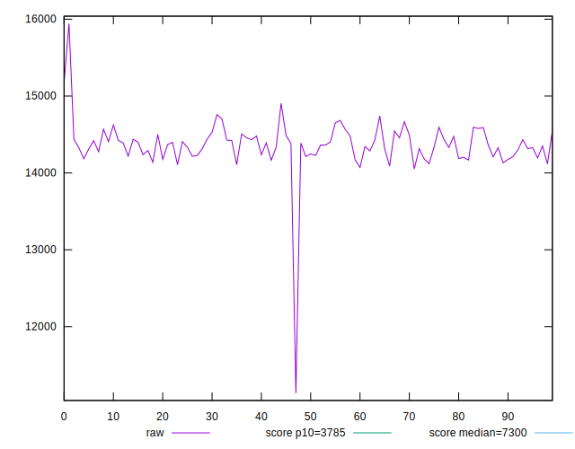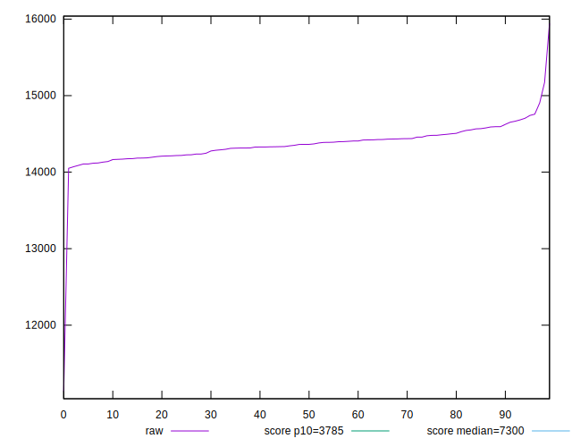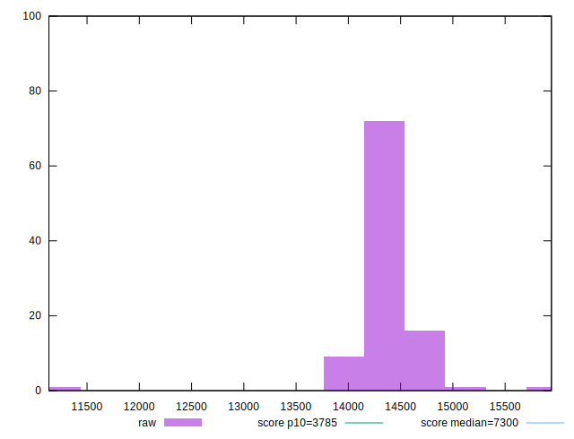
## Score


```yaml
p90min: 0.08
p90max: 0.1
p90range: 0.020000000000000004
p90mean: 0.09297872340425518
p90median: 0.09
p90stdev: 0.00480021879688446
p90skewness: 0.5924990132886105
p90eccentricity: 1.0000000000000016
p90discretization: 31.333333333333332
outlandishness: 1.0155750519717863
confidence: 0.005160477606634872
p90confidence: 0.0019407750174369098

```

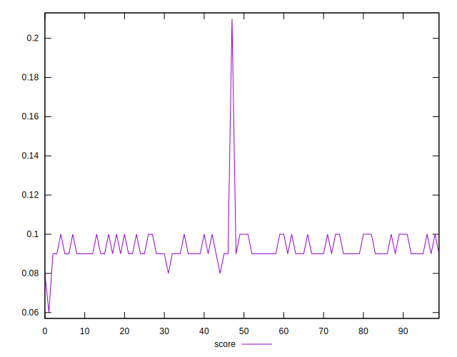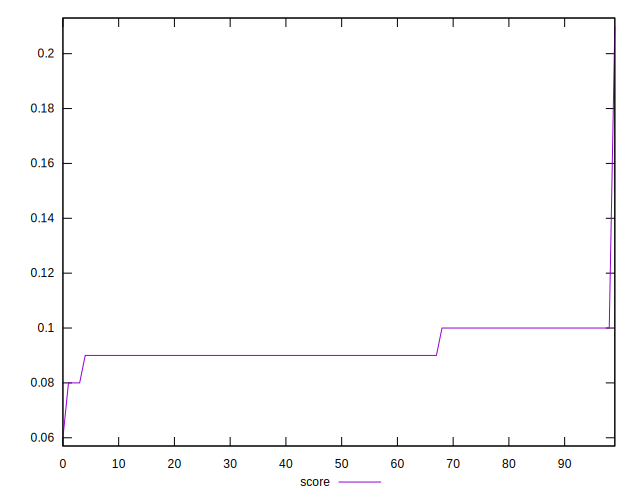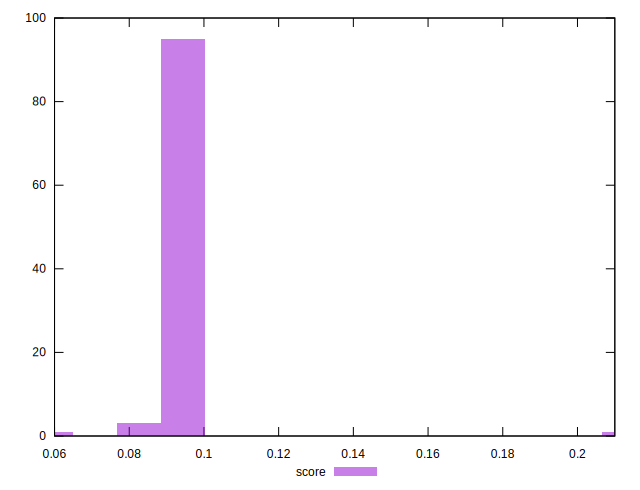
## Raw Estimate

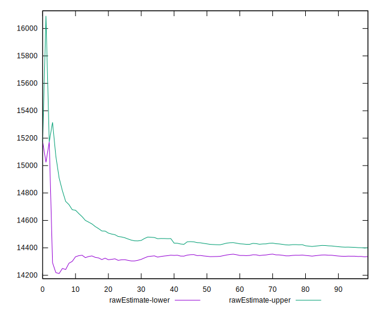
## Score Estimate

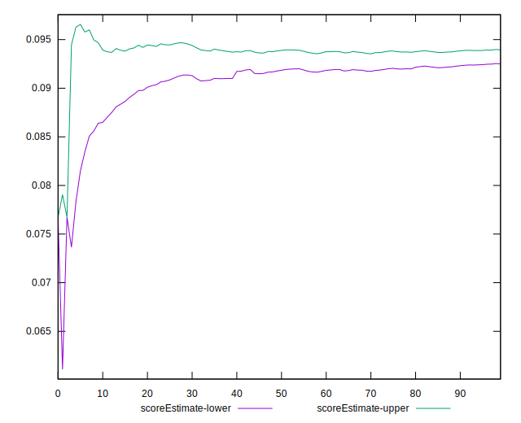
## P Score


```yaml
p90min: 0.08481908644493674
p90max: 0.09977876287099408
p90range: 0.014959676426057333
p90mean: 0.09328591417105178
p90median: 0.09333789773638662
p90stdev: 0.003546247265878562
p90skewness: -0.24827210701555194
p90eccentricity: 0.9999999999999999
p90discretization: 1
outlandishness: 1.0147463700768946
confidence: 0.0048010598764707405
p90confidence: 0.0014337821650417405

```

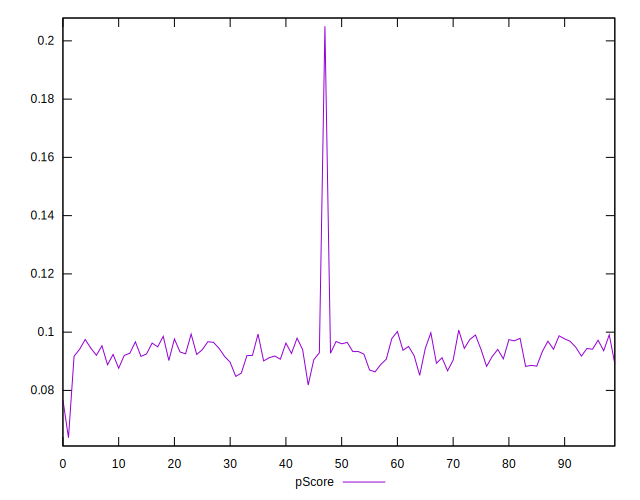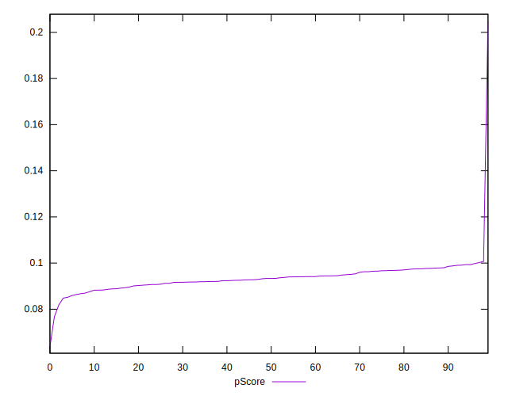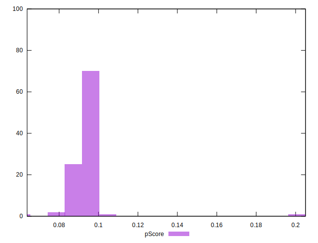
## Score Difference


```yaml
p90min: 0
p90max: 0
p90range: 0
p90mean: 0
p90median: 0
p90stdev: 0
p90skewness: .nan
p90eccentricity: .nan
p90discretization: 94
outlandishness: .nan
confidence: 0
p90confidence: 0

```


## P Score Difference


```yaml
p90min: -0.004684073182176923
p90max: 0.004523486923887904
p90range: 0.009207560106064827
p90mean: 0.0002898194883747942
p90median: 0.0004769983372437392
p90stdev: 0.002708582488094604
p90skewness: -0.04299350369685265
p90eccentricity: 0.9999999999999999
p90discretization: 1
outlandishness: 0.8757102418897431
confidence: 0.0011315908490497067
p90confidence: 0.0010951061707797488

```

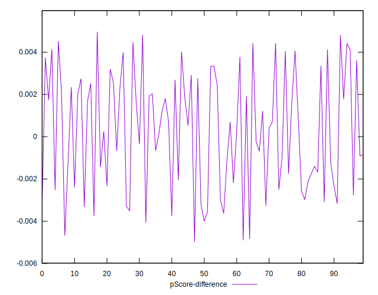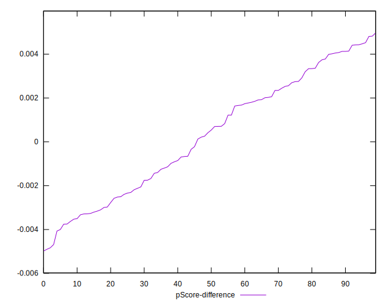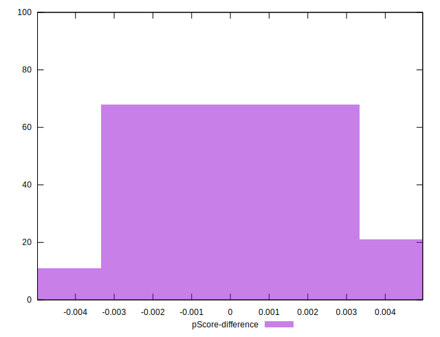