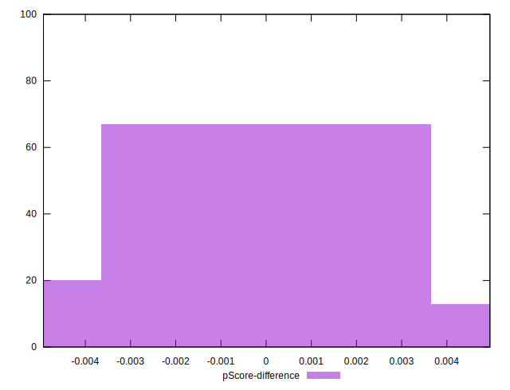

# //largest-contentful-paint/samples/pages+cached+noadtech+nomedia+nocss

[→ Parent](../..)


## Raw


```yaml
p90min: 4203.3755
p90max: 4347.469999999999
p90range: 144.09449999999924
p90mean: 4248.992390425529
p90median: 4227.1050000000005
p90stdev: 41.396299593327
p90skewness: 0.687254924012004
p90eccentricity: 1.0000000000000002
p90discretization: 1
outlandishness: 1.0050798648488053
confidence: 50.341072604847234
p90confidence: 16.73692543290054

```


## Score


```yaml
p90min: 0.41
p90max: 0.45
p90range: 0.040000000000000036
p90mean: 0.4342553191489362
p90median: 0.44
p90stdev: 0.0106680435206142
p90skewness: -0.5416120949762949
p90eccentricity: 1.0000000000000007
p90discretization: 18.8
outlandishness: 0.9910148847451352
confidence: 0.011586752756883468
p90confidence: 0.004313193465926108

```


## Raw Estimate


## Score Estimate


## P Score


```yaml
p90min: 0.4101605909335083
p90max: 0.44621660088802373
p90range: 0.03605600995451541
p90mean: 0.43468091405132436
p90median: 0.44015520189421947
p90stdev: 0.010403380845434277
p90skewness: -0.6756016080457102
p90eccentricity: 0.9999999999999994
p90discretization: 1
outlandishness: 0.9905663192543621
confidence: 0.011724276065370912
p90confidence: 0.004206187779358114

```


## Score Difference


```yaml
p90min: 0
p90max: 0
p90range: 0
p90mean: 0
p90median: 0
p90stdev: 0
p90skewness: .nan
p90eccentricity: .nan
p90discretization: 94
outlandishness: .inf
confidence: 3.711973057415537e-18
p90confidence: 0

```


## P Score Difference


```yaml
p90min: -0.004879734267877467
p90max: 0.004737095174645101
p90range: 0.009616829442522568
p90mean: 0.00034672537732055407
p90median: 0.0013550837915072556
p90stdev: 0.0029644568613631825
p90skewness: -0.4007078830579062
p90eccentricity: 0.9999999999999999
p90discretization: 1
outlandishness: 0.882587707371119
confidence: 0.0012214201228624112
p90confidence: 0.0011985586616462681

```

