# //largest-contentful-paint/samples/pages+cached+noadtech+nomedia

[→ Parent](../..)


## Raw


```yaml
p90min: 6845.38515
p90max: 7645.681000000001
p90range: 800.2958500000013
p90mean: 6975.573552455654
p90median: 6964.097200000002
p90stdev: 97.19756891223199
p90skewness: 3.5270388884190695
p90eccentricity: 0.9999999999999997
p90discretization: 1
outlandishness: 1.0194545460801732
confidence: 181.75978523479375
p90confidence: 39.29791984125735

```

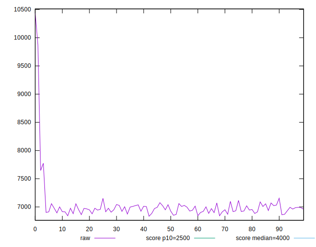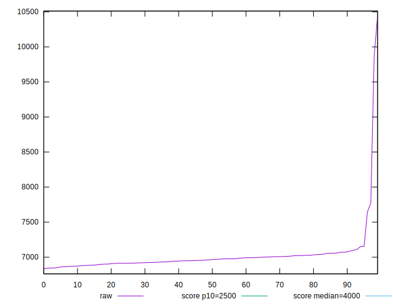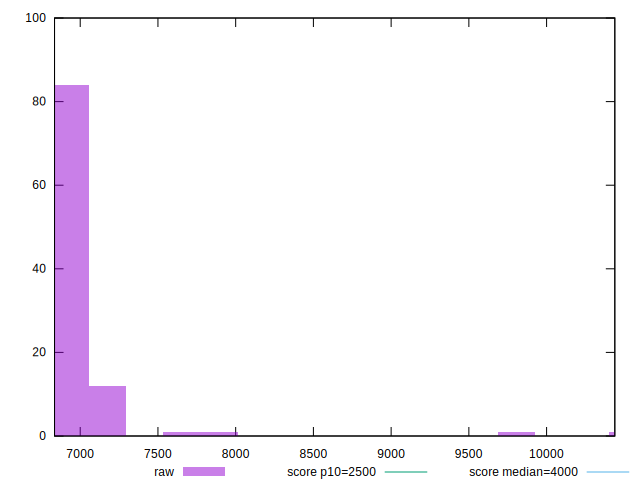
## Score


```yaml
p90min: 0.04
p90max: 0.07
p90range: 0.030000000000000006
p90mean: 0.06489361702127659
p90median: 0.07
p90stdev: 0.005601041098335401
p90skewness: -0.866297715424765
p90eccentricity: 1.0000000000000016
p90discretization: 31.333333333333332
outlandishness: 0.9575103735554958
confidence: 0.004162328588822671
p90confidence: 0.0022645552411781835

```

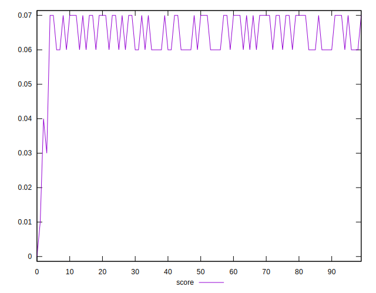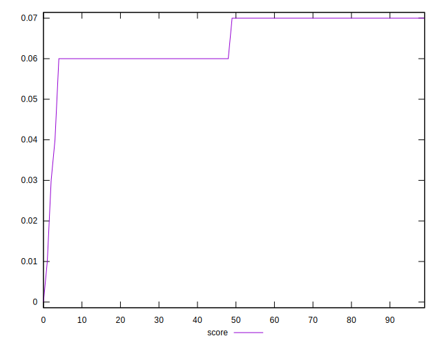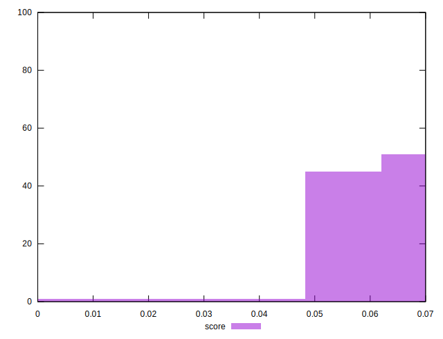
## Raw Estimate

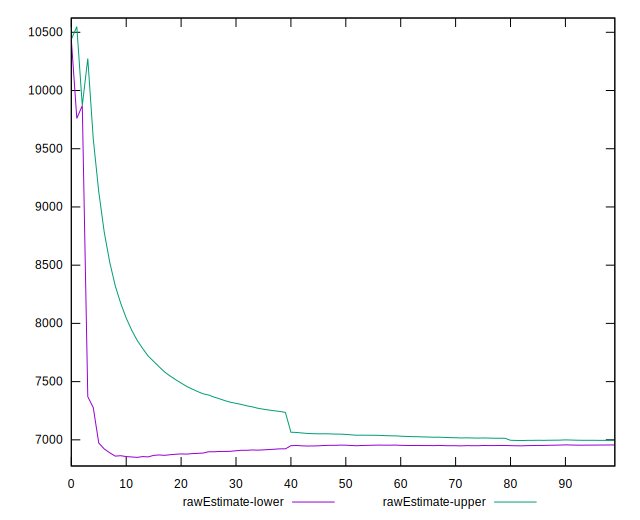
## Score Estimate

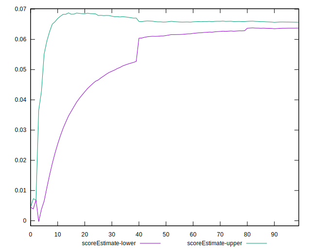
## P Score


```yaml
p90min: 0.03865821063850061
p90max: 0.07146131845664538
p90range: 0.03280310781814477
p90mean: 0.06487336685175502
p90median: 0.06528296710134268
p90stdev: 0.004308665640656377
p90skewness: -2.4277996322200743
p90eccentricity: 0.9999999999999997
p90discretization: 1
outlandishness: 0.961002914547583
confidence: 0.0038465733215886718
p90confidence: 0.0017420353087451088

```

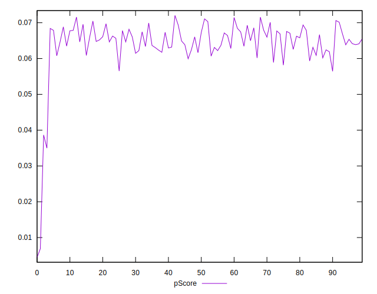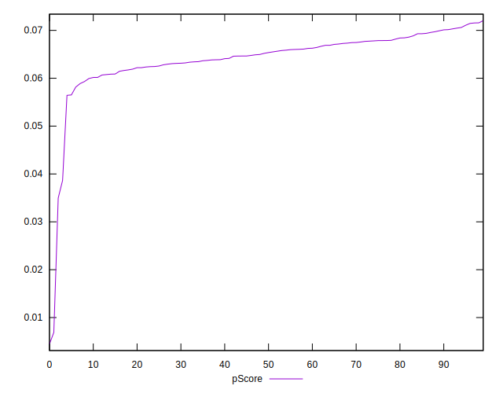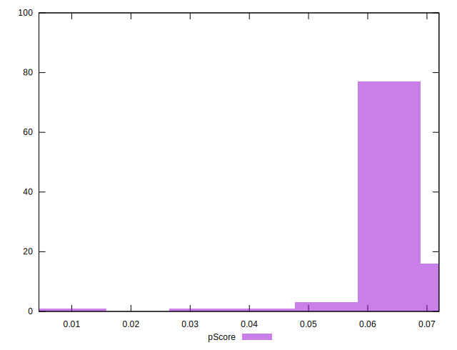
## Score Difference


```yaml
p90min: 0
p90max: 0
p90range: 0
p90mean: 0
p90median: 0
p90stdev: 0
p90skewness: .nan
p90eccentricity: .nan
p90discretization: 94
outlandishness: .nan
confidence: 0
p90confidence: 0

```


## P Score Difference


```yaml
p90min: -0.004349005336459544
p90max: 0.004768232942046924
p90range: 0.009117238278506468
p90mean: 0.0000922953411291135
p90median: 0.00013451951182630317
p90stdev: 0.002749907386428728
p90skewness: 0.07355745192433999
p90eccentricity: 1
p90discretization: 1
outlandishness: 1.0785572694500476
confidence: 0.0011420030971912012
p90confidence: 0.001111814227991025

```

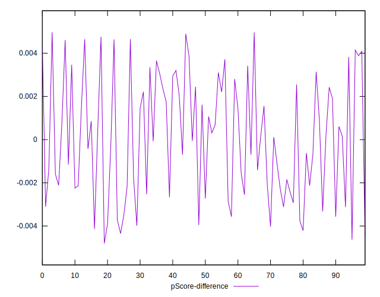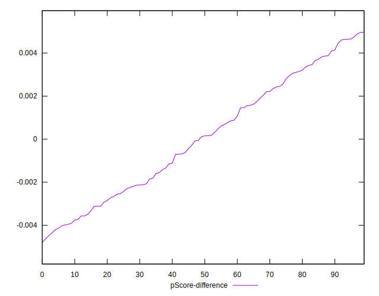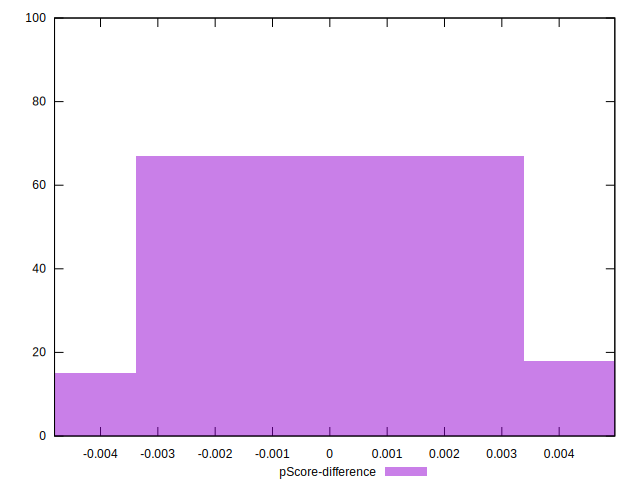