# //largest-contentful-paint/samples/pages+cached+noadtech

[→ Parent](../..)


## Raw


```yaml
p90min: 7731.834999999999
p90max: 8074.1595000000025
p90range: 342.32450000000335
p90mean: 7849.186754787234
p90median: 7835.11775
p90stdev: 76.9989252459864
p90skewness: 0.6849222245933336
p90eccentricity: 1.0000000000000002
p90discretization: 1
outlandishness: 1.005656382999626
confidence: 83.07045017598116
p90confidence: 31.131412298100607

```

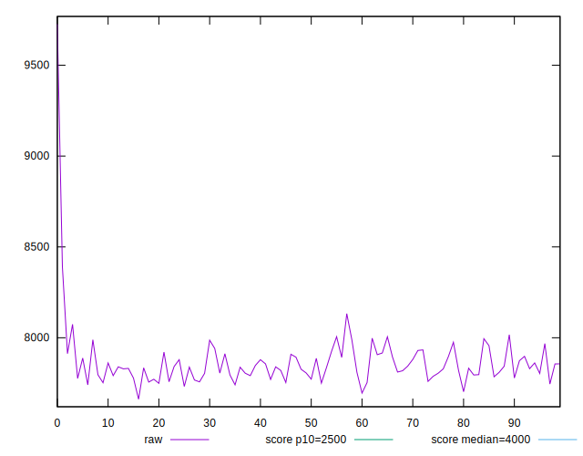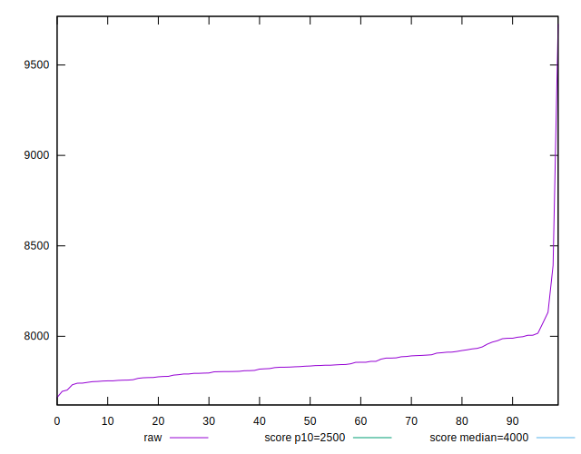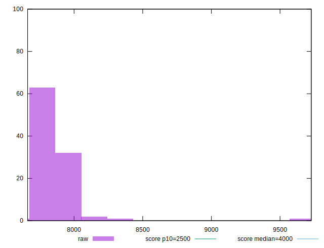
## Score


```yaml
p90min: 0.03
p90max: 0.04
p90range: 0.010000000000000002
p90mean: 0.03180851063829783
p90median: 0.03
p90stdev: 0.0038489473436437347
p90skewness: 1.6583699784683623
p90eccentricity: 0.9999999999999991
p90discretization: 47
outlandishness: 0.9931888949788026
confidence: 0.0018431999840011631
p90confidence: 0.001556166742403954

```

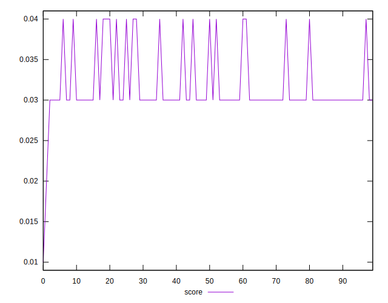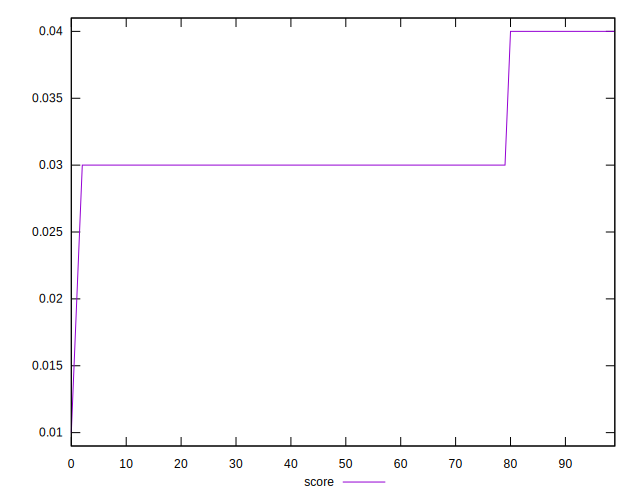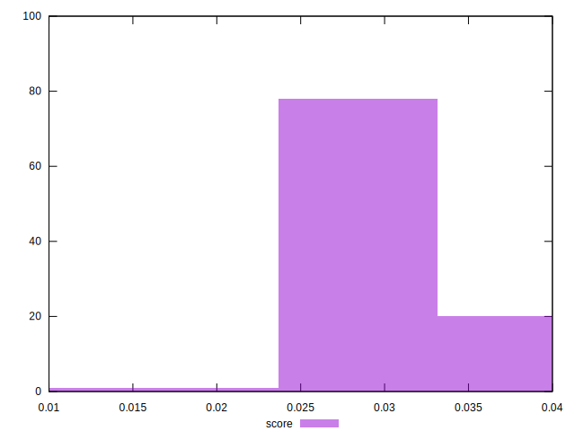
## Raw Estimate

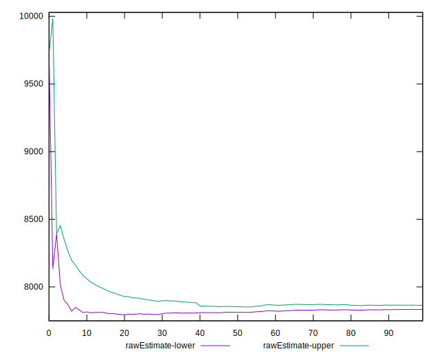
## Score Estimate

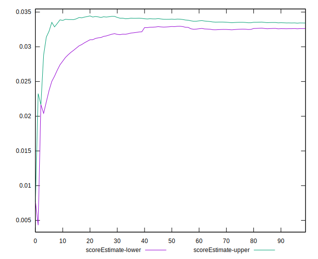
## P Score


```yaml
p90min: 0.0277364068506179
p90max: 0.03616566037309599
p90range: 0.008429253522478086
p90mean: 0.0330811367450911
p90median: 0.03338571746668542
p90stdev: 0.001934661805082857
p90skewness: -0.5707853120301631
p90eccentricity: 1.0000000000000002
p90discretization: 1
outlandishness: 0.9817969552241999
confidence: 0.0013685279545112127
p90confidence: 0.0007822025322952339

```

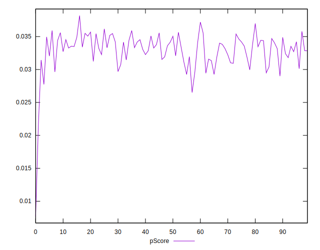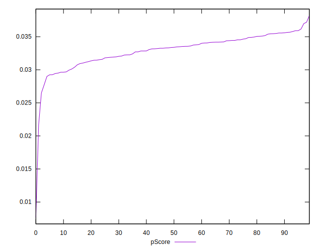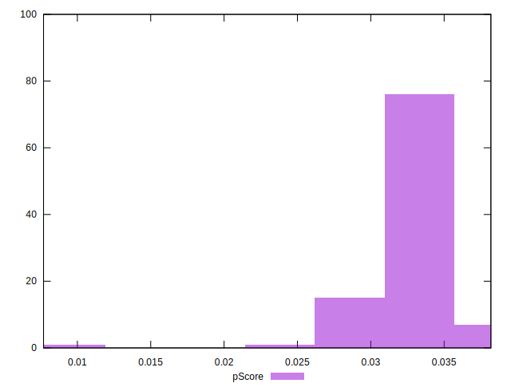
## Score Difference


```yaml
p90min: 0
p90max: 0
p90range: 0
p90mean: 0
p90median: 0
p90stdev: 0
p90skewness: .nan
p90eccentricity: .nan
p90discretization: 94
outlandishness: .nan
confidence: 0
p90confidence: 0

```


## P Score Difference


```yaml
p90min: -0.004819699237347395
p90max: 0.0047005880146167855
p90range: 0.009520287251964181
p90mean: 0.0011479972165897552
p90median: 0.001995568179493812
p90stdev: 0.0029805876459127797
p90skewness: -0.7831734774876344
p90eccentricity: 1.0000000000000007
p90discretization: 1
outlandishness: 0.8828597109540995
confidence: 0.0012320392424702386
p90confidence: 0.0012050804942939455

```

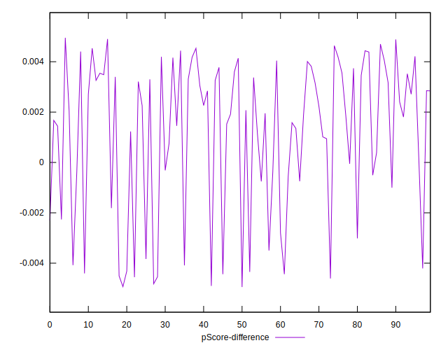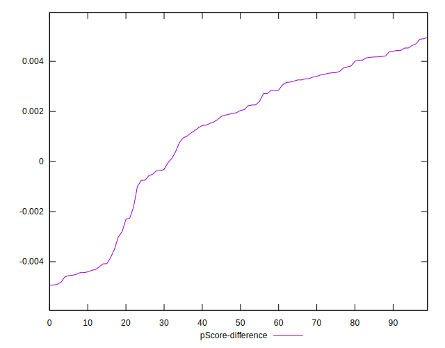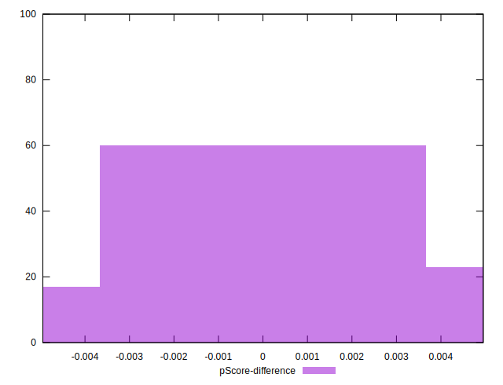