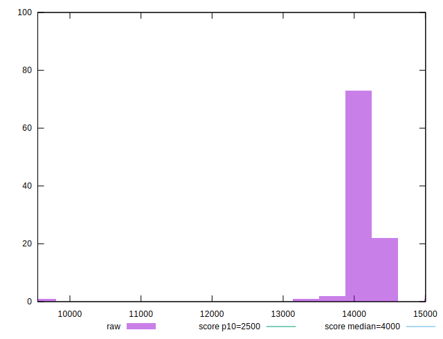
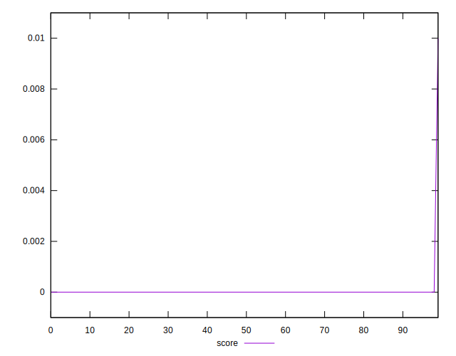
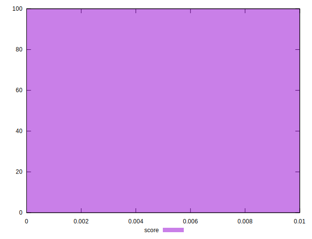

# //largest-contentful-paint/samples/pages+cached

[→ Parent](../..)


## Raw


```yaml
p90min: 13853.941499999997
p90max: 14396.483499999998
p90range: 542.5420000000013
p90mean: 14114.34864521277
p90median: 14116.332650000002
p90stdev: 150.33262345689863
p90skewness: 0.09770260121981403
p90eccentricity: 0.9999999999999997
p90discretization: 1
outlandishness: 0.9944766172509161
confidence: 193.85518390026914
p90confidence: 60.78093775647566

```


## Score


```yaml
p90min: 0
p90max: 0
p90range: 0
p90mean: 0
p90median: 0
p90stdev: 0
p90skewness: .nan
p90eccentricity: .nan
p90discretization: 94
outlandishness: .inf
confidence: 0.00039002790835975757
p90confidence: 0

```


## Raw Estimate


## Score Estimate


## P Score


```yaml
p90min: 0.00023972134790550825
p90max: 0.000352982277733227
p90range: 0.00011326092982771874
p90mean: 0.0002947202019085148
p90median: 0.00029257995075193666
p90stdev: 0.000031409356775276474
p90skewness: 0.036115207333313505
p90eccentricity: 1.0000000000000002
p90discretization: 1
outlandishness: 1.6617625701063685
confidence: 0.00033377984571173044
p90confidence: 0.000012699107587092469

```


## Score Difference


```yaml
p90min: 0
p90max: 0
p90range: 0
p90mean: 0
p90median: 0
p90stdev: 0
p90skewness: .nan
p90eccentricity: .nan
p90discretization: 94
outlandishness: .nan
confidence: 0
p90confidence: 0

```


## P Score Difference


```yaml
p90min: 0.00023298701596524696
p90max: 0.0003470081365642974
p90range: 0.00011402112059905045
p90mean: 0.0002934436565705576
p90median: 0.00028960544142997424
p90stdev: 0.00003145392113037935
p90skewness: 0.00974607878676967
p90eccentricity: 0.9999999999999996
p90discretization: 1
outlandishness: 0.9099645560477435
confidence: 0.00005876243567313335
p90confidence: 0.000012717125388095201

```

